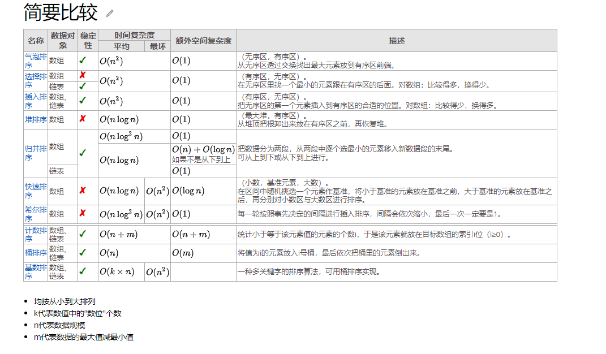

 

 

<!-- more -->
<!-- TOC -->

- [分类](#分类)
- [1 冒泡排序](#1-冒泡排序)
- [2 选择排序](#2-选择排序)
- [3 插入排序](#3-插入排序)
- [4 希尔排序](#4-希尔排序)
- [5 归并排序](#5-归并排序)
- [6 快速排序](#6-快速排序)
- [7 堆排序](#7-堆排序)
- [8 计数排序](#8-计数排序)
- [9 桶排序](#9-桶排序)
- [10 基数排序](#10-基数排序)

<!-- /TOC -->
***
参考文章：
[Github](https://github.com/hustcc/JS-Sorting-Algorithm)
[Runoob](https://www.runoob.com/w3cnote/ten-sorting-algorithm.html)
[CSDN](https://blog.csdn.net/qq_40803710/article/details/80642703)
[WIKI](https://www.wikiwand.com/zh/排序算法)

## 分类

排序算法分为内部排序和外部排序。
内部排序是数据记录在内存中进行排序。
外部排序是因为排序的数据很大，一次不能容纳全部的排序记录，在排序过程中需要访问外存。
用一张图概括：

***

**分类方法：**

- 计算的时间复杂度（最差、平均、和最好性能），依据串列（list）的大小(n)。一般而言，好的性能是O(n\log n)(大O符号)，坏的性能是O(n^{2})。对于一个排序理想的性能是O(n)，但平均而言不可能达到。基于比较的排序算法对大多数输入而言至少需要O(n\log n)。
- 内存使用量（以及其他电脑资源的使用）。
- 稳定性：稳定排序算法会让原本有相等键值的纪录维持相对次序。也就是如果一个排序算法是稳定的，当有两个相等键值的纪录R和S，且在原本的串列中R出现在S之前，在排序过的串列中R也将会是在S之前。
- 依据排序的方法：插入、交换、选择、合并等等。

## 1 冒泡排序
BubbleSort
原理：
从左至右比较相邻的两个数，并将较大的数移到右边，遍历一遍后最大的数则在最右边。对剩下的元素重复以上步骤。

1. 比较相邻的元素。如果第一个比第二个大，就交换他们两个。
2. 对每一对相邻元素作同样的工作，从开始第一对到结尾的最后一对。这步做完后，最后的元素会是最大的数。
3. 针对所有的元素重复以上的步骤，除了最后一个。
4. 持续每次对越来越少的元素重复上面的步骤，直到没有任何一对数字需要比较。

C++代码：

    #include <iostream>
    using namespace std;
    template<typename T>//整数或浮点数皆可用，若要使用class或struct，则必须重载>运算符。
    void bubble_sort(T arr[],int len){
        for(size_t i=0;i<len-1;++i)
            for(size_t j=0;j<len-1-i;++j)
                if(arr[j]>arr[j+1]) swap(arr[j],arr[i]);
    }

优化：
优化外层循环：若某一趟排序中无气泡位置交换，则终止。
优化内层排序：记住最后一次交换发生的位置lastExchange，则R[Exchange:end]为有序区，后序步骤只需在无序区R[1：lastExchange-1]执行，

## 2 选择排序 
Selection Sort
原理：
1. 首先在未排序序列中找到最小（大）元素，存放到排序序列的起始位置
2. 再从剩余未排序元素中继续寻找最小（大）元素，然后放到已排序序列的末尾。
3. 重复第二步，直到所有元素均排序完毕。

C++代码：

   template<typename T>
   void selection_sort(std::vector<T>& arr){
        for (int i = 0; i < arr.size() - 1; i++) {
            int min = i;
            for (int j = i + 1; j < arr.size(); j++)
                if (arr[j] < arr[min])
                        min = j;
            std::swap(arr[i], arr[min]);
        }
   } 

优化：
一趟排序同时找出MIN和MIAX，保存其下标。

## 3 插入排序 
Insertion Sort
原理：

1. 将第一待排序序列第一个元素看做一个有序序列，把第二个元素到最后一个元素当成是未排序序列。
2. 从头到尾依次扫描未排序序列，将扫描到的每个元素插入有序序列的适当位置。（如果待插入的元素与有序序列中的某个元素相等，则将待插入元素插入到相等元素的后面。）

C代码：

    void insertion_sort(int arr[],int len){
        for(int i=1;i<len;i++){
                int key=arr[i];
                int j=i-1;
                while((j>=0) && (key<arr[j])){
                        arr[j+1]=arr[j];
                        j--;
                }
                arr[j+1]=key;
        }
    }

## 4 希尔排序 
Shell Sort
原理：
先将整个待排序的记录序列分割成为若干子序列分别进行直接插入排序，待整个序列中的记录“基本有序”时，再对全体记录进行依次直接插入排序。
1. 选择一个增量序列：t1,t2...tk,其中tk=1;
2. 按照增量序列的个数k,对序列进行k趟排序；
3. 每趟排序，蜂聚对应的增量ti，将待排序列分成ti个等长度为m的子序列，分别对子表进行插入排序。

C++代码：

    template<typename T>
    void shell_sort(T array[], int length) {
        int h = 1;
        while (h < length / 3) {
            h = 3 * h + 1;
        }
        while (h >= 1) {
            for (int i = h; i < length; i++) {
                for (int j = i; j >= h && array[j] < array[j - h]; j -= h) {
                    std::swap(array[j], array[j - h]);
                }
            }
            h = h / 3;
        }
    }

## 5 归并排序 
Merge Sort
以归并操作为基础（采用分治法）。先使每个子序列有序，再使子序列段间有序。两个有序表合并为一个，称为2-路归并。
把长度为n的输入序列分成两个长度为n/2的子序列；对两个子序列分别采用归并排序。

1. 申请空间，使其大小为两个已经排序序列之和，该空间用来存放合并后的序列；
2. 设定两个指针，最初位置分别为两个已经排序序列的起始位置；
3. 比较两个指针所指向的元素，选择相对小的元素放入到合并空间，并移动指针到下一位置；
4. 重复步骤 3 直到某一指针达到序列尾；
5. 将另一序列剩下的所有元素直接复制到合并序列尾。

    //合并两个子序列
    void Merge(vector<int>& Array,int front,int mid,int end){
        vector<int> LeftSubArray(Array.begin()+front,Array.begin()+mid+1);
        vector<int> RightSubArray(Array.begin()+mid+1,Array.begin()+end+1);
        int idLeft=0,idRight=0;
        for(int i=front;i<=end;++i){
            if(LeftSubArray[idLeft]<RightSubArray[idRight]){
                Array[i]=LeftSubArray[idLeft];
                ++idLeft;
            }
            else {
                Array[i]=RightSubArray[idRight];
                ++idRight;
            }                
        }
    }
    void MergSort(vector<int>& Array,int front,int mid,int end){
        if(front>=end)  return;
        int mid=(front+end)/2;
        MergeSort(Array,front,mid);
        MergeSort(Array,mid+1,end);
        Merge(Array,front,mid,end);
    }

## 6 快速排序
QuickSort
快速排序是在冒泡排序基础上的递归分治法。

1. 从数列中选出一个元素，称为“基准”；
2. 分区操作。将比基准值小的元素摆放在基准前面，比基准值大的元素摆放在基准后面；
3. 递归对子序列进行排序。

C++代码：

    //分区位置的选择方案
    int partion(vector<int>& vi,low,up){
        int pivot=vi[up];
        int i=low-1;
        for(int j=low;j<up;++j){
            if(vi[j]<=pivot)
            {
                i++;
                swap(v[i],v[j]);
            }
        }
        swap(vi[i+1],vi[up]);
        return i+1;        
    }

    void quickSort(vector<int>& vi, int low,int up)
    {
        if(low<up)
        {
            int mid=partion(vi,low,up);
            quickSort(vi,low,mid-1);
            quickSort(vi,mid,up);
        }
    }

    void qSort(vector<int>& vi)
    {
        quickSort(vi,0,vi.size()-1);
    }

## 7 堆排序
HeapSort
原理：
堆排序是指利用堆这种数据结构所设计的一种排序算法。堆积是一个近似完全二叉树的结构，并同时满足堆积的性质：子节点的键值或索引总是小于（或者大于）它的父节点。分为两种：大顶堆——用于升序排序；小顶堆——降序排序。

1. 创建一个堆 H[0……n-1]；
2. 把堆首（最大值）和堆尾互换；
3. 把堆的尺寸缩小 1，并调用 shift_down(0)，目的是把新的数组顶端数据调整到相应位置；
4. 重复步骤 2，直到堆的尺寸为 1。

C++ 代码:

    #include <iostream>
    #include <algorithm>
    using namespace std;

    void max_heapify(int arr[], int start, int end) {
        // 建立父節點指標和子節點指標
        int dad = start;
        int son = dad * 2 + 1;
        while (son <= end) { // 若子節點指標在範圍內才做比較
            if (son + 1 <= end && arr[son] < arr[son + 1]) // 先比較兩個子節點大小，選擇最大的
                son++;
            if (arr[dad] > arr[son]) // 如果父節點大於子節點代表調整完畢，直接跳出函數
                return;
            else { // 否則交換父子內容再繼續子節點和孫節點比較
                swap(arr[dad], arr[son]);
                dad = son;
                son = dad * 2 + 1;
            }
        }
    }

    void heap_sort(int arr[], int len) {
        // 初始化，i從最後一個父節點開始調整
        for (int i = len / 2 - 1; i >= 0; i--)
            max_heapify(arr, i, len - 1);
        // 先將第一個元素和已经排好的元素前一位做交換，再從新調整(刚调整的元素之前的元素)，直到排序完畢
        for (int i = len - 1; i > 0; i--) {
            swap(arr[0], arr[i]);
            max_heapify(arr, 0, i - 1);
        }
    }

    int main() {
        int arr[] = { 3, 5, 3, 0, 8, 6, 1, 5, 8, 6, 2, 4, 9, 4, 7, 0, 1, 8, 9, 7, 3, 1, 2, 5, 9, 7, 4, 0, 2, 6 };
        int len = (int) sizeof(arr) / sizeof(*arr);
        heap_sort(arr, len);
        for (int i = 0; i < len; i++)
            cout << arr[i] << ' ';
        cout << endl;
        return 0;
    }

## 8 计数排序
CountingSort
原理：
将输入的数据值转化为键存储在额外开辟的数组空间中。要求输入的数据必须是由确定范围的整数。

（1）找出待排序的数组中最大和最小的元素
（2）统计数组中每个值为i的元素出现的次数，存入数组C的第i项
（3）对所有的计数累加（从C中的第一个元素开始，每一项和前一项相加）
（4）反向填充目标数组：将每个元素i放在新数组的第C(i)项，每放一个元素就将C(i)减去1

C  代码：

    #include <stdio.h>
    #include <stdlib.h>
    #include <time.h>

    void print_arr(int *arr, int n) {
        int i;
        printf("%d", arr[0]);
        for (i = 1; i < n; i++)
            printf(" %d", arr[i]);
        printf("\n");
    }

    void counting_sort(int *ini_arr, int *sorted_arr, int n) {
        int *count_arr = (int *) malloc(sizeof(int) * 100);
        int i, j, k;
        for (k = 0; k < 100; k++)
            count_arr[k] = 0;
        for (i = 0; i < n; i++)
            count_arr[ini_arr[i]]++; //计数
        for (k = 1; k < 100; k++)
            count_arr[k] += count_arr[k - 1]; //累积和作为最后数组下标
        for (j = n; j > 0; j--)
            sorted_arr[--count_arr[ini_arr[j - 1]]] = ini_arr[j - 1]; //反向填充
        free(count_arr);
    }

    int main(int argc, char **argv) {
        int n = 10;
        int i;
        int *arr = (int *) malloc(sizeof(int) * n);
        int *sorted_arr = (int *) malloc(sizeof(int) * n);
        srand(time(0));
        for (i = 0; i < n; i++)
            arr[i] = rand() % 100;
        printf("ini_array: ");
        print_arr(arr, n);
        counting_sort(arr, sorted_arr, n);
        printf("sorted_array: ");
        print_arr(sorted_arr, n);
        free(arr);
        free(sorted_arr);
        return 0;
    }

## 9 桶排序 
BucketSort
桶排序是计数排序的升级版。它利用了函数的映射关系，高效与否的关键就在于这个映射函数的确定。为了使桶排序更加高效，我们需要做到这两点：

1. 在额外空间充足的情况下，尽量增大桶的数量。
2. 使用的映射函数能够将输入的 N 个数据均匀的分配到 K 个桶中。
同时，对于桶中元素的排序，选择何种比较排序算法对于性能的影响至关重要。

- 什么时候最快
当输入的数据可以均匀的分配到每一个桶中。
- 什么时候最慢
当输入的数据被分配到了同一个桶中。

C++实现算法:

假设数据分布在[0，100)之间，每个桶内部用链表表示，在数据入桶的同时插入排序。然后把各个桶中的数据合并。

    #include<iterator>
    #include<iostream>
    #include<vector>
    using namespace std;
    const int BUCKET_NUM = 10;

    struct ListNode{
        explicit ListNode(int i=0):mData(i),mNext(NULL){}
        ListNode* mNext;
        int mData;
    };

    ListNode* insert(ListNode* head,int val){
        ListNode dummyNode;
        ListNode *newNode = new ListNode(val);
        ListNode *pre,*curr;
        dummyNode.mNext = head;
        pre = &dummyNode;
        curr = head;
        while(NULL!=curr && curr->mData<=val){
            pre = curr;
            curr = curr->mNext;
        }
        newNode->mNext = curr;
        pre->mNext = newNode;
        return dummyNode.mNext;
    }

    ListNode* Merge(ListNode *head1,ListNode *head2){
        ListNode dummyNode;
        ListNode *dummy = &dummyNode;
        while(NULL!=head1 && NULL!=head2){
            if(head1->mData <= head2->mData){
                dummy->mNext = head1;
                head1 = head1->mNext;
            }else{
                dummy->mNext = head2;
                head2 = head2->mNext;
            }
            dummy = dummy->mNext;
        }
        if(NULL!=head1) dummy->mNext = head1;
        if(NULL!=head2) dummy->mNext = head2;
        
        return dummyNode.mNext;
    }

    void BucketSort(int n,int arr[]){
        vector<ListNode*> buckets(BUCKET_NUM,(ListNode*)(0));
        for(int i=0;i<n;++i){
            int index = arr[i]/BUCKET_NUM;
            ListNode *head = buckets.at(index);
            buckets.at(index) = insert(head,arr[i]);
        }
        ListNode *head = buckets.at(0);
        for(int i=1;i<BUCKET_NUM;++i){
            head = Merge(head,buckets.at(i));
        }
        for(int i=0;i<n;++i){
            arr[i] = head->mData;
            head = head->mNext;
        }
    }

## 10 基数排序 
radixSort
原理：
基数排序是一种非比较型整数排序算法，其原理是将整数按位数切割成不同的数字，然后按每个位数分别比较。由于整数也可以表达字符串（比如名字或日期）和特定格式的浮点数，所以基数排序也不是只能使用于整数。

基数排序 vs 计数排序 vs 桶排序

- 基数排序：根据键值的每位数字来分配桶；
- 计数排序：每个桶只存储单一键值；
- 桶排序：每个桶存储一定范围的数值；

C代码：

    
    #include<stdio.h>
    #define MAX 20
    #define BASE 10

    void print(int *a, int n) {
    int i;
    for (i = 0; i < n; i++) {
        printf("%d\t", a[i]);
    }
    }
        void radixsort(int *a, int n) {
    int i, b[MAX], m = a[0], exp = 1;
    //找出最大值
    for (i = 1; i < n; i++) {
        if (a[i] > m) {
        m = a[i];
        }
    }

    while (m / exp > 0) {
        int bucket[BASE] = { 0 };

        for (i = 0; i < n; i++) {
        bucket[(a[i] / exp) % BASE]++; //计数
        }

        for (i = 1; i < BASE; i++) {
        bucket[i] += bucket[i - 1];  //累加值为下标
        }

        for (i = n - 1; i >= 0; i--) {
        b[--bucket[(a[i] / exp) % BASE]] = a[i];
        }

        for (i = 0; i < n; i++) {
        a[i] = b[i];
        }

        exp *= BASE;

    #ifdef SHOWPASS
        printf("\nPASS   : ");
        print(a, n);
    #endif
    }
    }

