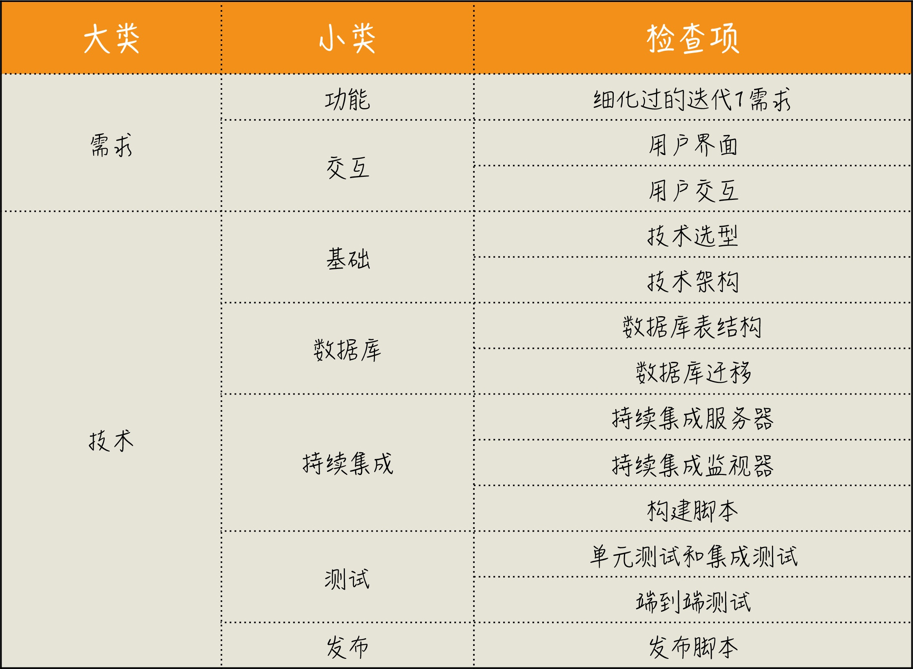
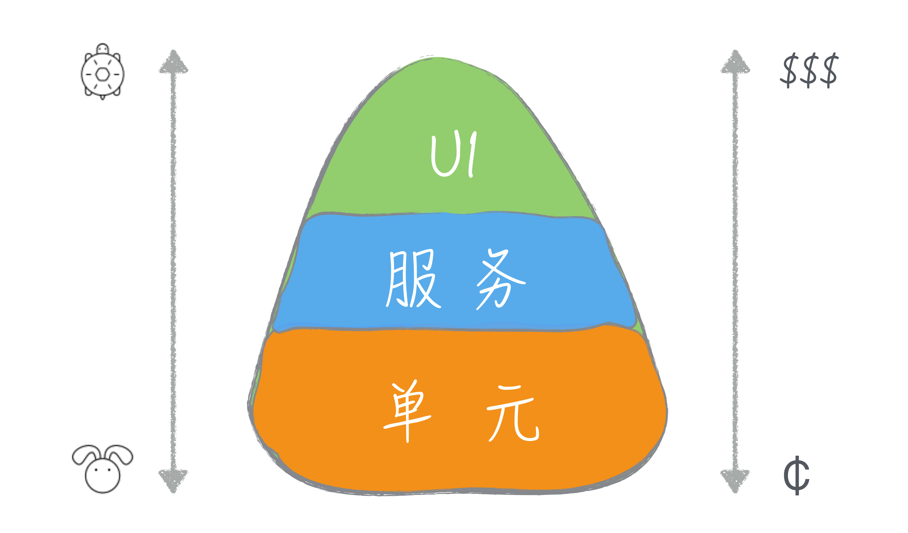
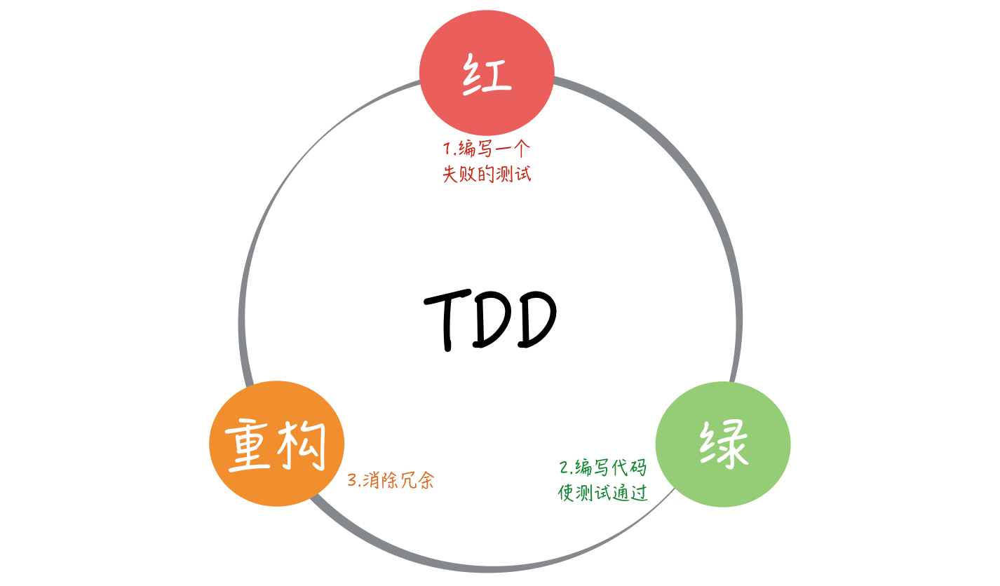
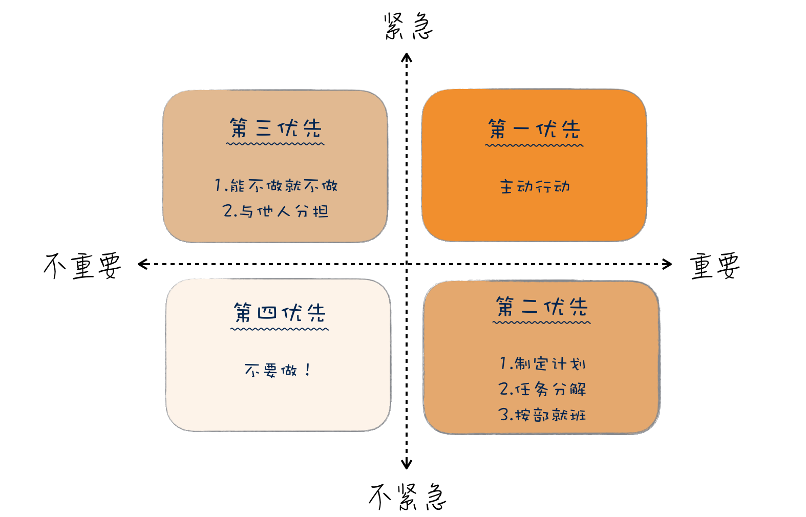
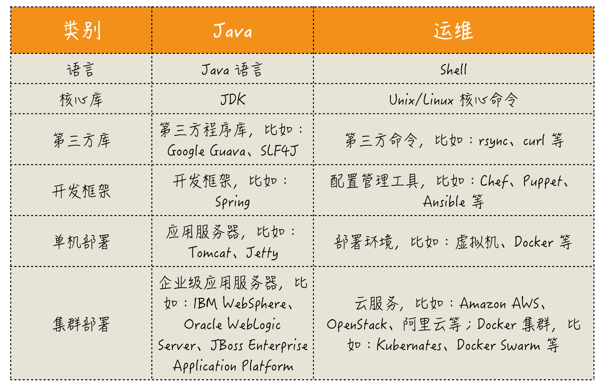
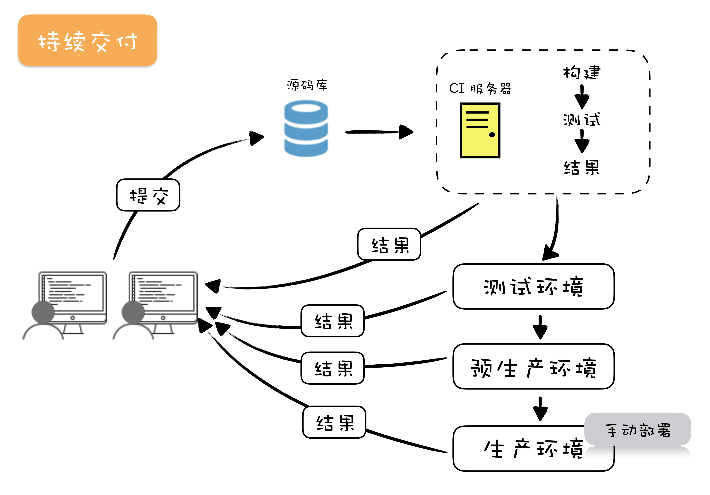
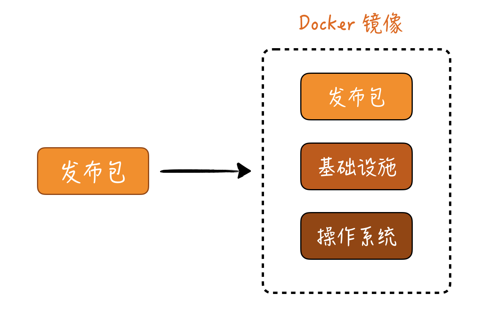
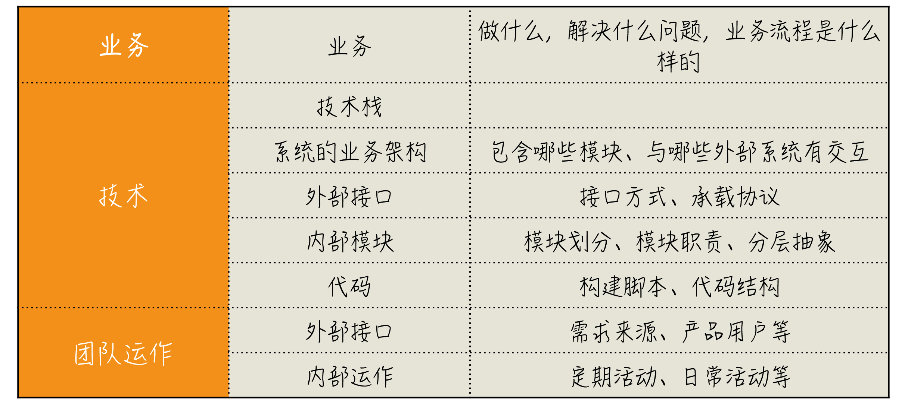

 

 

<!-- more -->
- [四项原则](#四项原则)
- [以终为始](#以终为始)
- [任务分解](#任务分解)
- [沟通反馈](#沟通反馈)
- [自动化](#自动化)
- [综合运用](#综合运用)

>[10x程序员工作法-郑晔-极客时间](https://time.geekbang.org/column/intro/148)
其中每章总结和总复习可用于构建对应的知识体系。

>高效工作：能用尽可能小的时间颗粒度来安排自己的工作。十五分钟？五分钟？

# 四项原则

本质复杂度（Essential Complexity）和偶然复杂度（Accident Complexity）。

1. 以终为始就是在工作的一开始就确定好自己的目标。我们需要看到的是真正的目标，而不是把别人交代给我们的工作当作目标。你可以看出这个原则是在帮助我们回答思考框架中，Where are we going?（我们要到哪儿去？）这个问题。

2. 任务分解是将大目标拆分成一个一个可行的执行任务，工作分解得越细致，我们便越能更好地掌控工作，它是帮助我们回答思维框架中，How can we get there?（我们如何到达那里？）的问题。

3. 沟通反馈是为了疏通与其他人交互的渠道。一方面，我们保证信息能够传达出去，减少因为理解偏差造成的工作疏漏；另一方面，也要保证我们能够准确接收外部信息，以免因为自我感觉良好，阻碍了进步。

4. 自动化就是将繁琐的工作通过自动化的方式交给机器执行，这是我们程序员本职工作的一部分，我们擅长的是为其他人打造自动化的服务，但自己的工作却应用得不够，这也是我们工作中最值得优化的部分。

# 以终为始
1. DOD
在做任何事情之前，先确定完成的标准。
DoD 是团队成员间彼此汇报的一种机制。
DOD是一个检查项清单，用于检查工作是否完成，只有完成和未完成两个状态，不存在完成了80%这样的状态。

2. 用户故事与验收标准
采用用户故事的格式进行需求描述固或，在功能列表中使用验收标准。验收标准给出了这个需求最基本的测试用例。
验收标准非常重要的一环是异常流程的描述。

3. 工作上下文
不同角色工作上真正的差异是上下文的不同。
扩大自己工作的上下文，别把自己局限在一个“程序员”的角色上。

4. 事先推演
我们的工作，多数情况下，即便目标清晰，路径却是模糊的。
在动手做一件事之前，先推演一番。

5. 数据思维

6. 精益创业，减少过度开发不确定性产品带来的浪费。
7. 迭代 0
  在项目开始之前，做好一些基础准备。
  

# 任务分解
1. 可执行的、小粒度的任务分解；便于任务量估算
安装完整实现一个需求的顺序去安排分解出来的任务。每做完一个任务，代码都是可以提交的。

2. 测试金字塔

越是底层的测试，牵扯到相关内容越少，成本越低，执行越快；而高层测试则涉及面更广。

3. TDD
TDD 的节奏：“红 - 绿 - 重构”。编写可测试的代码。
测试先行开发和测试驱动开发的差异就在重构上。

极限编程之所以叫“极限”，它背后的理念就是**把好的实践推向极限**。
4. 写简单的测试
前置准备、执行、断言和清理。
A-TRIP:
   - Automatic，自动化；
   - Thorough，全面的；
   - Repeatable，可重复的；
   - Independent，独立的；
   - Professional，专业的。
  
5. 需求分解与用户故事
需求分解。绝大多数问题都是由于分解的粒度太大造成的，少有因为粒度太小而出问题的。
需求拆分为细小的为用户故事，便于管理。
评价用户故事的INVEST原则：
   - Independent：独立的
   - **Negotiable：可协商的**
   - Valuable：有价值的
   - Estimable：可估算的
   - Small:小
   - Testable：可测试的。

6. 需求优先级
艾森豪威尔矩阵（Eisenhower Matrix）

按照时间管理的理念，
   - 重要且紧急的事情要立即做。
   - 重要但不紧急的事情应该是我们重点投入精力的地方。
   - 紧急但不重要的事情，可以委托别人做。
   - 不重要不紧急的事情，尽量少做。
**如果不把精力放在重要的事情上，到最后可能都变成紧急的事情。**

7. 最小可行产品MVP
产品开发同样需要分解，精益创业就包含了将庞大的产品分而治之的方式：Minimum Viable Product，MVP。
想要在实践中运用好最小可行产品的理念，就是要用**最小的代价找到一条可行的路径**。

# 沟通反馈
1. 信息论视角

每个人经历见识的差异，造成了各自编解码器的差异。
   - 不同角色间的沟通：克服上下文差异，分段解码，理解偏差早发现早反馈。
   - 相同角色间的沟通: 信号相同，解码能力因人而异，要有一个主导的人，控制沟通广度与深度，抓主线适可而止，此时结合任务分解，反向沙盘推演。

2. 用业务语言写代码
领域驱动设计（Domain Driven Design，DDD）。把不同的概念分解出来，这其实是限界上下文（Bounded Context）的作用，而在代码里尽可能使用业务语言，这是通用语言（Ubiquitous Language）的作用。

3. 轻量级沟通
多面对面沟通，少开会。
站会：
   - 我昨天做了什么？是为了与其他人同步进展，看事情是否在计划上。
   - 我今天打算做什么？是同步你接下来的工作安排，可能涉及到与其他人协作。
   - 我在过程中遇到了什么问题，需要请求帮助。 就是与其他人的协作。
关于站会，有一个典型的错误是，有些团队把站会开成了汇报会。项目负责人指定一个个轮流发言，说的人都向负责人在汇报工作，其他人自然就容易走神了，因为事情与己无关。
沟通的指导原则之一就是在同步沟通的时候（比如开会），人越少越好。而在异步沟通的时候（比如E-mail），涉及的听众越多越好。
亚马逊 CEO Jeff Bezos 透露了亚马逊内部的一个独特规则——召开员工会议时拒绝使用 PPT。召开员工会议前，与会者需要在会场静读 30 分钟会议相关文件。“我们的会议以自习课开场，”Jeff Bezos 如是解释道。

4. 可视化
多尝试用可视化的方式进行沟通。
雷达图、UML、流程图、看板等。
关注新技术，网站/论坛（InfoQ/ThougtWorks/OsChina）；试验新技术，以 Spike 为主；深入学习，以阅读文档为主
   > TODO：创建自己的读书雷达图 [build-your-own-radar](https://github.com/thoughtworks/build-your-own-radar)

5. 做好持续集成的关键在于快速反馈。
持续集成的价值在于，它是一条主线，可以将诸多实践贯穿起来。
想要做好 CI，最好采用主开发分支的方式;想用好主分支开发，最好能够频繁提交；而频繁提交需要你的任务足够小，能够快速完成；将任务拆解的足够小，需要你真正懂得任务分解。要想在一个分支上开发多个功能，那就需要用 Feature Toggle 或者 Branch by Abstraction。

6. 复盘
枚举关注点，选出重点，深入讨论，列出行动项，找到负责人。
5个为什么:沿着一条主线追问多个问题.

7. 聆听用户的声音
用户角度与逻辑推演的角度的差异。
做自己的用户/接近用户/创造用户。
谁离用户近，谁就有发言权，无论你的角色是什么。

8. 尽早暴露问题
**不是所有的问题，都是值得解决的技术难题。**
遇到问题，最好的解决方案是尽早把问题暴露出来。
A system that **fails fast** does exactly the op- posite: when a problem occurs, it fails imme- diately and visibly. 

9. 写文档
将零散的知识结构化。输出的过程，本质上就是把知识连接起来的过程。
构建自己的知识结构，提高对新知识的接收效率。
金字塔原理的四个基本原则：
   1. 结论先行:一次表达只支持一个思想，且出现在开头;
   2. 以上统下:任一层次上的思想都必须是其下一层思想的总结概括;
   3. 归类分组:每组中的思想都必须属于同一范畴;
   4. 逻辑递进:每组中的思想都必须按照逻辑顺序排列;
前面两个特点是纵向结构之间的特点，后面两个特点则是横向结构之间的特点。

# 自动化
1. 三大美德
   [Laziness, Impatience and Hubris](http://threevirtues.com/)
   技术人员普遍存在的问题：NIH 综合症（Not Invented Here Syndrome），即看不起别人做的东西。
   分清出设计与技术。
2. 运维知识体系
   
   [DevOps 技术栈](https://chaifeng.com/devops-tech-stack/)
   >自动化部署工具：Chef、Puppet、Ansible ？？

3. 持续交付
   DevOps 和持续交付是相辅相成的，二者在部署自动化是重叠的。
   
   如果把由人决定的是否上线变成自动化的，就成了另外一个实践：持续部署。
   基础设施即代码（Infrastructure as code）。
   

4. 验收测试
   Acceptance Testing，是确认应用是否满足设计规范的测试。
   行为驱动开发：其中的行为，指的是业务行为。BDD 希望促进业务人员与开发团队之间的协作，即关键点在用业务视角描述。

5. 设计原则
   《敏捷软件开发：原则、实践与模式》这本书中，比较完整地阐述了这五个原则。
   如果说设计模式是“术”，设计原则才是“道”。设计模式并不能帮你建立起知识体系，而设计原则可以。《设计模式》不推荐阅读，《Head First 设计模式》更容易入门。
   **SOLID 5原则：**
   - 单一职责原则（Single responsibility principle，SRP）
   - 开放封闭原则（Open–closed principle，OCP）
   - Liskov 替换原则（Liskov substitution principle，LSP）
   - 接口隔离原则（Interface segregation principle，ISP）
   - 依赖倒置原则（Dependency inversion principle，DIP）
  
   >《敏捷软件开发：原则、实践与模式》

6. 分层抽象的思想
   分层架构，实际上，就是一种在设计上的分解，构建出一个良好的抽象。
   Java 服务端应用的三层结构：
   - 数据访问层，按照传统的说法，叫 DAO（Data Access Object，数据访问对象），按照领域驱动开发的术语，称之为 Repository；
   - 服务层，提供应用服务；
   - 资源层，提供对外访问的资源，采用传统做法就是 Controller。
  
7. 使用合适的技术
   用简单技术解决问题，直到问题变复杂。
   不同量级的系统根本就不是一个系统。 

8. DDD与微服务
   ><《领域驱动设计精粹》

9. 重构
   **函数式编程已然成为时代的主流。**
   **函数式编程**：是一种抽象程度很高的编程范式，纯粹的函数式编程语言编写的函数没有变量。因此，任意一个函数，只要输入是确定的，输出就是确定的，这种纯函数我们称之为没有副作用。而允许使用变量的程序设计语言，由于函数内部的变量状态不确定，同样的输入，可能得到不同的输出，因此，这种函数是有副作用的。
    函数式编程的一个特点就是，允许把函 数本身作为参数传入另一个函数，还允许返回一个函数。
   >《重构》

10. 其它
   如IDEA快捷键学习

# 综合运用
1. 熟悉新团队
   三个维度：业务、技术和团队。
   了解一个项目，要从大图景开始。
   

2. 改造遗留系统

3. 保持竞争力
   一专多能。
   在学习区工作和成长。保持知识分享与输出。
