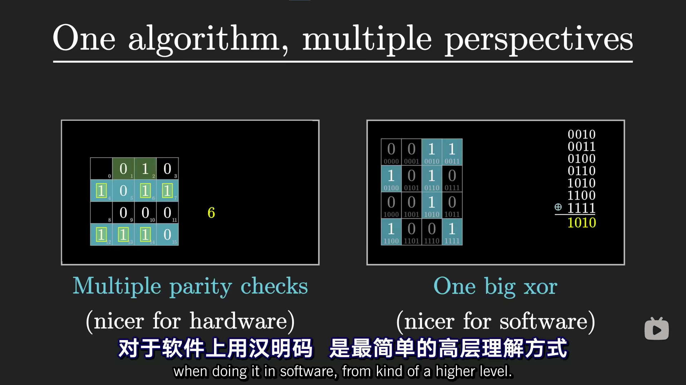

 

 

<!-- more -->
https://www.3blue1brown.com/
https://space.bilibili.com/88461692

 

# 群论
简单描述为：集合+运算。
关于对称的抽象表示。一个群可表示多种不同物体的对称情况。
二元乘法运算。
同构。
基本群。

相关：弦论、代数方程解、晶体结构、氢原子结构。

群公理：封闭性、结合性、单位元、逆元。

# 汉明码
Error-Correcting Code.

1. 可找出单个错误位置并纠正；可确定是否存在2个错误但不能确定位置。

2. 2^n bit位信息中包含 n+1 位冗余ecc信息。

3. 其中n位为二分奇偶校验位，位于bit(2^(n-1))的位置处，每个bit位可确定该二分范围内是否有错误，最终确定错误位置。

4. 若所有bit校验正确，则只能确定除bit0外数据均正确，此时无法确定bit0是否错误，因此bit0不用于存放有效数据，而是作为数据整体的奇偶校验位，并能够判断是否出现了2个错误(bit0校验通过，而剩余n bit中有一个校验失败)。

软件计算方法(Python)：
``reduce(lamda x,y:x^y, [i for i, bit in enumerate(bits) if bit])``

值为1的所有bit对应的位置编号异或，结果为错误bit的位置编号。

1. bit-n的编号n，n的bit-m位为1时代表bit-n在奇偶校验二分分组的第m组内，若第m组校验失败则置bit-m为1，组合所有bit即得到位置编号。

2. 即错误bit-n的位置n的各bit对应各个校验二分分组的结果(校验失败则该bit为1).