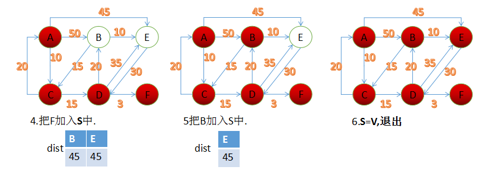

 

 

<!-- more -->

- [算法可视化](#算法可视化)
  - [括号匹配](#括号匹配)
- [Levenberg-Marquard](#levenberg-marquard)
- [Dijkstra](#dijkstra)

# 算法可视化
https://www.cs.usfca.edu/~galles/visualization/Algorithms.html

https://visualgo.net/zh

## 括号匹配

https://code.visualstudio.com/blogs/2021/09/29/bracket-pair-colorization

# Levenberg-Marquard
LM(Levenberg-Marquardt)算法属于信赖域法，将变量行走的长度 [公式] 控制在一定的信赖域之内，保证泰勒展开有很好的近似效果。

信赖域法：在最优化算法中，都是要求一个函数的极小值，每一步迭代中，都要求目标函数值是下降的，而信赖域法，顾名思义，就是从初始点开始，先假设一个可以信赖的最大位移 s ，然后在以当前点为中心，以 s 为半径的区域内，通过寻找目标函数的一个近似函数（二次的）的最优点，来求解得到真正的位移。在得到了位移之后，再计算目标函数值，如果其使目标函数值的下降满足了一定条件，那么就说明这个位移是可靠的，则继续按此规则迭代计算下去；如果其不能使目标函数值的下降满足一定的条件，则应减小信赖域的范围，再重新求解。

[ LM(Levenberg-Marquard)算法的实现](https://www.codelast.com/%E5%8E%9F%E5%88%9Blm%E7%AE%97%E6%B3%95%E7%9A%84%E5%AE%9E%E7%8E%B0/) 算法基础弱，看不懂。

[Levenberg-Marquardt 最小二乘优化](https://zhuanlan.zhihu.com/p/42415718)

# Dijkstra
一种解决单源最短路径问题的贪心算法.
基本思想:设置顶点集合S,并贪婪的方式不断扩充这个集合。

1. S初始化时只包括源节点s;
2. dist[]初始化：dist[i]= arc[s][i],arc为图的邻接矩阵。
3. V−S表示未被找到最短的路径的顶点集合；
4. 把dist按递增的顺序，选择一个最短路径，从V−S把对应顶点加入到S中，每次S中加入一个新顶点u , 需要对dist更新，即s能否通过顶点u达到其他顶点更近。 即若`dist[u] + arc[u][v] < dist[v]`,则更新  `dist[v]=dist[u]+arc[u][v]`
5. 重复上述步骤，直到S=V

[dijkstra算法](https://blog.csdn.net/luoshixian099/article/details/51918844)
[WikiPeidia](https://zh.wikipedia.org/wiki/%E6%88%B4%E5%85%8B%E6%96%AF%E7%89%B9%E6%8B%89%E7%AE%97%E6%B3%95)
[使用优先队列优化的Dijkstra算法](https://blog.csdn.net/tlonline/article/details/47398403)
[最短路径—Dijkstra算法和Floyd算法](https://www.cnblogs.com/biyeymyhjob/archive/2012/07/31/2615833.html)
