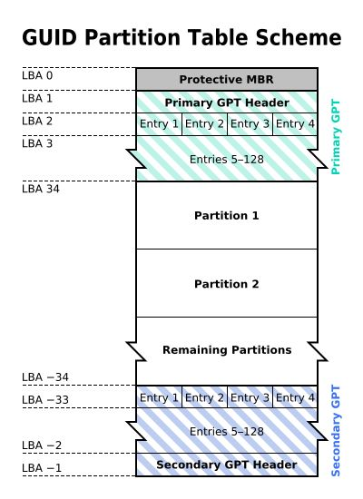
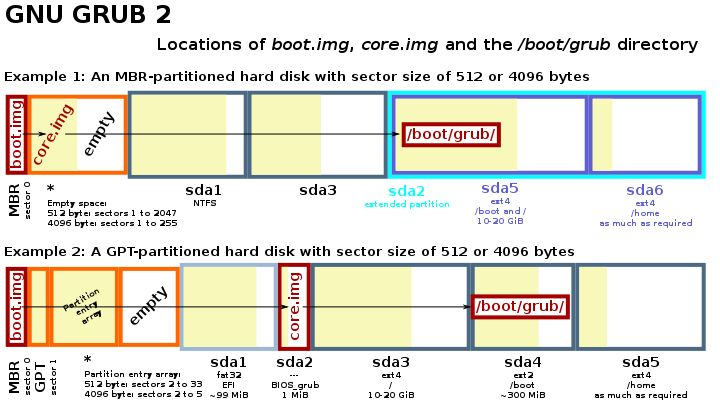

 

系统引导，分区表，系统安装

<!-- more -->
<!-- TOC -->

- [Windows安装](#windows安装)
  - [微PE](#微pe)
  - [PE](#pe)
  - [原版镜像安装](#原版镜像安装)
  - [微软官方工具USB](#微软官方工具usb)
- [引导与分区](#引导与分区)
  - [固件接口标准](#固件接口标准)
  - [启动方式](#启动方式)
  - [分区表](#分区表)
  - [分区](#分区)
  - [引导程序](#引导程序)
  - [多重引导工具](#多重引导工具)
- [Office安装](#office安装)

<!-- /TOC -->

# Windows安装
系统安装只会格式化系统盘，其它盘的数据不受影响。
重装系统前请将原来系统盘的数据（包括桌面文件）拷贝到其它盘/移动硬盘。
## 微PE
干净无捆绑无后台。
[官网](http://www.wepe.com.cn/download.html)，下载时选择`我已捐赠，继续查看下载地址`。同时提供纯净的Windows镜像下载。
老电脑建议使用微PE 1.2版本。

## PE
[参考教程](https://tieba.baidu.com/p/4261164243)
1. 制作PE U盘。
下载[微PE](https://pan.baidu.com/s/15E8CXGBBJXr4p8GKJtA44Q)（提取码ys7y）。([本站网盘](http://od1.webexp.me/?/%E8%BD%AF%E4%BB%B6/)也提供下载)，打开下载的微PE，选择U盘，将PE系统写入U盘（会格式化U盘）。
1. 进入PE系统。
插入U盘，按下开机键，然后按`启动项选择键`，弹出窗口后选择U盘的选项，即可进入U盘的PE系统。
`启动项选择键`：百度搜索“电脑主板品牌/笔记本的品牌+进入U盘启动项”，即可搜到是哪个键。
3. 进入系统后开始装系统。
   打开Windows安装器/CGI备份还原工具，选择已下载好的系统镜像文件，选将要安装系统的盘。点击开始即可，系统会重启多次。可参考[微PE](http://www.wepe.com.cn/ubook/installwimghost.html)。
4. 安装驱动。
   系统安装完成后如果不能上网，则在其它电脑下载好网卡驱动并拷贝过来安装。
   然后安装驱动人生/驱动精灵/360驱动来一键安装驱动。

**PE也可安装到本机硬盘**，安装和使用方法一样。

## 原版镜像安装
[下载镜像](https://msdn.itellyou.cn/)，将iso文件解压或载入光驱，点击`setup.exe`，选择系统盘，下一步，等待完成安装。不需要U盘。需要自行下载网卡驱动，请自备网线。

## 微软官方工具USB
[官网指南](https://www.microsoft.com/zh-cn/software-download/windows10)。
功能简单，在全新的电脑上安装系统时推荐。需要U盘。

# 引导与分区
在安装**多个操作系统**（特别是同时混合windows、Linux、OSX系统）时，需要注意引导的设置。

**分区表**是在磁盘（存储介质）上的，用于描述该磁盘的分区情况，有**GPT和MBR**两种格式。

**BIOS和UEFI**是固件接口标准，功能包括开机自检、启动流程（如何找到引导程序）、给操作系统和引导程序提供系统服务等。

**MBR**是引导扇区，包括最多446个字节的引导程序（通常是引导程序的前部）和MBR分区表，其中可以包括4个主分区。

启动方式是指如何主板上的固件在开机自检后如何找到引导程序，有**Legacy模式（BIOS + MBR）和UEFI模式（UEFI _+ GPT）**。

## 固件接口标准
**BIOS**
IBM推出的业界标准的固件接口，存储于主板的ROM/EEPROM/flash中，提供的功能包括：

**开机自检**
加载引导程序（MBR中的，通常是bootloader的第一级）
向OS提供抽象的硬件接口
PS：CMOS是PC上的另一个重要的存储器，用于保存BIOS的设置结果，CMOS是RAM。

**EFI/UEFI**
Unified Extensible Firmware Interface，架设在系统固件之上的软件接口，用于替代BIOS接口，EFI是UEFI的前称。

一般认为，**UEFI**由以下几个部分组成：
- Pre-EFI初始化模块
- EFI驱动程序执行环境（DXE）
- EFI驱动程序
- 兼容性支持模块（CSM）
- EFI高层应用
- GUID磁盘分区表（GPT）
- 通常初始化模块和DXE被集成在一个ROM中；EFI驱动程序一般在设备的ROM中，或者ESP中；EFI高层应用一般在ESP中。CSM用于给不具备UEFI引导能力的操作系统提供类似于传统BIOS的系统服务。

## 启动方式

**Legacy mode**
即通过MBR/BIOS进行引导的传统模式，流程如下：
1. BIOS加电自检（Power On Self Test -- POST）。
2. 读取主引导记录（MBR）。BIOS根据CMOS中的设置依次检查启动设备：将相应启动设备的第一个扇区（也就是MBR扇区）读入内存。
3. 检查MBR的结束标志位是否等于55AAH，若不等于则转去尝试其他启动设备，如果没有启动设备满足要求则显示"NO ROM BASIC"然后死机。
4. 当检测到有启动设备满足要求后，BIOS将控制权交给相应启动设备的MBR。
5. 根据MBR中的引导代码启动引导程序。

**UEFI mode**
UEFI启动不依赖于Boot Sector（比如MBR），大致流程如下：
1. Pre-EFI初始化模块运行，自检
2. 加载DXE（EFI驱动程序执行环境），枚举并加载EFI驱动程序（设备ROM或ESP中）
3. 找到ESP中的引导程序，通过其引导操作系统。

**CSM mode**
UEFI中的兼容性支持模块（Compatible Support Module）提供了引导UEFI固件的PC上的传统磁盘（MBR格式）的方法。

## 分区表
**MBR分区表**
指的是512字节的Master Boot Record（主引导记录）中的分区表，由于大小限制，其中只能存有最多四个分区的描述（亦即**4个主分区**）。

**EBR分区表**
位于Extended Boot Record（扩展引导纪录）中的分区表，该分区表所描述的分区即扩展分区。每个EBR仅表示了一个扩展分区，该扩展分区紧接在它的EBR后。EBR中的四个分区描述符中的第一个表示其描述的分你去，第二个描述符则表示下一个扩展分区（如果是最后一个则为空），也就是说，各个EBR串接成了一个EBR链表。

**GPT分区表**
GUID Partition Table，是EFI标准的一部分，用于替代MBR分区表，相较起来有分区更大，数量更多（没有4个主分区的限制）等优势，GPT格式的硬盘结构如下，可以看到首部MBR的位置有个保护MBR（用于防止不识别GPT的硬盘工具错误识别并破坏硬盘中的数据），这个MBR中只有一个类型为0xEE的分区。GPT结构如下：
 

## 分区
分区可以是文件系统，启动kernel image，bootloader裸程序，或者参数等各种数据。
MBR Partition ID（分区类型）：https://en.wikipedia.org/wiki/Partition_type

**ESP**（EFI系统分区）：
EFI System Partition，FAT格式，在MBR的分区类型ID是0xEF。主要目录是EFI。EFI/boot/bootx64.efi是EFI默认的启动项。安装的操作系统会建立相应的目录EFI/xxx，并将自己的启动项复制为到EFI/boot/bootx64.efi作为缺省启动项。

UEFI官网上注册的EFI的子目录：http://www.uefi.org/registry

比如安装Windows的时候，会在ESP分区中建立`EFI/Microsoft`子目录，并将EFI/Microsoft/bootmgr.efi复制到EFI/boot/bootx64.efi。

安装Ubuntu的时候，会在ESP分区中建立`EFI/Ubuntu`子目录，并将EFI/ubuntu/grubx64.efi（grub bootloader）复制为EFI/boot/bootx64.efi。因为Grub本身会扫描磁盘上的分区并找到windows启动程序（bootmgr.efi），因此先装windows后装ubuntu仍能通过grub让windows启动。

Linux也可以直接将编译出的Kernel及initrd（打开EFI Stub编译选项）作为efi文件复制到ESP中直接启动。

也可以在PC的系统设置中添加启动项。

维基百科的ESP条目：https://en.wikipedia.org/wiki/EFI_system_partition
Windows恢复分区
NTFS格式的分区，即Windows Recovery Environment，WinPE+工具集

## 引导程序
Bootloader即上文中提到的引导程序，用于启动操作系统或者其它引导程序（比如Grub启动Windows Bootmgr）

**Grub**
GNU的开源引导程序，可以用于引导Linux等操作系统，或者用于链式引导其它引导程序（比如Windows Boot Manager），分为三个部分，分别称为步骤1、1.5、2，看名字就可以知道，步骤1.5是可有可没有的，这三个步骤对应的文件分别是：

Boot.img：步骤1对应的文件，446个字节大小，步骤1可以引导步骤1.5也可以引导步骤2。MBR分区格式的磁盘中，放在MBR里（446也是为了符合MBR的启动代码区大小）； GPT分区格式的磁盘中，放在Protective MBR中。
Core.img：步骤1.5对应的文件，32256字节大小。MBR分区格式的磁盘中，放在紧邻MBR的若干扇区中；GPT分区格式的磁盘中，则放在34号扇区开始的位置（第一个分区所处的位置），而对应的GPT分区表中的第一个分区的entry被置空。通常其中包含文件系统驱动以便load步骤2的文件。
/boot/grub：步骤2对应的文件目录，放在系统分区或者单独的Boot分区中
 

**Windows Boot Manager**
是从Windows Vista开始引进的新一代开机管理程序，用以取代NTLDR。

当电脑运行完开机自检后，传统型BIOS会根据引导扇区查找开机硬盘中标记"引导"分区下的BOOTMGR文件；若是UEFI则是Bootmgfw.efi文件和Bootmgr.efi文件，接着管理程序会读取开机配置数据库（BCD, Boot Configuration Database）下的引导数据，接着根据其中的数据加载与默认或用户所选择的操作系统。

**NTLDR**
是微软的Windows NT系列操作系统（包括Windows XP和Windows Server 2003）的引导程序。NTLDR可以从硬盘以及CD-ROM、U盘等移动存储器运行并引导Windows NT系统的启动。如果要用NTLDR启动其他操作系统，则需要将该操作系统所使用的启动扇区代码保存为一个文件，NTLDR可以从这个文件加载其它引导程序。

NTLDR主要由两个文件组成，这两个文件必须放在系统分区（大多数情况下都是C盘）：

NTLDR，引导程序本身
boot.ini，引导程序的配置文件

## 多重引导工具

[YUMI](https://www.pendrivelinux.com/yumi-multiboot-usb-creator/)。支持linux、Windows
winPE.iso和Linux.iso。FAT32

Clover：支持OSX。

# Office安装
1. 本站共享网盘下载安装。
2. Office Tool Plus或[官方镜像下载](https://download.coolhub.top/)。