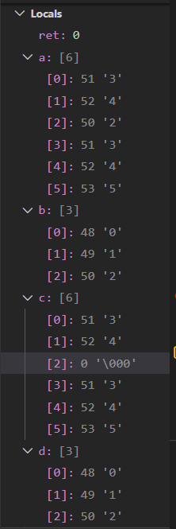

<font face="微软雅黑"> </font>
<center> </center>

<!-- more -->

# 缓冲区溢出
将未经检查的、外部输入作为可信任的数据。溢出指数据被添加到分配给该缓冲区的内存块之外。

缓冲区是一块连续的计算机内存区域，可保存相同数据类型的多个实例。缓冲区可以是堆栈(自动变量)、堆(动态内存)和静态数据区(全局或静态)。

攻击者可利用缓冲区溢出来篡改进程运行时栈，从而**改变程序正常流向**，轻则导致程序崩溃，重则系统特权被窃取。


## 缓冲区攻击

1. [缓冲区溢出详解](https://www.cnblogs.com/clover-toeic/p/3737011.html)：非常好！ 缓冲区溢出+c库函数。
2. [Epilogues, Canaries, and Buffer Overflows](https://manybutfinite.com/post/epilogues-canaries-buffer-overflows/):可视化栈

改变函数的返回地址（被保存在栈上的eip/rip），使函数调用返回后跳转到某个指定的指令位置：

以下修改返回值的示例（不是缓冲区溢出攻击！！）：

```
//buffer_overflow.c

#inlcude <stdio.h>
void foo(void){
    int a, *p;
    p = (int*)((char *)&a + 20);  //让p指向main函数调用foo时，入栈保存的返回地址; 参考文章中为12，32位系统。
    *p += 12;    //修改该地址的值，使其指向一条指令的起始地址
}

int main(void){
    foo();
    printf("First printf call\n");
    printf("Second printf call\n");
    return 0;
}
```


```
gcc buffer_overflow.c -o buffer_overflow -fno-stack-protector

运行后跳过了第一条打印，结果为：
Second printf call

```

### 汇编分析

1. foo调用前保存的rip在foo的rbp上一个位置（+8B），由 地址63e 的指令知 局部变量a位于rbp的 -12B位置，使用lea取得a地址后，再减 20即为 rip地址。
2. 原本foo返回后下一条指令（rip）为 地址665 （打印1），改为 地址671 则需要将rip +12.

```
000000000000063a <foo>:
 63a:   55                      push   %rbp
 63b:   48 89 e5                mov    %rsp,%rbp
 63e:   48 8d 45 f4             lea    -0xc(%rbp),%rax
 642:   48 83 c0 14             add    $0x14,%rax
 646:   48 89 45 f8             mov    %rax,-0x8(%rbp)
 64a:   48 8b 45 f8             mov    -0x8(%rbp),%rax
 64e:   8b 00                   mov    (%rax),%eax
 650:   8d 50 0c                lea    0xc(%rax),%edx
 653:   48 8b 45 f8             mov    -0x8(%rbp),%rax
 657:   89 10                   mov    %edx,(%rax)
 659:   90                      nop
 65a:   5d                      pop    %rbp
 65b:   c3                      retq

000000000000065c <main>:
 65c:   55                      push   %rbp
 65d:   48 89 e5                mov    %rsp,%rbp
 660:   e8 d5 ff ff ff          callq  63a <foo>
 665:   48 8d 3d a8 00 00 00    lea    0xa8(%rip),%rdi        # 714 <_IO_stdin_used+0x4>
 66c:   e8 9f fe ff ff          callq  510 <puts@plt>
 671:   48 8d 3d ae 00 00 00    lea    0xae(%rip),%rdi        # 726 <_IO_stdin_used+0x16>
 678:   e8 93 fe ff ff          callq  510 <puts@plt>
 67d:   b8 00 00 00 00          mov    $0x0,%eax
 682:   5d                      pop    %rbp
 683:   c3                      retq
 684:   66 2e 0f 1f 84 00 00    nopw   %cs:0x0(%rax,%rax,1)
 68b:   00 00 00
 68e:   66 90                   xchg   %ax,%ax


```


**lea**指令用于把源操作数的地址偏移量传送目的操作数。 一般对应为指针操作。


## stack-protector
[栈溢出的几种保护机制](https://blog.csdn.net/ATFWUS/article/details/104552315)


用于检查当前堆栈的完整性，因为缓冲区溢出通常会修改一大段内存。不能阻止上述例子中修改返回值的攻击(对于上述例子来说只是在栈上多了个变量而已)。


gcc-8默认打开（？）

```
-fstack-protector
    Emit extra code to check for buffer overflows, such as stack smashing attacks.  This is done by adding a guard variable to functions with vulnerable objects.
    This includes functions that call "alloca", and functions with buffers larger than 8 bytes.
    The guards are initialized when a function is entered and then checked when the function exits.
    If a guard check fails, an error message is printed and the program exits.

```

在一个函数的入口处，先从**fs/gs寄存器**中取出一个4字节(eax)或者8字节(rax)的值存到栈上，当函数结束时会检查这个栈上的值是否和存进去的值一致。


**实例(%fs:)**

```
00000000000006aa <foo>:
 6aa:   55                      push   %rbp
 6ab:   48 89 e5                mov    %rsp,%rbp
 6ae:   48 83 ec 20             sub    $0x20,%rsp
 6b2:   64 48 8b 04 25 28 00    mov    %fs:0x28,%rax
 6b9:   00 00
 6bb:   48 89 45 f8             mov    %rax,-0x8(%rbp)
 6bf:   31 c0                   xor    %eax,%eax
 6c1:   48 8d 45 ec             lea    -0x14(%rbp),%rax
 6c5:   48 83 c0 14             add    $0x14,%rax
 6c9:   48 89 45 f0             mov    %rax,-0x10(%rbp)
 6cd:   48 8b 45 f0             mov    -0x10(%rbp),%rax
 6d1:   8b 00                   mov    (%rax),%eax
 6d3:   8d 50 0c                lea    0xc(%rax),%edx
 6d6:   48 8b 45 f0             mov    -0x10(%rbp),%rax
 6da:   89 10                   mov    %edx,(%rax)
 6dc:   90                      nop
 6dd:   48 8b 45 f8             mov    -0x8(%rbp),%rax
 6e1:   64 48 33 04 25 28 00    xor    %fs:0x28,%rax
 6e8:   00 00
 6ea:   74 05                   je     6f1 <foo+0x47>
 6ec:   e8 8f fe ff ff          callq  580 <__stack_chk_fail@plt>
 6f1:   c9                      leaveq
 6f2:   c3                      retq

```


# C安全函数

微软在Windows中实现的[CRT安全函数](https://docs.microsoft.com/zh-cn/cpp/c-runtime-library/security-features-in-the-crt?view=vs-2019)

安全函数**不阻止或纠正安全性错误,而是在出现错误时捕获错误**。对错误条件进行附加检查。如果出现错误,将调用错误处理程序。

## CWE风险与C不安全函数
分析总结了CWE的风险类型，将其与相关的不安全函数进行对应，从而进一步揭示风险点。具体的缺陷对应关系如下表所示：

序号 | CWE | 风险类型 |涉及不安全函数
---|---|---|---|
1| CWE-787 |  越界写入(Out-of-bounds Write)  |  memcpy;printf;scanf;strncat/strcat;strcpy/strncpy
2| CWE-125 |  越界读取(Out-of-bounds Read)  |  printf
3| CWE-119 |  内存缓冲区范围内的操作限制不当(Improper Restriction of Operations within the Bounds of a Memory Buffer)  |  memcpy;strncat/strcat;scanf
4| CWE-78 |  OS命令注入(OS Command Injection)  |  system
5| CWE-120 |  不检查输入大小的缓冲区复制(Classic Buffer Overflow)  |  memcpy;strcpy/strncpy;strncat/strcat
6| CWE-338 |  加密弱伪随机数生成器的使用(Use of Cryptographically Weak Pseudo-Random Number Generator (PRNG))  |  rand
7| CWE-242 |  使用固有危险函数(Use of Inherently Dangerous Function)  |  gets/fgets
8| CWE-134 |  使用外部可控的格式字符串(Use of Externally-Controlled Format String)  |  printf;sprintf/snprintf/vsnprintf
9| CWE-121 |  基于栈的缓冲区溢出(Stack-based Buffer Overflow)  |  strcpy/strncpy;memcpy;scanf
10| CWE-170 |  NULL终止符错误(Improper Null Termination)  |  strlen
11| CWE-367 |  检查时间使用时间竞争(Time-of-check Time-of-use (TOCTOU) Race Condition)  |  fopen;stat;access
12| CWE-362 |  使用共享资源和不正确的同步(Concurrent Execution using Shared Resource with Improper Synchronization)  |  strtok
13| CWE-73 |  外部可控的文件名或路径(External Control of File Name or Path)  |  rename
14 | CWE-676 |  使用潜在危险函数(Use of Potentially Dangerous Function)  |  etc

## 主要特性
1. 参数验证: NULL值、有效的enum值、整数值是否在有效范围内;
2. 验证缓冲区是否足够大,如memcpy_s、stncpy_s;
3. Null termination,确保字符串以null(\0)结束,如strnlen_s(str);
4. 增强的错误报告,返回更多的错误信息;
5. 提供无效参数处理程序;
6. 文件系统IO安全;
7. 字符串格式语法检查,如printf_s。

## sscanf_s
- sscanf_s
从字符串读取格式化输入。swscanf:宽字符串。
返回值:成功转换并分配的字段数;到达字符串末尾而未发生转换则返回EOF;如果缓冲区或格式为NULL指针。

微软通用文本映射:不兼容ANSI。使用名称映射编写三种字符集(ASCI(SBCS),MBCS或Unicode)均可用的代码:

## strncpy和strncpy_s
当Src和Dst重叠时，行为未定义。
函数原型比较：
```
char *strncpy(   char *strDest,   const char *strSource,   size_t count);
errno_t strncpy_s(   char *strDest,   size_t numberOfElements,   const char *strSource,   size_t count);
```
1. strcpy:明显会造成缓冲区溢出。
2. [strncpy][1]: 不检查strDest是否有足够空间。strSrc被截断时，不会在strDest添加null结尾符。错误情况不返回错误码。
3. [strncpy_s][2]:更严格的参数检查，count必须小于目标缓存区，否则error。位于`C:\Program Files (x86)\Windows Kits\10\Include\10.0.18362.0\ucrt\string.h` 。但是不能防止传入了不合理的目标缓冲区numberOfElements值（大于实际str长度）

strncpy缓冲区溢出，此处传入的目标缓冲区大小大于实际strDest长度：

```
#include <stdio.h>
#include <string.h>

int main()
{
    int ret=0;
    char a[6]="012345";
    char b[3]="789";

    strncpy(b,a,5);
    printf("a=%s,b=%s\n",a,b);

    char c[6]="012345";
    char d[3]="789";

    ret=strncpy_s(d,6,c,5);
    printf("ret=%d,c=%s,d=%s\n",ret,c,d);

    return 0;
}
```

结果为：
```
a=342345,b=012342345  # b的结束符 \0被覆盖 ，并且覆写了a的前几个字符。（这种存在重叠的情况是未定义行为）
ret=0,c=34,d=01234    # b的结束符 \0被覆盖 ，因为制定了错误的目的缓冲区大小 6 .
```

变量内存堆栈:a/c被复制的字符数少于自身长度（即不包好结束符\0），srtncpy_s


[1]:https://docs.microsoft.com/en-us/cpp/c-runtime-library/reference/strncpy-strncpy-l-wcsncpy-wcsncpy-l-mbsncpy-mbsncpy-l?view=msvc-160
[2]:https://docs.microsoft.com/en-us/cpp/c-runtime-library/reference/strncpy-s-strncpy-s-l-wcsncpy-s-wcsncpy-s-l-mbsncpy-s-mbsncpy-s-l?view=msvc-160


