<font face="微软雅黑"> </font>
<center> </center>

<!-- more -->

https://www.ituring.com.cn/book/tupubarticle/1768

# CMOS和逻辑门
数字电路中的电源电压 H （High，高）电平、接地电压 L（Low，低）电平分别代表 1 和 0，以此实现信息的表达。大部分数字电路是基于叫做 MOSFET（Metal-Oxide-Semiconductor Field-Effect Transistor，金属氧化物半导体场效应管）的场效应管实现的。

MOSFET 有 P 型 MOSFET 和 N 型 MOSFET 两种。
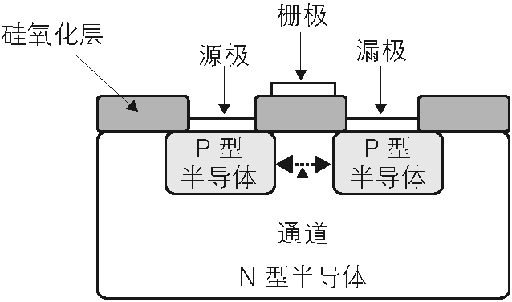
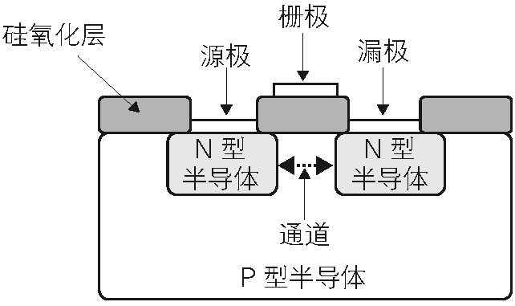

N 型 MOSFET 在栅极施加电源电压（H）时电流可以流通，接地（L）时电流无法流通。
P 型 MOSFET 的栅极接地时电流可以通过，施加电源电压时电流无法流过。
这种持有相反特性的 N 型 MOSFET 和 P 型 MOSFET 互补使用形成的门电路称为 CMOS（Complementary Metal Oxide Semiconductor，互补金属氧化物半导体）。

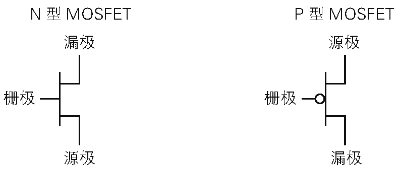

NOT门电路
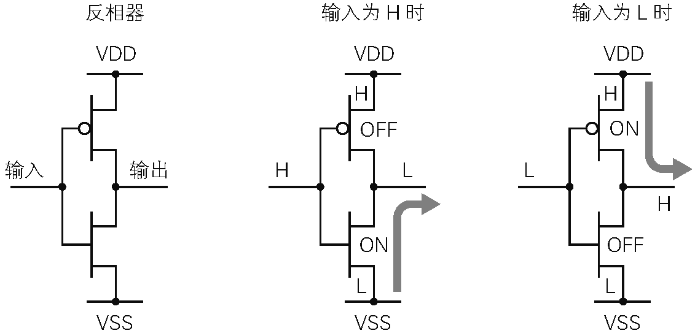

总表
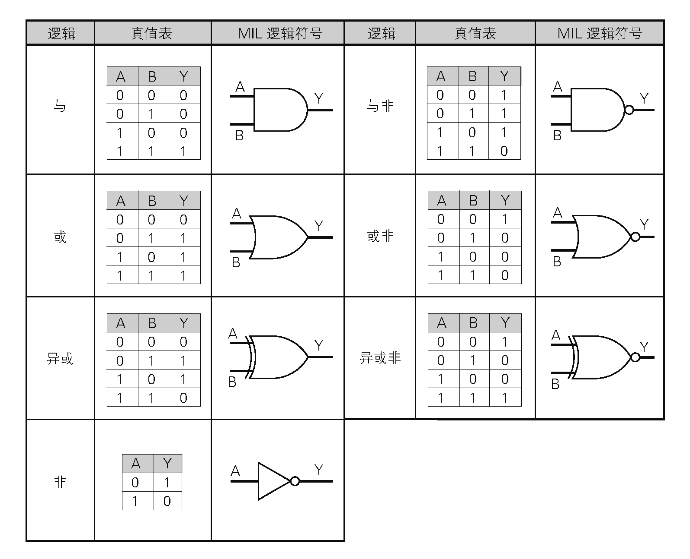

# 存储元件
## 电子元件与对应功能
加法器：
振荡器：时钟
分频器：计数器
锁存器（触发器）：存储器
选择器与译码器

## 简单锁存器
一旦这个电路的输入 A 为 0 时，循环回路中的值就一直为 0。
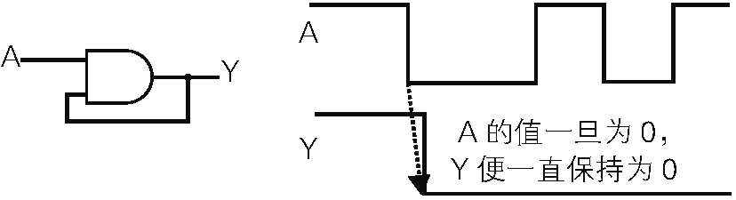


## D锁存器
Data Latch，D-Latch，数据锁存器
D 锁存器中有 D（Data） 和 E（Enable）两个输入信号，Q 和 \overline{\text{Q}} 两个输出信号。D 锁存器在 E 为 0 时保持前一个数据，E 为 1 时将输入 D 的数据输出到 Q。
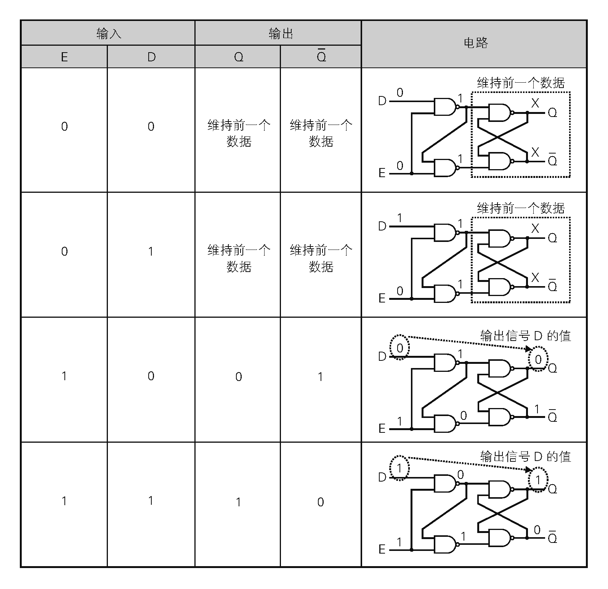

## SR锁存器
Set Reset Latch。SRAM最常见的的实现原理。
由一对相互交错的NAND逻辑门组成。

## D触发器
data flip-flop
D 锁存器和 NOT 门组合，可以实现依据时钟信号同步并保存数据的 D 触发器。


D 触发器有 D（Data） 和 C（Clock） 两个输入信号，Q 和 \overline{\text{Q}} 两个输出信号。当 D 触 发器的 C 为 0 时，前端 D 锁存器输出信号 D 的值，后端 D 锁存器保持之前的数据。当 C 为 1 时，前端 D 锁存器保持之前的数据，后端 D 锁存器将前端 D 锁存器保持的数据直接通过 Q 输出。

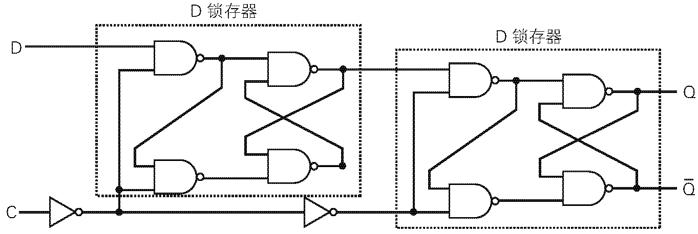
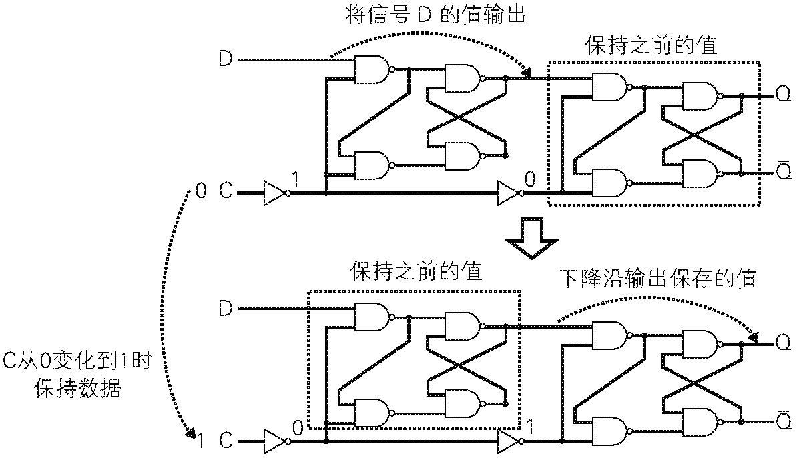
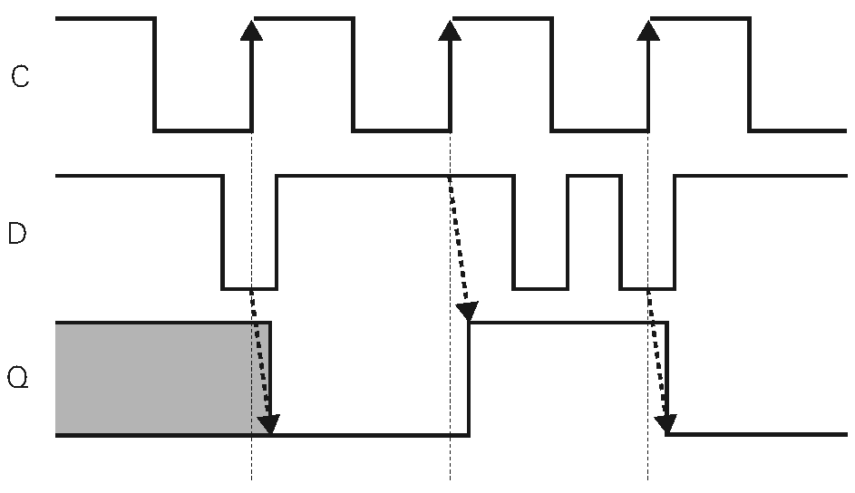


## 时钟同步设计
一种周期性地在 H 和 L 间变化的时钟信号，时钟变化边沿（上升沿或下降沿）之前被称为过去，之后被称为现在。
时钟同步设计中，由时钟边沿触发同步更新电路的状态。
设计者只需要注意时钟边沿的时序，电路的设计和验证都比较容易。

# Verilog HDL语言
Verilog HDL 是一种 HDL 语言（Hardware Description Language，硬件描述性语言）。使用 Verilog HDL 语言可以进行抽象度较高的 RTL（Register Transfer Level，寄存器传输级）电路设计。RTL 是根据寄存器间的信号流动和电路逻辑来记述电路动作的一种设计模型。


首先，在硬件功能确定之后，使用 Verilog HDL 语言进行目标电路和测试程序的编写。同时根据硬件的设计目标设定面积、时钟周期等约束参数。然后在仿真器上使用测试程序对设计好的电路进行功能验证。最后，验证成功的 Verilog HDL 在约束参数条件下进行逻辑综合并生成电路网表。

逻辑综合是将RTL级别记述的抽象电路转换到门电路级别的电路网表的过程。逻辑综合时，针对 ASIC（Application Specific Integrated Circuit）、FPGA（Field Programmable Gate Array）等不同电路实现技术，需要使用这些技术厂商提供的相应的目标元件库。
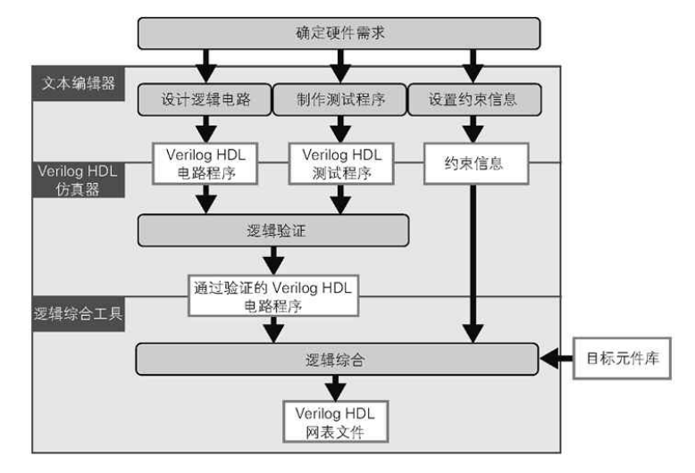

## 模块
Verilog HDL 中使用模块来设计一个功能单位的逻辑。模块也是 Verilog HDL 语言中最基本的构成单位。模块声明的语法如图 1-34 所示。
输入信号的**声明**使用 input 关键字，输出信号的声明使用 output 关键字，双向信号的声明使用 inout 关键字进行描述。
信号声明的关键字后分别要对**数据类型、信号线的位宽和信号名**进行描述。变量位宽的定义是在方括号中记述最高位和最低位的位置，中间用冒号隔开，如 [31:0]。比特数据的最高位被称为 MSB（Most Significant Bit），最低位称为 LSB（Least Significant Bit）。
```
module<模块名>(
    <输入输出信号的定义>,
    <输入输出信号的定义>,
    …
);
　
<电路描述>
　
endmodule
```

模块的实例化

设计好的模块可以被其他模块调用。

```
< 模块名> < 实例名> (
    .< 相连的端口名> ( 相连的信号名),
    .< 相连的端口名> ( 相连的信号名),
    …
);
```

辑值 | 名称 | 含义
---|----|---
0 | Low | 数值 0（接地）与逻辑假
1 | High | 数值 1（电源电压）与逻辑真
x | 不定值 | 无法确定值是 0 还是 1
z | 高阻值 | 电气绝缘状态

常数：首先在位宽中指定常数的宽度，然后是单引号加表示该常数为几进制的底数符号。二进制底数符号为 b、八进制为 o、十六进制为 h。最后在数值中指定该常数的数值。

## 数据类型
数据类型有寄存器型和网络型两种。寄存器型是可以保存上次写入数据的数据类型，根据程序不同可以生成锁存器、触发器等存储元件，也可能生成组合电路。

变量的符号用 signed 和 unsigned 关键字指定。在赋值或比较等处理时，如果需要在有符号数和无符号数间进行转换，需要使用 $signed() 和 $unsigned() 系统任务（system task）。

## 寄存器型变量

名称 | 默认位宽 | 默认符号 | 含义
---|------|------|---
reg | 1 位 | 无符号 | 比特数据
integer | 32 位 | 有符号 | 整数
real | 64 位 | 有符号 | 实数

寄存器型变量可以在接下来将要介绍的 always 和 initial 语句中实现过程赋值（Procedural Assignment）。这种方式称为过程赋值。过程赋值分为阻塞式和非阻塞式赋值两种。

阻塞式赋值是一种按照代码顺序进行赋值的方式。在先赋值的代码赋值完成之前阻塞后续代码的赋值，因此得名阻塞式赋值。阻塞式赋值使用 = 运算符。

非阻塞式赋值中所有代码不会互相阻塞，同时进行赋值。非阻塞式赋值使用 <= 运 算符。
### 网络型变量

网络型是用来描述模块和寄存器间连接的数据类型。网络型只描述信号的传输不持有数据。

名称 | 默认位宽 | 默认符号 | 含义
---|------|------|---
wire, tri | 1 位 | 无符号 | 线连接
wor, trior | 1 位 | 无符号 | 线或连接
wand, triand | 1 位 | 无符号 | 线与连接
tri1, tri0 | 1 位 | 无符号 | 有上拉或下拉的连接
supply0, supply1 | 1 位 | 无符号 | 接地或接电源的连接

网络型变量可以在 assign 语句或声明语句中实现连续赋值（Continuous Assignment）。连续赋值就是进行连续的赋值。


正逻辑与负逻辑

控制信号的有效、无效与信号高低电平相对应时，高电平有效、低电平无效的分配方式称为正逻辑。反之，高电平无效、低电平有效的分配称为负逻辑。

不论信号电平的高低，控制信号转为有效状态的动作称为 assert（断言），转为无效状态的动作称为 negate（无效）。并且，信号有效时称为 enable（使能），信号无效时称为 disable（非使能）。

## 电路仿真

