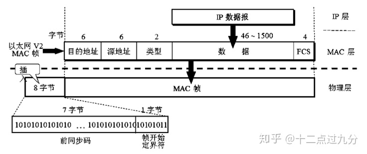
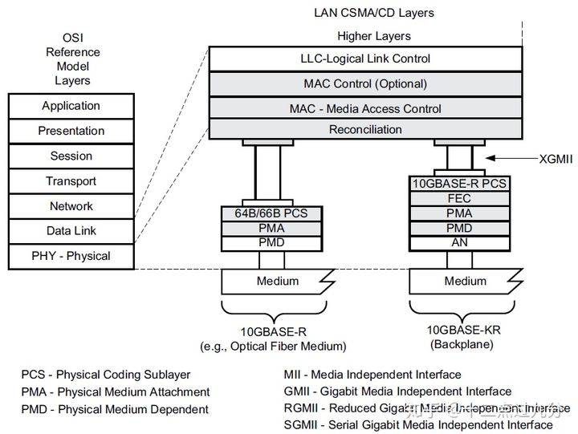
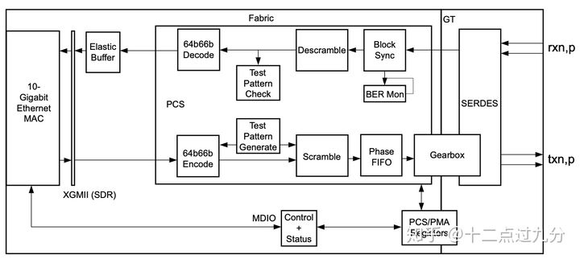

<font face="微软雅黑"> </font>
<center> </center>

<!-- more -->

# 网口
[10G以太网口系列专栏](https://zhuanlan.zhihu.com/p/97662754)


[以太网帧结构](./CN-Chapter-6)






GMII：背板。


# PCS 和 Serdes
Serdes是一个物理器件，可用于实现PMA。

10GBASE-R 结构图：

https://zhuanlan.zhihu.com/p/97792312

对应的就是上面那个典型结构图中的PMA、PCS和MAC部分。


1. PMA层对应就是GT部分，利用SerDes技术实现：对光模块来的数据（rxn,p）进行时钟恢复，并将串行信号转换为并行66bit位宽的数据，对应时钟为156.25 MHz，可计算出速率为10.3125 Gbps；对PCS层来的66bit位宽、156.25 MHz的数据转为串行数据（txn,p）再传输到光模块；

2. PCS层如图所示包括64b/66b编解码器、绕码/解绕码等，该部分是为了将PMA层来的数据进行解绕码、将66b位宽解码成64b位宽，即转为64bit位宽、156.25 MHz的数据了；对MAC层来的数据进行信道编码（64b/66b编码）、绕码等操作送入信道传输；

3. PCS子层与MAC子层之间使用XGMII接口连接，该接口传输的数据其实已经是完整的以太网帧数据（包括了前导码、FCS等部分）。如果自行设计MAC的话，可以直接将XGMII对接到MAC上；



## Serdes基础知识

https://www.cnblogs.com/rouwawa/p/13524703.html

https://zhuanlan.zhihu.com/p/113737215

http://xilinx.eetrend.com/files-eetrend-xilinx/forum/201709/11981-32468-serdeszhi_shi_xiang_jie_.pdf


# ARP包
https://blog.csdn.net/shanzhizi/article/details/9995489
```
以太网首部:

字段                   长度(Byte)          默认值                 备注
接收方MAC       6                                                    广播时,为 ff-ff-ff-ff-ff-ff
发送方MAC       6        
Ethertype           2                                                   0x0806       0x0806是ARP帧的类型值

ARP包:

字段                     长度(Byte)         默认值              备注
硬件类型              2                       0x1             以太网类型值
上层协议类型       2                       0x0800          上层协议为IP协议
MAC地址长度      1                       0x6             以太网MAC地址长度为 6
IP地址长度          1                       0x4             IP地址长度为 4
操作码                 2                                        0x1表示ARP请求包,0x2表示应答包
发送方MAC          6        
发送方IP              4        
接收方MAC          6        
接收方IP              4        
填充数据              18                            因为物理帧最小长度为64字节,前面的42字节再加上4个CRC校验字节,还差18个字节
```

# socket原理
## 接口与流程
[socket原理详解](https://www.cnblogs.com/zengzy/p/5107516.html)：介绍了各接口、流程。

```
int socket(int af,int type,int protoco1);
int band(SOCKET s,const struct sockaddr *name,ant name1em),
int send(SOCKET s,const char *buf,int len,int f1ags);
int sendto(SOCKET s,const char *buf,int len,int flags,const struct sockaddr *to,int tolen);
int WSAAPI recV(SOCKET s,char *buf,int len,int flags);
Int WSAAPI recvfrom(SOCKET s,char *buf,int len,int flags,struct sockaddr *from,int *fromlen);

```
socket屏蔽了各个协议的通信细节，无需关注协议本身，直接使用socket提供的接口来进行互联的不同主机间的进程的通信。


>socket实例的结构?


## TCP socket - Linux

[TCP Socket 是如何工作的?](https://colobu.com/2019/07/27/How-TCP-Sockets-Work/)：翻译自[eklitzke](https://eklitzke.org/)的文章。

# 路由选择
[TCP/IP详解 IP路由选择](https://www.cnblogs.com/Dr-wei/p/11966224.html)

# TLS握手
[HTTPS 详解二：SSL / TLS 工作原理和详细握手过程](https://segmentfault.com/a/1190000021559557)
https://www.cnblogs.com/awkflf11/p/12942986.html