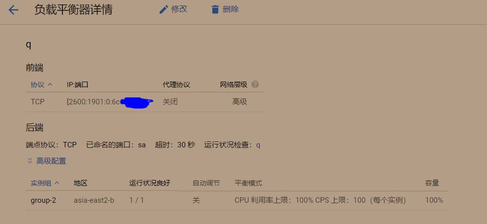

 

 

<!-- more -->

<!-- TOC -->

- [GCP路线](#gcp路线)
  - [VPS线路比较](#vps线路比较)
  - [三大运营商](#三大运营商)
- [配置Load Balance并绑定IPv6](#配置load-balance并绑定ipv6)
  - [负载平衡价格](#负载平衡价格)
- [结果](#结果)
- [谷歌云原账号无限试用](#谷歌云原账号无限试用)

<!-- /TOC -->

# GCP路线
使用[ipip.net的traceroute工具](https://tools.ipip.net/traceroute.php)
[BeastTrace图形客户端](https://www.ipip.net/product/client.html)更直观方便。

## VPS线路比较
**请勿选择**
1. 所有的**热门**推荐产品（AFF推广居多）；
2. 注册使用门槛低的产品（如可支付宝支付）。

**海外国人运营，支持支付宝付款，价格奇低，非一线大厂，NTT 线路，犄角旮旯地区**，符合上述六条规则中的三条，打死都别碰，碰就是交学费。
**VPS运营商的选择应该因地制宜，且同一服务商内也会有多种线路。**

| 区域 | 手机移动线路 |手机移动延时（ss) | 电信线路(校园网)|延时（ss） |
|---|---|---|---|---|
|香港 GCP asia-east2-b| 重庆——广州——加利福利亚——谷歌骨干|700 |重庆-广州-香港|200|
|日本 Sakura| 重庆——广州——香港——大阪-东京| 700|重庆-成都-上海-东京-北海道|500|
|香港Klayer|重庆——广州移动-广州联通-香港联通 |500|重庆-广州-香港|300|
|DO 多伦多| 重庆——广州——美国多省份——多伦多|1200+|重庆——加州——芝加哥——多伦多（**NTT**）|1000+|

教育网的ipv6的线路与ping：
- GCP HK：重庆-北京-香港-美国(?)；74ms
- Sakura：重庆-北京-香港-大阪-北海道;233ms
- DO tor:重庆-北京-香港-经美国国内7个省份-多伦多；245ms

三条线路国内路径一样，均从香港hkix.net出口，差别在国外线路。
故使用hk/jp两种ipv6代理线路延时差别应当不大。故更换为GCP HK意义不大。

GCP香港与Sakura相比，只在电信ipv4下有明显优势。

## 三大运营商
无论什么网络，路由都不是固定，路由是时刻动态的，随时会变，这个变，由你自身（比如本地精品网络CN2用户），或者你连接的网络（比如提供CN2的服务器）与通信提供商签约的合同而定，也由网络容量，稳定情况而定。
[国内主流网络运营商国际连接线路简谈](https://zhuanlan.zhihu.com/p/64467370)

各家出口带宽的总量比较如下：
`中国电信 ＞ 中国联通 ＞ 中国移动`
结合上述宽带用户数，可得各家人均用户出口带宽量比较如下：
`中国联通 ＞ 中国电信 ＞ 中国移动`

电信：163(Chinanet)、半程CN2 GT、全程CN2 GIA（又分为单向、双向）。CN2 GIA 产品还分为单网、双网、三网三种
联通：美日线路性价比高，俄罗斯线路也可以。
移动：相对较差，选择较少。

# 配置Load Balance并绑定IPv6

参考[使用谷歌云GCP IPv6为教育网搭建6to4服务](https://luotianyi.vc/1941.html)
**原理：`目标代理` 根据 `转发规则` 使用 `后端服务`（即目标服务器）。**

首先我们要创建一个VM实例，然后在Computer Engine选项下选择实例组，创建一个**与VM区域对应的单区域实例组**

`导航菜单->网络服务->负载均衡`（或搜索**Load Balance**），进去之后直接选择高级菜单

上方需要配置的三个选项卡如图

1. 首先选择后端服务，创建后端服务。如图，协议选择TCP，选好对应的刚建立的实例组，然后填入VPS上代理的端口（我是通过NGINX转发所以代理端口是443端口）
注意后端检查是必须配置的，将端口指向你VPS上的代理端口即可
2. 随后选择目标代理选项卡，创建目标代理。选择好对应的后端，类型TCP，代理协议选择关闭。
3. 最后选择转发规则，点击创建全局转发规则。
选择TCP协议，端口为转发到LB的的端口，选择一个合适的即可。IP选择V6，目标选择上一步建立的目标代理。

创建，静候5到10分钟，等待`后端验证`完成并出现对号

这时已经可以通过相应的方式验证转发成功了

注意Load Balance本质上是一个复杂的反代，它把VPS上的IPv4的端口A转发到LB的IPv6的端口B，所以在配置好转发后配置自己的客户端的时候，你需要填写的的是IPv6的地址加上全局转发规则中设置的LB的端口。

## 负载平衡价格

| 收费项 | 每单位价格 (USD) | 价格单位 | 包月价格 |
|---|---|---|---|
|前 5 条转发规则|$0.035|每小时|**25.2**|
|每条额外转发规则|$0.014|每小时|10.08 |
|由负载平衡器处理的入站数据|$0.009|每 GB|低流量时可以忽略|

`f1-micro（1 个 vCPU，0.6 GB 内存）`每个月约$5。

# 结果

按照教程配置后，在登录校园网后可使用ipv6的代理，测速近百兆。ipv4代理被限制在20M。

| VPS | [测试ip](whatismyip.com) | [fast.com](fast.com)/[ip](whatismyipaddress.com)|
|---|---|---|
|DO|主ipv6，次ipv4|显示v6|
|Sakura|主v4,次v6|显示v4|
|GCP|只有v4|显示v4|
- DO 原生双栈。
- GCP采用负载均衡而得。

ipv6代理在**未登录drcom时无法使用。登录后也可能无法使用**
原因分析：
1. 以前能用的`jp v6`代理在**不登录的时候也不能使用**。
2. 同时注意到最近校园网整体网络（ipv4/ipv6）**不稳定**，表现为网络常断六维bt种子红色。可能是学校ipv6网络调整。最有可能是此原因，故以后再测。
3. 整体互联网代理环境不稳定。
4. ping ipv6地址 请求超时。
5. 不登网时访问六维会被强制跳转到登录页。

# 谷歌云原账号无限试用
https://www.xunikawang.com/1570.html
https://xunihao.net/743.html#Google-Cloud90300

申请过免费谷歌云的信用卡可以再次申请，但是不要太频繁

新申请的Google云服务器。点击Billing>>Account Management 显示更多信息 点击 Add Member 输入你要续费的Google账号，并设定角色 Billing>>Billing Account Administractor
Billing Account (第三步图1右上角）Manage, 为这个Billing Account改个名字，方便管理

登陆需要续费的Google云服务器，点击Billing, 我们可以看到提示：你有多个Billing Account 
选择Billing>>Account Management  点开My first Project后面的三个小点点，选择Change billing

1. 开启root ssh
2. 固定Ip

