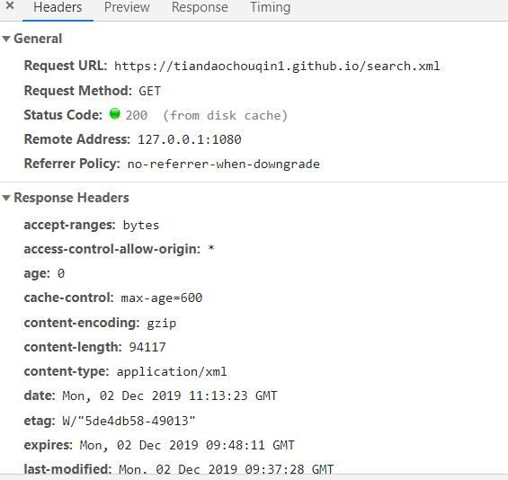
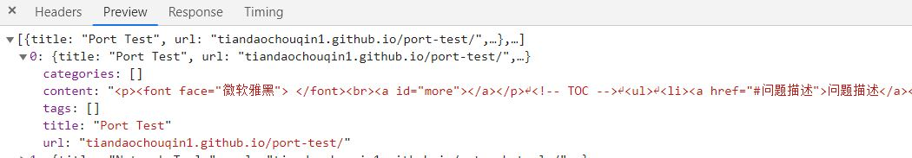

<font face="微软雅黑"> </font>
<center>Hexo Next主题下的一些设置和问题</center>

<!-- more -->


[github pages 文档](https://help.github.com/en/github/working-with-github-pages)
[Hext文档](https://hexo.io/zh-cn/docs/)
[next文档](https://theme-next.iissnan.com/theme-settings.html)

[hexo目录结构小探](https://yuchen-lea.github.io/2016-01-18-hexo-dir-struct/)
[Hexo-NexT 主题个性优化](https://guanqr.com/tech/website/hexo-theme-next-customization/)
https://blog.csdn.net/u011475210/article/details/79023429
https://blog.rytinselver.com/Hexo/31602.html

# 使用命令
`hexo g -d --silent`
只构建被修改的内容。隐藏终端信息。
不需要每次`hexo clean`

`hexo g` 
hexo(node.js程序)会遍历你的 source 目录，建立索引，根据你 theme 文件夹的主题生成页面到 public 文件夹。这时 public 文件夹就是一个纯由 html javascript css 等内容制作的博客，而这些恰好能在 git pages 识别
`hexo d` 
将 public 文件夹的内容复制到临时目录，以 git 方式 push 到 github 的指定项目的指定分支，由 github 进行显示

## 升级前用git备份

## hexo和插件升级
3.9.0->4.2.0
1. 全局升级hexo-cli，先hexo version查看当前版本，然后npm i hexo-cli -g，再次hexo version查看是否升级成功。

2. 使用npm install -g npm-check和npm-check，检查系统中的插件是否有升级的，可以看到自己前面都安装了那些插件

3. 使用npm install -g npm-upgrade和npm-upgrade，升级系统中的插件

4. 使用npm update -g和npm update --save
  --save表示把包安装到当前目录的node_modules问下夹下，我们目前所有的关于Hexo包都是安装在这个目录下的


出现错误。
```
hexo -v
ERROR Plugin load failed: hexo-tag-bootstrap
E:\学习\Plans\Blog\node_modules\hexo-tag-bootstrap\input.js:8
<div class="form-group">
```
重装此插件未解决。卸载后则无错误。

hexo s无法预览。
**搜索失效**

## Next升级

目前使用的hexo next 主题版本为5.1.4，最新为7.5.0。
按照[官方指南](https://github.com/theme-next/hexo-theme-next/blob/master/docs/zh-CN/UPDATE-FROM-5.1.X.md)直接下载，切换为新版本(7.5)，页面空白。

下载6.0.0版本，切换后正常。部分以前的文章页面仍然空白。
可能与标题或文章中的特殊字符有关，比如“-”。
参考文章[hexo+next点击阅读全文显示空白结解决方案](https://xuyin666.github.io/2019/01/02/hexo-next%E7%82%B9%E5%87%BB%E9%98%85%E8%AF%BB%E5%85%A8%E6%96%87%E6%98%BE%E7%A4%BA%E7%A9%BA%E7%99%BD%E7%BB%93%E8%A7%A3%E5%86%B3%E6%96%B9%E6%A1%88/)
部署后可以正常访问，故问题在本地。

# 超链接错误
## 标题栏和侧边栏超链接错误

标题栏的超链接为当前的连接。/友链中超链接错误。
`hexo->_config.yml->relative_link: false`
同时解决部署后的文章的`非第一页的main.css`路径加载错误。


## 文章中超链接跳转错误
文章中超链接需填写完整：`https://www.domain.com`

# 配置搜索功能

[Hexo 添加搜索](https://getiot.tech/hexo/hexo-search.html)
npm install hexo-generator-searchdb --save

# 搜索Loding问题
按照[指南配置](https://github.com/theme-next/hexo-generator-searchdb)好search后无法使用，点击后一直在loading。
添加的搜索功能无法使用，一直处于`Loading` 状态。

https://www.sqlsec.com/2017/12/hexosearch.html

## 问题排查

非[特殊字符问题](https://www.sqlsec.com/2017/12/hexosearch.html)
[](https://pusu.info/2019/03/28/hexo%E5%8D%9A%E5%AE%A2%E6%9C%AC%E5%9C%B0%E6%90%9C%E7%B4%A2%E6%97%A0%E6%B3%95%E4%BD%BF%E7%94%A8/)

F12调试页面，search.xml`状态码200`。未发现错误提示，未找到类似问题的解决方法。




进入[search预览页](https://tiandaochouqin1.github.io/search.xml)提示文档为空：

        This page contains the following errors:
        error on line 1 at column 1: Document is empty
        Below is a rendering of the page up to the first error.

未正确解析`search.xml`,可能是设置的`解析格式不对`。

## 解决
使用`json`格式的search：

  path: search.json
  field: post
  format: json

## 搜索结果跳转链接错误

本地预览时跳转链接错误：`http://localhost:4000/******.github.io/post/`
部署后跳转正常，但是查看跳转链接仍然与本地预览时相同。

----

20200404更新

## 搜索结果的超链接中出现两次根域名

直接将hexo的`config.yml`中的`url`改为`/`。本地预览的链接也正常了。
如下

```
url: /
root: /
permalink: :title/  ##设置网址的格式内容
permalink_defaults: 
```

其他类似问题解决方法：修改`localsearch.swig`.
[local_search 跳转的链接不正确](url: / root: / permalink: :title/  ##设置网址的格式内容 permalink_defaults: )

# 换行符问题
每篇文章都提示：
```
warning: LF will be replaced by CRLF in 
The file will have its original line endings in your working directory
```

CR回车
LF换行

|系统|行末| 对应符号|
|---|---|---|
|Windows/Dos| CRLF| \r\n|
|Linux/Unix |LF |\n|
|MacOS |CR |\r|

https://help.github.com/cn/github/using-git/configuring-git-to-handle-line-endings

在 Git 通过下面的命令关闭转换：
`git config --global core.autocrlf false`
解释：core.autocrlf 是 git 中负责处理 line endings 的变量，可以设置三个值 –true,inout,false.
1. AutoCRLF
```
#提交时转换为LF，检出时转换为CRLF
git config --global core.autocrlf true   
#提交时转换为LF，检出时不转换
git config --global core.autocrlf input   
#提交检出均不转换
git config --global core.autocrlf false

```
2. SafeCRLF
```
#拒绝提交包含混合换行符的文件
git config --global core.safecrlf true   
#允许提交包含混合换行符的文件
git config --global core.safecrlf false   
#提交包含混合换行符的文件时给出警告
git config --global core.safecrlf warn

```

# meta类
## 简化post meta
简化：字数统计、阅读时间、更新于等字段。只留下数字和单位。

`.\themes\next-7\layout\_macro\post.swig`,**post block** 的内容，在最前面。
swig引用了文件`.\themes\next-7\languages\en.yml`

以下为**字数统计**的示例（字数统计需要安装`npm install hexo-symbols-count-time`）：
```
{{- next_inject('postMeta') }}


<br>
  <span class="post-meta-item" title="{{ __('symbols_count_time.count') }}">
    <span class="post-meta-item-icon">
      <i class="fa fa-file-word-o"></i> @@@@@@@这里是图标
    </span>
    
      {###<span class="post-meta-item-text">{{ __('symbols_count_time.count') + __('symbol.colon') }}</span>###}
      <span class="post-meta-item-text"></span> @@@@@@@@名称
    
    <span>{{ symbolsCount(post) }}</span>  @@@@@@值，包括单位
  </span>


```

## 分类

```
{###<span class="post-meta-item-text">{{ __('post.in') }}</span>###}
<span class="post-meta-item-text"></span>

```

## 阅读时间

```
{###<span class="post-meta-item-text">{{ __('symbols_count_time.time') }} &asymp;</span>###}
<span class="post-meta-item-text"></span>

```

去掉阅读时间显示，注释掉：
```

到
 

```

## 更新于/发表于
去掉显示的`Edited`字段，鼠标悬浮在时间上时同时显示创建于更新时间。
```
{##<span class="post-meta-item-text">{{ __('post.edited') }}</span>#}
<span class="post-meta-item-text">{{ __('post.edited') }}</span>
<time title="{{  __('post.modified') + __('symbol.colon') + date(post.updated) + ' ; ' + __('post.created') + __('symbol.colon') + full_date(post.date)}}" itemprop="dateModified" datetime="{{ moment(post.updated).format() }}">{{ date(post.updated) }}</time>

```

**发表与更新只显示一个**

更新时间：meta中加入`updated: date`可手动指定。
发表于/Posted 对应：`.md文档的创建时间`。文档编辑后即有`edited`属性。
updated/edited/modified这三个词在配置中视为同一个。

```
post_meta:
  item_text: false # 不显示edited/posted 等词
  created_at: false 
  updated_at:
    enable: true
    another_day: true # created与updated一致时只显示Created
  categories: true
  
```

也可于config.yml中可隐藏：
```
post_meta:
  item_text: false
```

## 日期格式
博客config.yml:
```
date_format: DD-MM-YYYY 
time_format: HH:mm:s
```


# 间距类
## 文章宽度和间距

找到：`/themes/next/source/css/_variables/base.styl`

分割线间距：
```
//post-eof中使用的变量值
//  .post-expand .post-eof
//  In Muse scheme, margin above and below the post separator
$post-eof-margin-top          = 20px; //  or 160px for more white space;
$post-eof-margin-bottom       = 10px; //  or 120px for less white space;
```

文章宽度：
```
// Layout sizes
// --------------------------------------------------
$content-desktop                = 850px;
$content-desktop-large          = 1000px;
$content-desktop-largest        = 1100px;

$content-desktop-padding        = 20px;
$content-tablet-padding         = 10px;
$content-mobile-padding         = 8px;
```

修改主题色也在`base.styl`

## 站点名背景
source\css\_schemes\Muse\_header.styl：改为与正文背景相同值。
```
.brand {
  background:var(--body-bg-color);
}
```

## 站点前后空白
`\themes\next-7\source\css\_schemes\Muse\_layout.styl`
```
.header-inner {
  align-items: center;
  display: flex;
  padding: 20px 0;//

  +mobile() {
    display: block;
    padding: 10px 0;//
    width: auto;
  }
}
.main-inner {
  padding-bottom: 10px;//
}

.content {
  padding-top: 0px; //

  +mobile() {
    padding-top: 5px;//
  }
}
```
后部分
`source\css\_common\scaffolding\pagination.styl`
```
.pagination {
  border-top: 1px solid $pagination-border;
  margin: 20px 0 0;
  text-align: center;

```

## sidebar宽度
主题配置中，默认被注释：
```
sidebar:
  # Sidebar Position.
  position: left
  #position: right

  # Manual define the sidebar width. If commented, will be default for:
  # Muse | Mist: 320
  # Pisces | Gemini: 240
  width: 270
```

# 自定义样式的方法

## 调试方法

通过浏览器打开你的网站，进入调试模式。
窗口右上角的小箭头定位到需要修改的元素区域，调试台就会显示这一元素的 `CSS` 代码，在source->index中搜索样式名，修改样式则会实时显示。

## 自定义CSS文件
这些自定义样式会添加到原有样式后面。`不会覆盖已有设定`。

Next 7.2 版本后取消了 `\themes\next\source\css\_custom\custom.styl`
使用NexT主题v7.3.0版本的用户请在`hexo/themes/next/_config.yml`中将以下片段：
```
custom_file_path:
  #head: source/_data/head.swig
  #header: source/_data/header.swig
  #sidebar: source/_data/sidebar.swig
  #postMeta: source/_data/post-meta.swig
  #postBodyEnd: source/_data/post-body-end.swig
  #footer: source/_data/footer.swig
  #bodyEnd: source/_data/body-end.swig
  #variable: source/_data/variables.styl
  #mixin: source/_data/mixins.styl
  #style: source/_data/styles.styl
```

## 启用数据目录
尽量把涉及自定义改动的地方挪到该目录，保持 Next 源文件的干净，便于升级和维护。
可考虑通过 `git pull` 升级 NexT 主题。

在 `hexo/source/_data` 目录下新建 `next.yml` 文件，把 Next 的主题配置文件 next/_config.yml修改以下位置,内容全部复制到 next.yml.
```
# If false, merge configs from `_data/next.yml` into default configuration (rewrite).
# If true, will fully override default configuration by options from `_data/next.yml` (override). Only for NexT settings.
# And if true, all config from default NexT `_config.yml` must be copied into `next.yml`. Use if you know what you are doing.
# Useful if you want to comment some options from NexT `_config.yml` by `next.yml` without editing default config.
- override: false
+ override: true
```
这样设置后，以后关于 Next 主题的配置就在 next.yml 里修改，next.yml 的会覆盖 next/_config.yml 的内容，遇到 Next 版本更新时，只需要把新版本改动到的_config.yml 配置合并到 next.yml 即可，不需要全部重写，

# 文章加密
使用hexo-blog-encrypt


# 内置标签

```
<!-- HTML方式: 直接在 Markdown 文件中编写 HTML 来调用 -->
<!-- 其中 class="blockquote-center" 是必须的 -->
<blockquote class="blockquote-center">blah blah blah</blockquote>

<!-- 标签 方式，要求版本在0.4.5或以上 -->
blah blah blah

<!-- 标签别名 -->
 blah blah blah 
```
效果如下：
<!-- HTML方式: 直接在 Markdown 文件中编写 HTML 来调用 -->
<!-- 其中 class="blockquote-center" 是必须的 -->
<blockquote class="blockquote-center">blah blah blah</blockquote>

<!-- 标签 方式，要求版本在0.4.5或以上 -->
blah blah blah

<!-- 标签别名 -->
 blah blah blah 

## Bootsrap callout

```
 Content (md partial supported) 
```
 Content (md partial supported) 
其中，class_name 可以是以下列表中的一个值：
`default、primary、success、info、warning、danger`

# 添加自定义页面
跳过渲染：
1. 文件头部添加如下内容：

```
---
layout: false
---

```
2. 根目录_config.yml

```
skip_render: projects/**

```
## FODI放到同一个仓库。
 FODI的前端只是一个纯html文件。source文件夹下新建文件夹onedrive，并放入fodi.html文件，跳过渲染。
主题配置中，`menu->  NetDisk: /onedrive/ || download`。

# 总结
[三段式主题](https://github.com/yelog/hexo-theme-3-hexo)
[一个简洁优雅的hexo主题](https://github.com/litten/hexo-theme-yilia)

**注意版本问题**；版本不同时不要过多尝试。
目前72篇文章，更改两篇文章后`hexo g`需要10s+,`hexo clean&&hexo d -g`需要105 s,考虑迁移到hugo。
