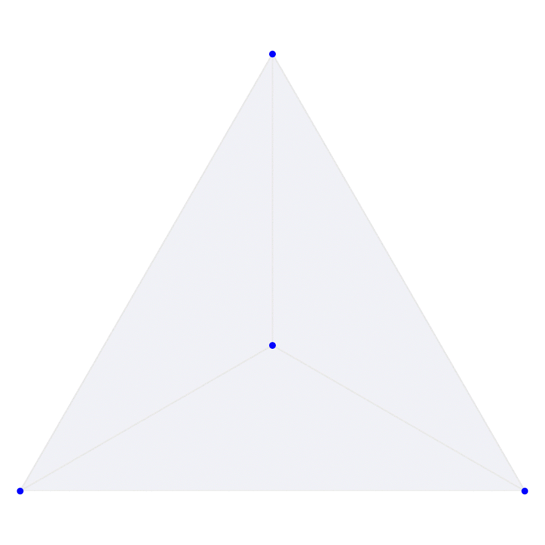
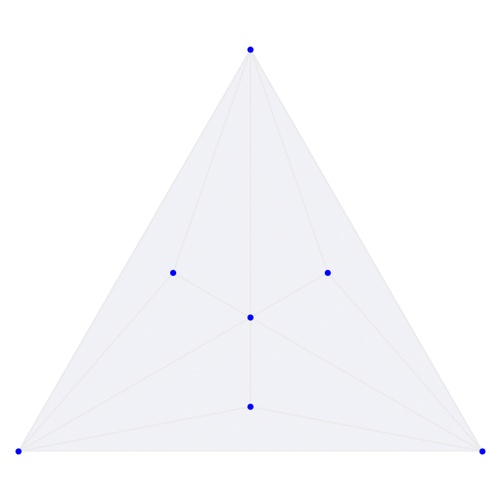
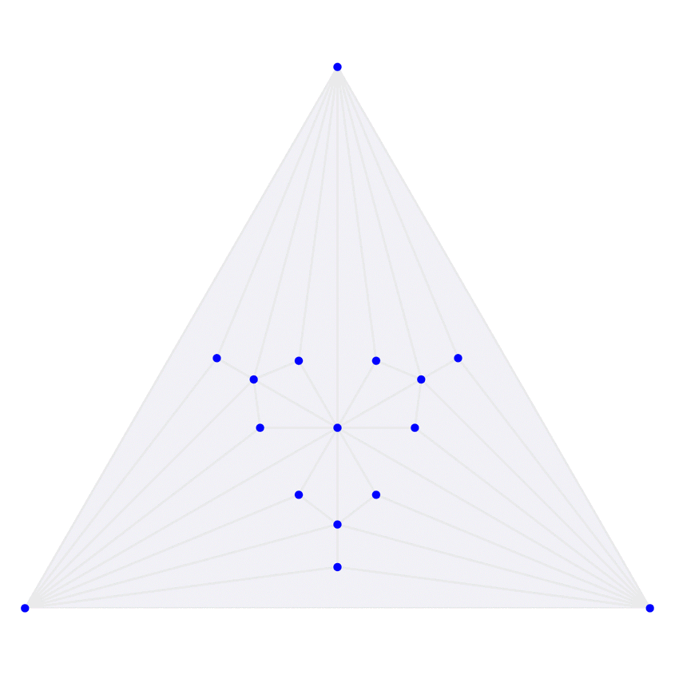
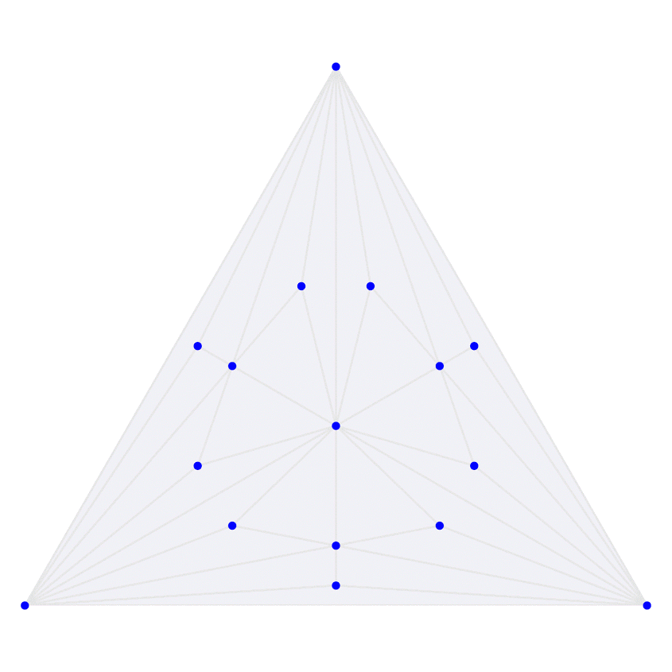
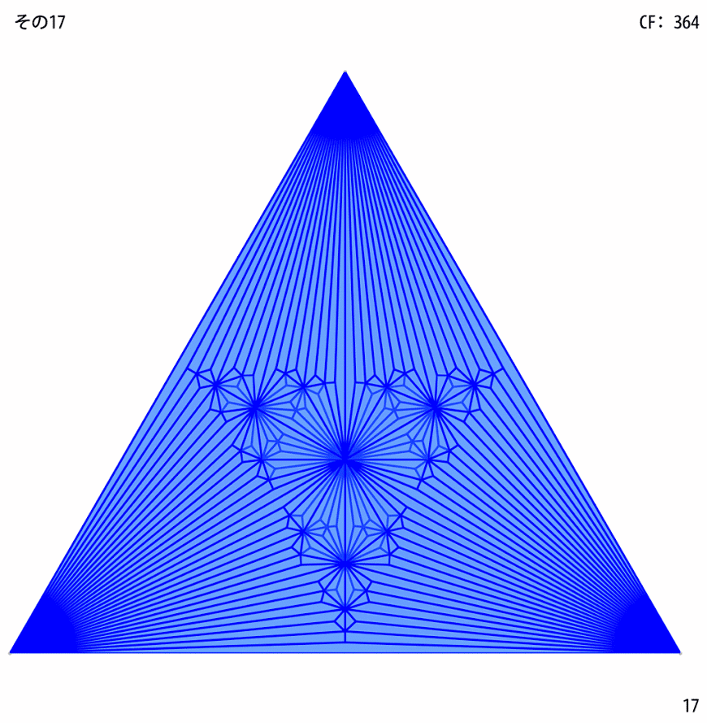

 

Ingress游戏归档

<!-- more -->

<!-- TOC -->

- [前言](#前言)
- [常用工具](#常用工具)
- [多重](#多重)

<!-- /TOC -->

[参考](https://mp.weixin.qq.com/s?__biz=MzU0OTAzNTY4OA==&mid=2247484020&idx=1&sn=99c6c5c7a1f4f84118d82d0c03f6ffa7&chksm=fbb749b3ccc0c0a545e4d99f06c4deede908f7ca086358d56cbac47584e7d5c29f9e7689469d)

# 前言

17年开始玩的一个游戏，现在已经没落，大概游戏的生命周期到了。故把以前收集的相关资料备份一下。

# 常用工具
这些网站几乎包含了游戏的方方面面。

1. Ingress Intel Map（官方地图网站，中国地图有偏移，可以在网页上安装 iitc 插件纠偏，也可以在各大应用商店搜索 iitc 下载使用）
https://www.ingress.com/intel
https://iitc.me
2. Agent Stats（展示 Ingress 中个人数据进展的网站）
https://www.agent-stats.com/

3. Maxfield（规划多重网站）
http://www.ingress-maxfield.com/index.php

4. A Simple Guide to Multi-layering（简易多重说明）
https://docs.google.com/document/d/1A3Yyb4Z_Z4LksF1RMF4nIGRzOIy4PFbxR1es5gRoVec

5. AQMissionHelper（覆盖两大任务查询网站：ingressmm 和 ingressmosaik，有地图纠偏和路径导航功能；为微信用户提供小程序「AQMissionHelper」，为 Telegram 用户提供 @today520_bot，为 iOS 用户提供网页版，为 Android 用户提供应用）
http://imaq.cn/mh/
https://ingressmm.com
https://ingressmosaik.com
https://t.me/today520_bot

6. Mission Banner Cropper（拼图任务裁剪工具）
http://www.giacintogarcea.com/ingress/tools/missionset/
https://mission-author-dot-betaspike.appspot.com/

7. 任务申请入口
https://mission-author-dot-betaspike.appspot.com/

8. Glyph Image Maker - Ingress Glyph Tools
https://gm9.github.io/ingress-glyph-tools/example-glyph-image-maker.html

9. Passcode 网页自动兑换脚本
https://gist.github.com/idealhack/87822642eac5247e4fd9a04dff308d5c

10. Ingress Passcode Channel（请在 Telagram 上关注）
https://t.me/enlpasscode

11. BioCard PSD 模版（模版有 2016 和 2017 两个版本，附素材）
https://drive.google.com/drive/folders/0ByTHE2FaB4oQbjNuRHdoS1ZMNW8

12. Biocard 2016 制作指南
https://cuter44.gitbooks.io/biocard-2016-making-cn/

13. 2016 BioCard 制作资料（请在 Telagram 上关注）
https://t.me/biocard2016

14. Ingress Enlightened Fan site（绿军查询 Met 网站，用谷歌账号登录）
https://ingress.pub/

15. Ingress 剧情介绍（中文翻译请在 Telegram 上关注）
http://investigate.ingress.com/
https://t.me/IngressStoryCHN

16. Portal Asist Bot（可以查询附近 Portal，通过名称搜索 Portal，设置 Portal 充电提醒等，请在 Telagram 上关注）
https://t.me/PortalAssistBot

17. Guardian of Agent（查成就网站，仅供参考，结果非常不准）
https://ingress-intel.com/agent/

# 多重

竹笋：区域内每处的field层数相同

