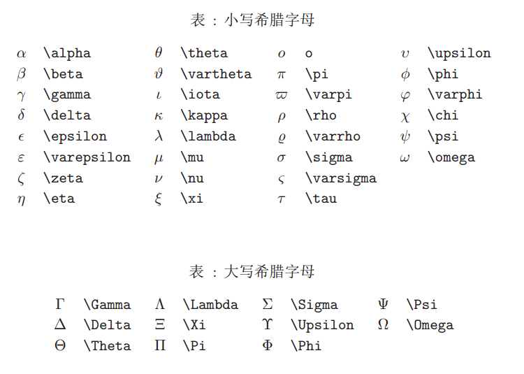

<font face="微软雅黑"> </font>
<center> GIthubPages 的markdown </center>

<!-- more -->
- [VS Code](#vs-code)
  - [Markdown ShortCuts](#markdown-shortcuts)
- [文本语法](#文本语法)
  - [功能快捷键](#功能快捷键)
  - [标题](#标题)
  - [文本的样式](#文本的样式)
  - [链接与图片](#链接与图片)
  - [代码片](#代码片)
  - [列表](#列表)
  - [数学公式](#数学公式)
    - [字母上标](#字母上标)
    - [希腊字母](#希腊字母)
- [表格与注释](#表格与注释)
  - [表格](#表格)
    - [居中、居左、居右](#居中居左居右)
  - [注脚](#注脚)
  - [注释](#注释)
- [mermaid图](#mermaid图)


<head>
    <script src="https://cdn.mathjax.org/mathjax/latest/MathJax.js?config=TeX-AMS-MML_HTMLorMML" type="text/javascript"></script>
    <script type="text/x-mathjax-config">
        MathJax.Hub.Config({
            tex2jax: {
            skipTags: ['script', 'noscript', 'style', 'textarea', 'pre'],
            inlineMath: [['$','$']]
            }
        });
    </script>
</head>


>参考手册：[一份不太简短的LaTeX介绍_PDF](../files/一份不太简短的LaTeX介绍.pdf)
https://www.latex-tutorial.com/

# VS Code
安装插件：
- `Markdown all in one`：基本
- `Markdown Shortcuts`：快捷键
- `Markdown Toc`：目录
- `Markdown Preview Enhanced`：预览，pdf/html等
- `markdownlint`：语法

## Markdown ShortCuts

| 命令 | 功能 | 快捷键 |
| ---- | ---- | ---- |
|md-shortcut.showCommandPalette | 显示所有命令 | ctrl+M ctrl+M|
|md-shortcut.toggleBold | 加粗 **bold** | ctrl+B|
|md-shortcut.toggleItalic | 斜体  Make _italic_ | ctrl+I|
|md-shortcut.toggleStrikethrough | 删除线 Make ~~strikethrough~~ | |
|md-shortcut.toggleLink | 超链接Make [a hyperlink] (www.example.org) | ctrl+L|
|md-shortcut.toggleImage | 图片引用 Make an image ![] (image_url.png) | ctrl+shift+L|
|md-shortcut.toggleCodeBlock | 代码块 Make  | ctrl+M ctrl+C|
|md-shortcut.toggleInlineCode | 行内代码 Make `inline code` | ctrl+M ctrl+I|
|md-shortcut.toggleBullets | 无序列表 Make * bullet point | ctrl+M ctrl+B|
|md-shortcut.toggleNumbers | 有序列表 Make 1. numbered list | ctrl+M ctrl+1|

-------

# 文本语法
文本之间的间距会自动优化，即手动回车多行无效。 
需输入手动空行符：`</br>`

## 功能快捷键
键盘命令的格式：
< kbd >Ctrl/Command< /kbd >

撤销：<kbd>Ctrl/Command</kbd> + <kbd>Z</kbd>
重做：<kbd>Ctrl/Command</kbd> + <kbd>Y</kbd>
加粗：<kbd>Ctrl/Command</kbd> + <kbd>B</kbd>
斜体：<kbd>Ctrl/Command</kbd> + <kbd>I</kbd>
标题：<kbd>Ctrl/Command</kbd> + <kbd>Shift</kbd> + <kbd>H</kbd>
无序列表：<kbd>Ctrl/Command</kbd> + <kbd>Shift</kbd> + <kbd>U</kbd>
有序列表：<kbd>Ctrl/Command</kbd> + <kbd>Shift</kbd> + <kbd>O</kbd>
检查列表：<kbd>Ctrl/Command</kbd> + <kbd>Shift</kbd> + <kbd>C</kbd>
插入代码：<kbd>Ctrl/Command</kbd> + <kbd>Shift</kbd> + <kbd>K</kbd>
插入链接：<kbd>Ctrl/Command</kbd> + <kbd>Shift</kbd> + <kbd>L</kbd>
插入图片：<kbd>Ctrl/Command</kbd> + <kbd>Shift</kbd> + <kbd>G</kbd>

## 标题

直接输入1次<kbd>##</kbd>，并按下<kbd>space</kbd>后，将生成1级标题。
输入2次<kbd>##</kbd>，并按下<kbd>space</kbd>后，将生成2级标题。
以此类推，我们支持6级标题。有助于使用`TOC`语法后生成一个完美的目录。

## 文本的样式

*强调文本* _强调文本_

**加粗文本** __加粗文本__

==标记文本==

~~删除文本~~

> 引用文本

H~2~O is是液体。

2^10^ 运算结果是 1024.

## 链接与图片

```
链接: [link](https://mp.csdn.net).

```
链接: [link](https://mp.csdn.net).


```

```


图片: 


## 代码片


```javascript
// An highlighted block
var foo = 'bar';
```

## 列表

- 项目
  - 项目
    - 项目

1. 项目1
2. 项目2
3. 项目3

- [ ] 计划任务
- [x] 完成任务

## 数学公式

vscode可正常预览，默认生成的html不支持公式。
[解决方法](https://stackoverflow.com/questions/26275645/how-to-support-latex-in-github-pages)之一：借用MathJax帮助渲染(慢)，在需要渲染公式的md文档标题后面/正文前面加入以下：
```
<head>
    <script src="https://cdn.mathjax.org/mathjax/latest/MathJax.js?config=TeX-AMS-MML_HTMLorMML" type="text/javascript"></script>
    <script type="text/x-mathjax-config">
        MathJax.Hub.Config({
            tex2jax: {
            skipTags: ['script', 'noscript', 'style', 'textarea', 'pre'],
            inlineMath: [['$','$']]
            }
        });
    </script>
</head>

```

与latex语法基本一致。
`$$`独占一行`$$ abs $$`;
`$`行内公式`$ abs $`

```
\hat{f}(\xi)=\int_{-\infty}^{+\infty} f(x) e^{2 \pi i x \xi} dx 
```
$$ \hat{f}(\xi)=\int_{-\infty}^{+\infty} f(x) e^{2 \pi i x \xi} dx  $$

> 你可以找到更多关于的信息 **LaTeX** 数学表达式[here][1].

### 字母上标
```
加^号 输入\hat  或 \widehat

加横线 输入 \overline

加波浪线 输入 \widetilde

加一个点 \dot{要加点的字母}
加两个点\ddot{要加点的字母}

```

### 希腊字母




# 表格与注释
## 表格
表格前面需要空一行

项目 | Value
-------- | -----
电脑  | $1600
手机  | $12
导管  | $1

### 居中、居左、居右
使用`:---------:`居中
使用`:----------`居左
使用`----------:`居右

| 第一列 | 第二列 | 第三列 |
|:-----------:| -------------:|:-------------|
| 居中 | 居右  | 居左 |

(githubpages中失效？)

## 注脚

一个具有注脚的文本。[^2]

[^2]: https://webxp.ml

## 注释

<!--超文本标记语言-->
[comment]: <> (This is a comment, it will not be included in  the output file unless you use it ina reference style link.)
[//]: <> (This is also a comment.)
[//]: # (This may be the most platform independent comment)
```
<!--超文本标记语言--> (not be included in  the output)
[comment]: <> (not be included in  the output file unless you use it ina reference style link.)
[//]: <> (This is also a comment.)
[//]: # (This may be the most platform independent comment)
```


# mermaid图
[mermaid](https://mermaidjs.github.io/)支持用 markdown 撰写 流程图，时序图，甘特图，类图 等。
对hexo不友好。hexo的插件：[hexo-filter-mermaid-diagrams](https://github.com/webappdevelp/hexo-filter-mermaid-diagrams)； [配置方法](https://cloud.tencent.com/developer/article/1688180)。


 [1]: http://meta.math.stackexchange.com/questions/5020/mathjax-basic-tutorial-and-quick-reference

