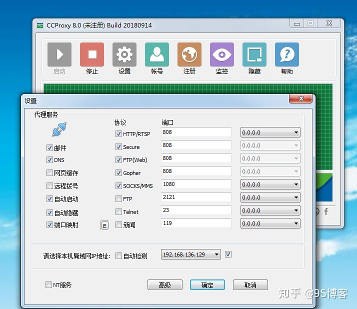

 

为局域网设备提供代理上网服务的几种方法

<!-- more -->
<!-- TOC -->

- [需求](#需求)
- [两种方式](#两种方式)
- [路由转发模式](#路由转发模式)
- [代理服务器模式](#代理服务器模式)

<!-- /TOC -->
***

# 需求

设备通过局域网内的一台可上网的主机上网。

# 两种方式

[两种方法突破局域网封锁](https://zhuanlan.zhihu.com/p/47877486).
两种方法均不可行（测试网站中只能打开淘宝）。原因可能是校园网对局域网内网络端口的限制。

# 路由转发模式

在路由转发模式中，我们在白名单电脑上做的事情很简单，只需要开启转发模式即可。

LINUX系统开启IPV4转发功能

        echo "1" > /proc/sys/net/ipv4/ip_forward
        Windows系统开启IPV4转发功能

在注册表编辑器中，定位以下注册表项：
        HKEY_LOCAL_MACHINE/SYSTEM/CurrentControlSet/Services/Tcpip/Parameters
选择下面的项目：
        IPEnableRouter:REG_DWORD:0x0 
要对该计算机安装和使用的所有网络连接都启用 IP 转发，请指定值为 1。 
要对该计算机安装和使用的所有网络连接都关闭 IP 转发，请指定值为 0。
注意，windows修改注册表后需要重启，而linux则不需要。

在客户端中，我们只需要将网关设置为可上网PC的IP即可，此时可上网PC处于路由模式，等同于一台路由器。

# 代理服务器模式

CCProxy代理服务器软件 Proxifier全局流量代理软件
如果是linux用户，可以使用$$(指代)服务端与客户端搭建，效果相同。

此网络模式跟上面的方法也没有任何区别，都不会影响局域网内的访问。

