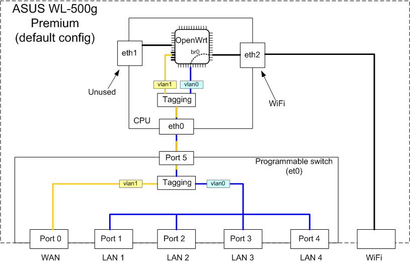
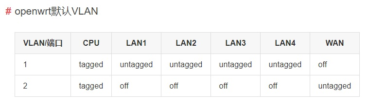

<font face="微软雅黑"> </font>
<center>旁路由、VLAN、多路由器级联/串联</center>

<!-- more -->
<!-- TOC -->

- [非VLAN方案的三种模式](#非vlan方案的三种模式)
    - [手动切换模式](#手动切换模式)
    - [全局](#全局)
    - [全局（强制DHCP）](#全局强制dhcp)
- [VLAN方案](#vlan方案)
    - [内部结构图](#内部结构图)
    - [端口三个状态](#端口三个状态)
    - [openwrt默认VLAN](#openwrt默认vlan)
- [多台路由器如何串联（级联）](#多台路由器如何串联级联)
    - [WDS（无线桥接）](#wds无线桥接)
    - [当AP（无线交换机）使用](#当ap无线交换机使用)
    - [搭建新网络（子网络）](#搭建新网络子网络)
- [网络配置](#网络配置)
    - [有线网配置](#有线网配置)
    - [无线网络配置](#无线网络配置)

<!-- /TOC -->
***
转载自[关于 N1 旁路由的设置](https://instar.me/archives/e806f8ac.html)
[N1 OpenWRT 当旁路由设置教程](https://www.maxlicheng.com/openwrt/65.html)

# 非VLAN方案的三种模式

## 手动切换模式

**主路由开 DHPC + N1 关 DHPC (非全局）**

该配置下，用户需要手动设置需要 N1 **服务设备的网关和DNS**，对于未设置的设备只使用主路由功能。
应用场景：家庭环境中，我只需要我自己的设备科学上网，其他家人设备不需要，因为个别机场会有BT、迅雷、360等审计规则，避免家人设备不慎触发规则，可以自定义需求。

设置步骤

        主路由无需做任何变动。
        N1 网口直连电脑，网络地址使用DHCP自动获取。
        浏览器打开 192.168.1.1，进入Openwrt，默认账户名root，密码 password 。
        点击「网络」-「接口」-「修改 br-lan接口」，将静态 IPv4 地址修改为主路由网段中的一个地址，例如 192.168.1.2。
        再将网关设置为主路由地址，例如 192.168.1.1。
        IPv4 广播设置为 192.168.1.255。
        DNS 地址根据本地网络情况设置。
        同时下方「DHCP服务器」，勾选「忽略此接口」。
        保存并应用配置，然后将 N1 连接到主路由的 LAN 口。

        手动指定需要 N1 服务的设备，网关地址和 DNS 服务器为192.168.1.2。

## 全局

**主路由开 DHPC + N1 关DHPC (全局)**
该配置下，所有设备都会使用 N1 作为网关和 DNS 服务。

方法一

        N1 的设置与模式一相同。
        进入主路由，将主路由的 DHCP 的默认网关修改为192.168.1.2，同时将 DNS 服务器也修改为 192.168.1.2。

方法二（适用于主路由为Openwrt）

        N1 的设置与模式一相同。
        进入主路由，「网络」-「接口」-「LAN」-「DHCP 服务器」-「高级设置」
        在「DHCP 选项」中，添加两条参数，3,192.168.1.2，6,192.168.1.2 。
        保存并应用配置即可。

## 全局（强制DHCP）

**主路由开 DHPC + N1 开 DHPC (全局)**

该配置下，N1 会成为首选 DHCP 服务器，主路由 DHCP 只用于给 N1 分配地址

        设置步骤
        主路由无需设置
        N1 设置与模式一基本相同，但是，「DHCP服务器」取消勾选「忽略此接口」
        「高级设置」中，勾选「强制」
        保存并应用配置。

PS：我尝试过该配置，不太稳定，有时候 DHCP 地址还是会分配在主路由下面，因此该种方法只作为参考

# VLAN方案

[交换机手册](https://oldwiki.archive.openwrt.org/zh-cn/doc/uci/network/switch)
[Openwrt官网 Vlan](https://openwrt.org/start?id=docs/guide-user/network/vlan/switch_configuration)

## 内部结构图



## 端口三个状态

**标记（tagged）**：对数据进行VLAN ID标记，标记的端口可属于多个VLAN，类似于中继端口，因为同属多个VLAN， 所以数据必须要进行标记才能进行正确的转发。
**未标记(untagged)**：不对数据进行VLAN ID标记，只会处理这个接口所属VLAN的数据，这个接口中的设备都不会有VLAN的概念，这些设备会认为他们都是一个广播域中的设备，未标记的接口只能属于一个VLAN。
**关闭（off）**：处于这个状态的端口，不会处理该VLAN中的任何数据

## openwrt默认VLAN



因为CPU要处理所有VLAN的数据，所以CPU在所有VLAN中的状态均为tagged，WAN是独立的VLAN，不与其他端口通信，如果要通信均需要通过路由处理，所以在VLAN2中WAN为untagged，其他端口均为off。

# 多台路由器如何串联（级联）

转自[TP-LINK多台路由器如何串联（级联）](https://service.tp-link.com.cn/detail_article_89.html)

## WDS（无线桥接）

**适用环境：**

家庭或办公环境中，原有路由器信号强度较弱，为了增强无线信号的覆盖范围，多台无线路由器通过WDS无线桥接组网。

**组网后的效果：**

多台路由器都在同一局域网，电脑连接任何路由器的LAN口都可以上网，无线终端连接信号后可以漫游，达到信号增强的目的。

**简要设置方法：**

1. 确认前端主路由器的无线信号名称、密码；

2. 登录新路由器的管理界面；

3. 开启WDS桥接扫描**桥接前端主路由的无线信号**；

4. 记录新路由器的管理IP地址；

设置成功，连接上网。

## 当AP（无线交换机）使用

**适用环境：**

家庭或办公环境中，原有的有线路由器无法提供Wi-Fi信号，现在需要在原有的有线网络上增加无线，将新增路由器当无线AP使用。

**组网后的效果**：

网络中增加了无线信号，手机、Pad可以连接无线信号上网；所有终端在同一局域网，属于同一网段，可以相互访问。

**简要设置步骤：**

1. 登录新路由器的管理界面；

2. 更改管理IP地址

3. 设置无线名称和密码；

4. 关闭DHCP服务器；

5. 使用网线将LAN口连接到前端网络；

设置成功，连接上网。

不同型号的路由器设置方法略有差异，请根据路由器的实际型号，参考相应的设置文档：如何设置当作无线交换机使用？

## 搭建新网络（子网络）

**适用环境：**

要接入邻居、房东或者公司网络，将新增的路由器当作独立的路由器使用。

**组网后的效果：**

路由器下的终端均可以上网，且该路由器下的网络是一个小型的局域网（子网络），前端网络无法访问到您的终端，就像拉了一条宽带给您上网。

**简要设置步骤：**

1. 复位新增的路由器；

2. 按照的拓扑图连接线路并登录新路由器的界面(连接新路由器的Wan口)；

3. 设置无线名称与密码；

4. 修改管理地址为其他网段（新购买的路由器无需该操作）；

5. 重启路由器；

设置成功，连接上网。

# 网络配置

本部分转自[老高](https://blog.phpgao.com/openwrt-interface.html)

## 有线网配置

openwrt的有线网络配置文件位于`/etc/config/network`：

```C++
config interface 'loopback'
option ifname 'lo'
option proto 'static'
option ipaddr '127.0.0.1'
option netmask '255.0.0.0'

config globals 'globals'
option ula_prefix 'auto'

config interface 'lan'
option ifname 'eth0.1'
option force_link '1'
option type 'bridge'
option proto 'static'
option ipaddr '192.168.1.1'
option netmask '255.255.255.0'
option ip6assign '60'
option macaddr '64:09:80:05:e1:bb'

config interface 'wan'
option ifname 'eth0.2'
option _orig_ifname 'eth0.2'
option _orig_bridge 'false'
option proto 'pppoe'
option macaddr '64:09:80:05:e1:bc'
option username '11100026295'
option password '380926'

config interface 'wan6'
option _orig_ifname '@wan'
option _orig_bridge 'false'
option proto '6to4'

config switch
option name 'mt762x'
option reset '1'
option enable_vlan '1'

config switch_vlan
option device 'mt762x'
option vlan '1'
option ports '0 1 2 3 5 6t'

config switch_vlan
option device 'mt762x'
option vlan '2'
option ports '4 6t'
```

## 无线网络配置

openwrt的无线网络配置文件位于/etc/config/wireless，老高的配置如下：

```C++
config wifi-device 'rai0'
option type 'mt7612'
option mode '14'
option channel 'auto'
option txpower '100'
option ht '20+40+80'
option country 'US'
option disabled '0'

config wifi-iface
option device 'rai0'
option network 'lan'
option mode 'ap'
option ssid 'BYBY_WORLD'
option encryption 'psk2'
option key 'xxx'

config wifi-device 'ra0'
option type 'rt2860v2'
option mode '9'
option channel 'auto'
option txpower '100'
option ht '40'
option country 'US'
option disabled '0'

config wifi-iface
option device 'ra0'
option network 'lan'
option mode 'ap'
option wps 'pbc'
option ssid 'HELLO_WORLD'
option encryption 'psk2'
option key 'xxx'
```
