<font face="微软雅黑"> </font>
<center> </center>

<!-- more -->
- [操作系统与LINUX](#操作系统与linux)
  - [Linux启动](#linux启动)
  - [进程与线程](#进程与线程)
    - [基本概念](#基本概念)
    - [进程间通信方式](#进程间通信方式)
    - [共享内存](#共享内存)
    - [线程安全与可重入](#线程安全与可重入)
    - [并发与井行](#并发与井行)
  - [异常的类别](#异常的类别)
  - [RAM](#ram)
    - [CAM](#cam)
    - [DRAM](#dram)
    - [SRAM](#sram)
    - [PLD](#pld)
  - [DMA](#dma)
    - [DMA机制在TCP/IP协议模型中的位置](#dma机制在tcpip协议模型中的位置)
    - [ISR](#isr)
  - [伪随机数](#伪随机数)
  - [getchar()与标准输入](#getchar与标准输入)
  - [芯片相关](#芯片相关)
    - [芯片分类](#芯片分类)
    - [MeltDown和Spectre](#meltdown和spectre)
  - [系统调用](#系统调用)
  - [函数调用栈帧](#函数调用栈帧)
- [C语言](#c语言)
  - [声明与定义](#声明与定义)
  - [宏与内联函数](#宏与内联函数)
  - [数据类型](#数据类型)
    - [数据类型与转换](#数据类型与转换)
    - [类型检查](#类型检查)
    - [存储类型关键字](#存储类型关键字)
  - [数组](#数组)
    - [变长数组和柔性数组](#变长数组和柔性数组)
    - [行指针和列指针](#行指针和列指针)
  - [内存管理](#内存管理)
  - [字符集合与字符编码](#字符集合与字符编码)
  - [回调与函数指针](#回调与函数指针)
  - [++i与i++](#i与i)
  - [结构体](#结构体)
    - [指针与结构体](#指针与结构体)
    - [定义](#定义)
    - [赋值](#赋值)
    - [对齐](#对齐)
- [GCC与汇编](#gcc与汇编)
  - [AT&T(gcc)与Intel汇编的区别](#attgcc与intel汇编的区别)
  - [include](#include)
  - [gcc vs g++](#gcc-vs-g)
  - [浮点数](#浮点数)
  - [原码反码补码移码](#原码反码补码移码)
    - [溢出判断](#溢出判断)
- [嵌入式](#嵌入式)
  - [重要概念](#重要概念)
    - [FPGA](#fpga)
    - [单/双口RAM](#单双口ram)
    - [BSP](#bsp)
    - [AVS](#avs)
  - [嵌入式系统](#嵌入式系统)
  - [协议](#协议)
  - [串行总线协议](#串行总线协议)
  - [AXI](#axi)
- [网络](#网络)
  - [socket原理](#socket原理)
    - [TCP数据流和UDP数据报](#tcp数据流和udp数据报)
  - [重要协议](#重要协议)
    - [uPNP](#upnp)
    - [1588协议](#1588协议)
    - [空口](#空口)
    - [多生成树协议？](#多生成树协议)
    - [XGMII](#xgmii)
  - [字节序](#字节序)
  - [环回](#环回)
  - [DDOS](#ddos)
  - [相关算法](#相关算法)
    - [Dijkstra算法](#dijkstra算法)
    - [非对称加密](#非对称加密)
    - [卡特兰数](#卡特兰数)
  - [DPDK](#dpdk)
    - [DPDK旁路原理](#dpdk旁路原理)
    - [UIO原理](#uio原理)
    - [核心优化PMD](#核心优化pmd)
- [总结](#总结)


<head>
    <script src="https://cdn.mathjax.org/mathjax/latest/MathJax.js?config=TeX-AMS-MML_HTMLorMML" type="text/javascript"></script>
    <script type="text/x-mathjax-config">
        MathJax.Hub.Config({
            tex2jax: {
            skipTags: ['script', 'noscript', 'style', 'textarea', 'pre'],
            inlineMath: [['$','$']]
            }
        });
    </script>
</head>


# 操作系统与LINUX
## Linux启动
BIOS -> Boot ->  Kernel Init程序 -> Rcs启动用户态程序。

1. 内核文件
ulmage 内核镜像+dtb设备描述符+ramdisk文件系统
vmlinux 是原始内核文件-zImage是ARMLinux常用的一种压缩映像文件,ulmage是U-boot专用的映像文件，它是在zmage之前加上一个长度为0x40的“头”，说明这个映像文件的类型、加载位置、生成时间、大小等信息。

2. elf
ELF (ExeculableandLinking Format 可执行可链接格式)，是一个开放标准,各种UNIX系统的可执行文件都采用ELF格式,它有三种不同的类型:
- o: Relocatable可重定位的目标文件;
- .so: ShareObject共享库文件: 
- exe: Executable 可执行文件


## 进程与线程
### 基本概念
进程:资源管理的单位，用于隔离各个实体线程:调度单元，内核以线程的粒度来调度系统。
进程调度算法:先来先服务、最短作业优先、高响应比优先、时间片轮转


### 进程间通信方式

1. 管道
写入的数据在内核缓存中。单向，先进先出。数据是无格式的流。
匿名管道：是存在内存中的特殊文件。存在父子关系的进程间通信。
命名管道（FIFO）：文件系统中一个类型为p的设备文件。无亲缘关系的进程间。

2. 消息队列
是保存在内核的消息链表。有格式，用户可自定义消息体的数据类型。
每次数据读取和写入均需经过用户态与内核态之间的拷贝。

3. 共享内存
将进程的虚拟地址空间映射到同一物理内存。无数据拷贝的开销。
多线程竞争同个资源造成数据错乱的问题。

4. 信号量
是一个计数器，表示资源的个数。通过两个原子操作：P操作（-）和V操作（+）。
互斥访问，保护共享资源。确保任何时刻只有一个进程访问共享资源。可用于线程间。
1-互斥信号量；0-同步信号量。

5. 信号
是进程间通信中唯一的异步通信机制。信号可以在应用进程和内核之间直接交互。
硬件来源（如Ctrl+C）;软件来源（kill 命令）。

6. 通信
网络IPC，不同计算机的进程相互通信。可以采用许多不同的网络协议进行通信，如TCP/IP协议栈。
API：socket() 创建。bind() 关联套接字地址结构。close() 释放分配的资源。listen、accept等。

### 共享内存
1. [世上最好的共享内存(Linux共享内存最透彻的一篇)](https://mp.weixin.qq.com/s/ss_q3uRKRknxdonaoPQZJg)

共享内存属于匿名页，被mount为tmpfs，shijishang会被统计到page cache(free名的cached项)。

`tmpfs           480M     0  480M   0% /dev/shm`

1. SYS V: ftok - shmget - shmat - shmdt。
2. POSIX: shm_open/open - mmap - munmap 。关键是mmap——将file映射到内存。
3. memfd_create - socket 。操作匿名文件，具带权限控制。
   
   memfd_create() creates an anonymous file and returns a file descriptor that refers to it.  The file behaves like a regular file
  
4. dma_buf：实现buffer在多个设备的共享，应用可以把一片底层驱动A的buffer导出到用户空间成为一个fd，也可以把fd导入到底层驱动 B。
   
   The DMABUF framework provides a generic method for sharing buffers between multiple devices. 


### 线程安全与可重入

编写可重入函数时，若使用全局变量，则应通过信号量（即P、V操作）等手段对其加以保护。未施加保护时，当多个进程调用此函数时，很有可能使有关全局变量变为不可知状态。

kill：发送信号到进程，-number指定信号类别。信号将进程作为一个整体对待。
pthread_kill：函数，在同进程的线程中使用。

### 并发与井行
并发:系统支持两个或多个动作同时存在,不一定要同时执行。可以是多线程或单线程
并行:系统支持两个或多个动作同时执行


## 异常的类别

中断：来自I/O设备；异步；总是返回到下一条指令。
陷阱：有意的异常；同步；总是返回到下一条指令。实现系统调用（syscall导致一个陷阱，然后对应的异常处理程序则调用适当的内核程序）

故障：潜在可恢复错误（如缺页错误）；同步；返回当前指令或不返回。

终止：不可恢复的错误（如DRAM/SRAM位损坏时的奇偶错误）；同步；不返回。


## RAM

### CAM
内容可寻址内存。单周期搜索，读取和写入操作。在芯片中集成。
二进制 CAM (BCAM) 和三进制 CAM (TCAM)。BCAM 是最简单的 CAM 类型，因为它们在存储的字符中仅使用 1 和 0。TCAM 还支持在搜索字符中含有第三种匹配状态，即一个或多个数位的 X 或“无关”（使用mask实现）。

全并行 CAM 中的每个单独的存储位都必须具有与自身相关的比对电路，以检测存储位和输入位之间的匹配情况。

基于 CAM 的搜索等同于并行比对所有内容，然后返回所有比对成功的地址，使用优先级选路器选择其中一个。需要更大的面积和能耗。

### DRAM
对干扰敏感，需要周期性刷新以保持电荷。1MOS电容+1MOS晶体管。

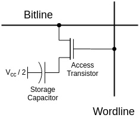

http://www.wowotech.net/basic_tech/307.html

SDRAM：Synchronous Dynamic Random Access Memory，同步动态随机存储器，同步是指Memory工作需要同步时钟， 内部命令的发送与数据的传输都以它为基准；动态是指存储阵列需要不断的刷新来保证数据不丢失；随机是指数据不是线性依次存储，而是自由指定地址进行数据读写。

DDR: 即DDR SDRAM.

### SRAM
使用更多的晶体管，双稳态存储单元无限期保持其状态；功耗与价格高，

典型的SRAM单元由六个MOSFET组成，由SR锁存器来实现的。
S、R输入0时保输出持不变。 

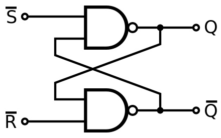

RS锁存器，其中“S”表示“设定”（Set），“R”表示“重设”（Reset）。这种锁存器是由一对相互交错的NAND逻辑门组成。储存的比特是在输出的地方用Q表示。
在存储模式中，输入$\bar S$及$\bar R$的电压都是高的，逻辑上的1(逻辑一)(S及R的电压应该是低的，逻辑上的0)，而输出Q及$\bar Q$则维持其原有的数值，

### PLD
由逻辑部分和记忆部分组成。记忆部分使用集成电路保存配置的程序内容，可使用的集成电路包括**SRAM、EEPROM、Flash**。

可编程逻辑器件（Programmable Logic Device，PLD）是可以通过外部设置（俗称“编程”）来改变内部逻辑功能的芯片，通常采用设置内部连线通/断的办法来改变内部逻辑功能。

## DMA
Directmemory Access，直接内存访问。允许硬件子系统直接访问系统内存，DMA控制器获得总线控制权,不需要cpu直接控制数据传输，也没有中断处理方式中的保存与恢复现场的操作，通过硬件为RAM和IO设各开辟直接数据传输的通路，提高了cpu效率。
DMAC: DMA Controller
[DMA](../images/DMA2.png)


[CpuWorkModes](../images/CpuWorkModes.png)

### DMA机制在TCP/IP协议模型中的位置

[LINUX网络子系统中DMA机制的实现](https://cloud.tencent.com/developer/article/1628161)

当I/O准备就绪，设备向CPU发出DMA请求，CPU响应请求，关闭对主存的控制器，只关闭一个或者几个存取周期，在这段时间内，主存和设备完成数据交换。而且在这段时间内，CPU不能访问主存，即不能取指令，但是CPU可以先执行cache中已经保存了一些指令，只要这些指令不涉及访存，CPU和设备还是并行执行。数据传输完成后，DMA接口向CPU发出中断请求，让CPU做后续处理。DMA技术其实是建立在中断技术之上的，它包含了中断技术。


主存的内核空间中为接收和发送数据分别建立了两个环形缓冲区（Ring Buffer）。分别叫接受环形缓冲区（Receive Ring Buffer）和发送环形缓冲区（Send Ring Buffer），通常也叫DMA环形缓冲区。
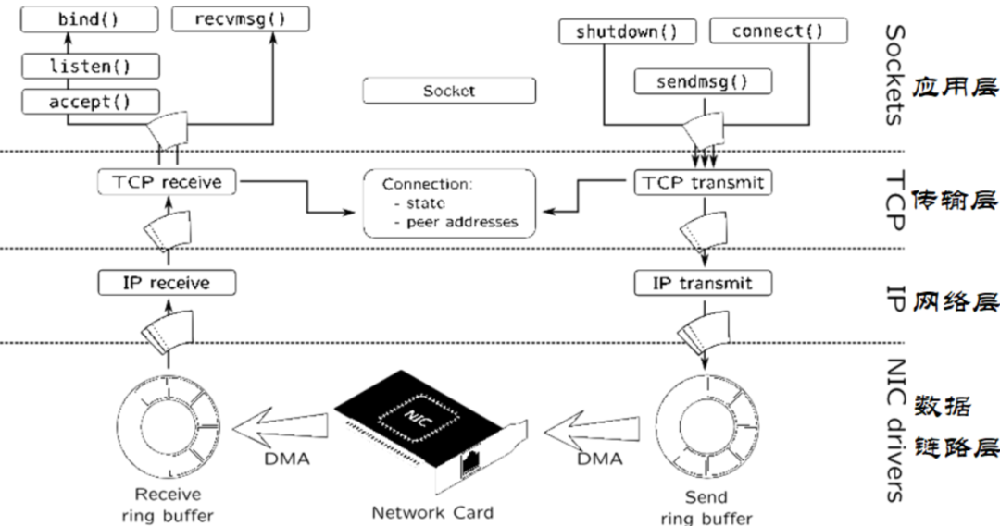

DMA 环形缓冲区建立在与处理器共享的内存中。每一个输入数据包被放置在环形缓冲区中下一个可用缓冲区，然后发出中断。接着驱动程序将网络数据包传给内核的其它部分处理，并在环形缓冲区中放置一个新的 DMA 缓冲区。驱动程序在初始化时分配DMA缓冲区，并使用驱动程序直到停止运行。
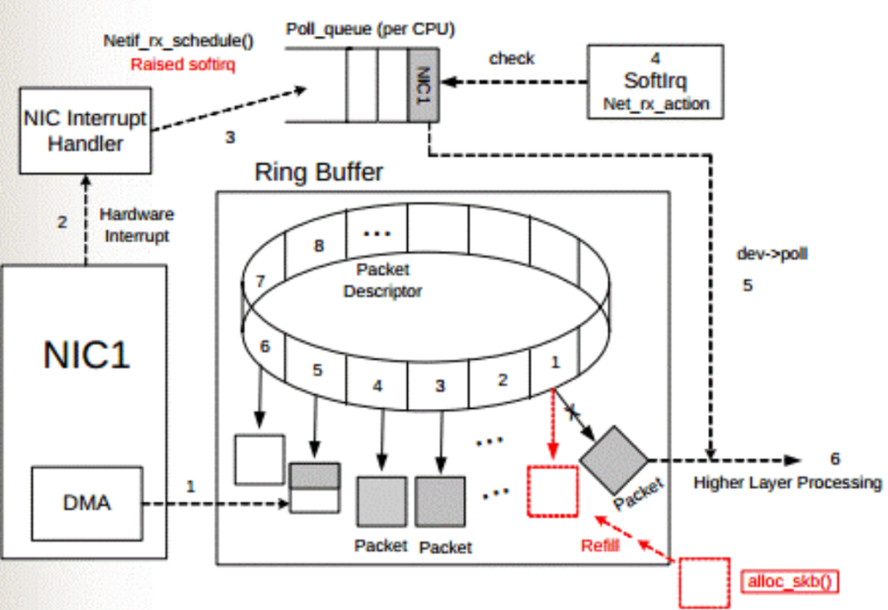
### ISR
An ISR (also called an interrupt handler) is a software process invoked by an interrupt request from a hardware device. 硬件中断请求invoke的软进程。
[ISR-Interruption Service Routine](https://techterms.com/definition/isr)

## 伪随机数
/dev/random/dev/urandom:Linux内核伪随机数生成器。将从设备驱动和其它源收集到的环境噪声放入熵池,保留了对熵池中噪声比特数的估计值,从倘池生成随机数。当噪声源不够时,/dev/random会阻塞,比/dev/urandom更安全。
伪随机数生成器:由算法生成随机序列,其参数可能包含真随机数。由于是完全由初始值种子确定的,故不是真随机数。
硬件随机数生成器/真随机数:基于随机的微观物理过程生成随机数,如热噪声、光电效应和其它量子现象。
1. asctimes
<time.h>:将Tm结构的时间转为可打印输出的字符串

## getchar()与标准输入
等效于getc(stdin)。 getc()与 fgetc()类似.
从文本流读取unsignedchar并映射到int类型返回，遇到文件结尾或error则返回EOF.

文本流:由多行字符构成的字符序列，每行有0或多个字符组成，行末为换行符

**问题:**while(getchar()!=EOF) 只有在行首输入 Ctrl-Z时，才会结束循环。
- cononical input mode: 标准输入模式，bashcmd等:按行处理，行以 (newline (\n'),EOF,or EOL) 结束，行输入结束后才会被传到程序中。可对行输入字符进行编辑，如backspace Ctrl+Z/S 。
- non-cononical input mode: 非标准输入模式，vim (也具有许多canonical特性，如编辑)每输入一个字符即被传送到程序中.
- EOF:  windows (Ctrl+Z) 、Linux (Ctrl+D) 。make the accumulatedinputavailable to read()
综上，while(getehar(!=EOF) 只有在行首输入 Ctl-Z时(系统调用 read()的字符数为0，即系统认为到了End Of File，从而发送EOF)，才会结束循环。在非行首Z时，只会将其前面的字符传到程序中，并且继续等待输入。

## 芯片相关

### 芯片分类

SoC:由多个具有特定功能的集成电路组合在一个芯片上形成的系统或产品,其中包含完整
的硬件系统及其承载的嵌入式软件。
[芯片相关名词对比:CPU,MCU,SoC,MPU,PLC,DSP,ASIC，FPGA](https://www.crifan.com/chip_name_difference_cpu_mcu_soc_mpu_plc_dsp_asic_fpga/)

https://www.processon.com/view/link/5c91f1b6e4b09a16b9a9acfe

- ASIC: Application Specific Integrated Circuit,专用集成电路,专用Specific的硬件实现特定的功能,效率很高。
- FPGA： Field Programmable Gate Array，现场可编程门阵列，硬件软件化，使得硬件的功能可以像软件一样通过编程来修改，并行处理速度快，功耗比ASIC，SoC要高
- CPU：通用general-purpose，可以通过软件控制实现各种通用的功能。

- MCU：Micro Control Unit，微控制器/Micro Controller/Microcontroller/Microcontroller Unit
别名 单片机(Single-Chip Microcomputer)
典型组成:CPU、一些存储（RAM，ROM）、一些输出输出针脚(IO Pin)用于连接外部设备，用于控制外部设备。
运行简单系统。

- SoC：System On Chip/System On a Chip/系统级芯片/片上系统.
典型组成:CPU、存储（RAM，ROM）、很多（相对更复杂的）外设peripheral、各种外设的控制接口/芯片(Flash，DRAM，LCD显示屏等）、往往还额外集成其他方面的芯片（DSP、GPU）
可运行多任务复杂系统（嵌入式、LINUX）。

- PLC： Programmable Logic Controller/可编程逻辑控制器。主要用于工业控制领域。

[Ceva](https://www.ceva-dsp.com/)提供DSP IP授权;arm提供微处理器IP核授权。

### MeltDown和Spectre
乱序执行对应的利用即为Meltdown,而预测执行对应的利用即为Spectre
Meltdown:软件突破与操作系统之间的隔离,访问内存内容
Spectre:软件可访问其他软件的数据
基本原理:欺骗cpu使其将目标内存放入缓存,对缓存进行侧信道攻击,根据CPU读取缓存和内存的时长不同来逆推目标内存对应的值

分支预测:静态分支预测器、双模态分支预测器
乱序执行:使用指令缓冲池实现。顺序发射-乱序执行-顺序提交。

内存屏障:lfence/sfence/mfence,保证命令前面的指令先于后面的指令运行。
编译器屏障:阻止编译器的优化重排

[CPU体系结构](https://my.oschina.net/fileoptions/blog/1633021)

[熔断和幽灵](https://www.leiphone.com/news/201801/TIVOThWMtMsyM3b.html)
[谈谈幽灵和熔断两兄弟](https://bbs.pediy.com/thread-224007.htm)

## 系统调用
https://blog.packagecloud.io/eng/2016/04/05/the-definitive-guide-to-linux-system-calls/

## 函数调用栈帧
https://manybutfinite.com/post/journey-to-the-stack/

# C语言
## 声明与定义

1. 函数和变量的声明不会分配内存, 但是定义会分配相应的内存空间
2. 函数和变量的声明可以有很多次, 但是定义最多只能有一次
3. 函数的声明和定义方式默认都是 extern 的, 即函数默认是全局的
4. 变量的声明和定义方式默认都是局部的, 在当前编译单元或者文件内可用

## 宏与内联函数

宏：预编译时展开。无参数检查。
内联函数：编译时展开。参数检查。减少函数调用，耗费更多内存。

## 数据类型
### 数据类型与转换
>类型转换：不改变数据内容，改变解释方式。

1. 枚举类型
由一组命名的整数常量组成。其表达式值所占空间与int类型相同。可用于替代define预处理指令。
在C语言中,enum非基本数据类型,在C#、C++、Java等中为基本数据类型基本数据类型:char、int、float、double;加signed、unsigned、long、short等修饰符
派生类型:指针、数组、结构体、联合体;
枚举类型:
空类型:函数返回空、空函数参数、空指针。
2. 整型提升
可以使用int的表达式也可以使用char/shortint/整型位域、枚举对象。
算术运算中,如果int能表示源类型的所有值,则转为int;否则转为unsignedint。
-lu的值为2*32-1。+/-为一元运算法。
3. 隐式类型转换
1)算术转换:整型提升+提升为最长类型:
2)赋值转换:右边的数据类型转换为左边的数据类型,可能存在截断或舍入。

4. 输出转换
  printf函数将参数的类型转为格式参数表示的类型,此时格式参数的类型必须能完整表示参数的值。

强制转换和隐式转换均不会改变原变量值和类型,转换结果保存到临时的内存空间。

### 类型检查
以下定义均为模糊定义。
编译时检查数据类型:静态。运行时检查:动态

[强类型](https://www.zhihu.com/question/19918532)语言和弱类型根本区别在于：是否会隐形进行语言类型转变。
强类型:只允许不丢失任何信息的自动类型转换


### 存储类型关键字
> 表格，CSAPP？

静态存储时期: 只初始化一次，默认全0。其在内存中的位置时不变的。
c语言关键字

1. register: 请求编译器将变量存放到寄存器或高速内存中，可能被处理为自动变量(仍无法获取变量地址) 。
2. const： 不可改变的变量
3. volatile: 如硬件时钟可以同时为const和volatile。
   
   - 可能被其它代理改变的变量，需从原始内存读取。硬件状态、信号处理函数、longjump
   - 禁止编译器重排指令(注意不是cpu乱序执行)，内联汇编中使用来禁止指令重排。

4. restrict: 用于指针，表示指针是访问数据对象的唯一且初始的方式。可增强编译器优化和计算支持

动态内存分配:mallocfee。内存碎片，低性能

#### volatile
1. [volatile-considered-harmful.rst](https://www.kernel.org/doc/Documentation/process/volatile-considered-harmful.rst)
2. [(4 封私信) 多线程编程中什么情况下需要加 volatile？ - 知乎](https://www.zhihu.com/question/31459750)


the purpose of volatile is to force an implementation to ``suppress optimization`` that could otherwise occur. 

For example, for a machine with memory-mapped input/output,
a pointer to a device register might be declared as a pointer to volatile, 
in order to **prevent the compiler from removing apparently redundant references** through the pointer

## 数组
### 变长数组和柔性数组
[C语言柔性数组](https://www.cnblogs.com/WindSun/p/11286141.html)
变长数组: VLA,C99引入，实际长度不可变。使用整型变量、整型表达式来定义数组各维度，如arr[m][n]。运行时动态分配存储。
柔性数组: flexible array。必须为结构体的最后一个成员。不占结构体空间大小 (sizeof，无论成员多少均为0长度)，前面至少有一个其它成员。使用时使用malloc分配空间，即堆区。原始的实现方法:在结构体中定义一个方法，在方法中动态地将指针指向动态数组。需要释放结构体指针和数组指针

柔性数组:节省了指针空间，数组名不占空间 (为内存偏移量) ;只需要释放结构体指针。
禁止包含柔性数组成员的结构体数组，因为结构体数组在栈区分配了固定大小空间。可用于网络通信中构造不定长数据包、缓冲区等。

### 行指针和列指针
[二维数组的行指针与列指针](https://www.cnblogs.com/kira2will/p/3590748.html)
理解二维数组的存放，不必在意行指针/列指针的命名。
>a[i][j]=*(*(a+i)+j)

行指针可以这样定义`int (*p)[n]`
行指针为指向一行元素(多个)的数组指针,例如:
列指针为指向具体(单个)元素的一维指针,例如:
一行的列指针的行地址相同

&列指针--->行指针,*行指针--->列指针


## 内存管理
  
序号 | 函数和描述
---|------
1 | void *calloc(int num, int size); 在内存中动态地分配 num 个长度为 size 的连续空间，并将每一个字节都初始化为 0。所以它的结果是分配了 num*size 个字节长度的内存空间，并且每个字节的值都是0。
2 | void free(void *address); 该函数释放 address 所指向的内存块,释放的是动态分配的内存空间。
3 | void *malloc(int num); 在堆区分配一块指定大小的内存空间，用来存放数据。这块内存空间在函数执行完成后不会被初始化，它们的值是未知的。
4 | void *realloc(void *address, int newsize); 该函数重新分配内存，把内存扩展到 newsize。

1. memcpy
void *memcpy(void* destination,const void*s ource,size_t num)
示例代码:
http://cpp.sh/8ek23


## 字符集合与字符编码

[彻底弄懂常见的7种中文字符编码](https://zhuanlan.zhihu.com/p/46216008)

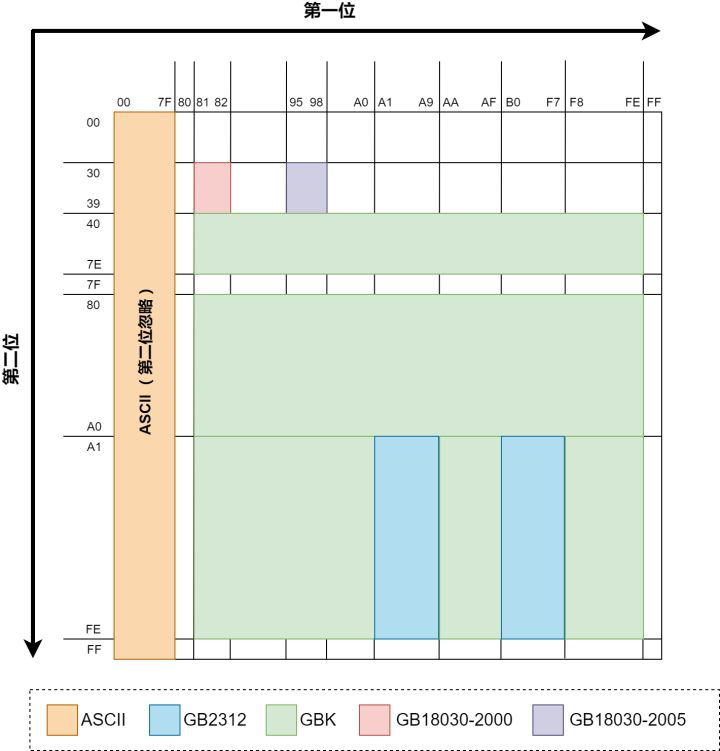
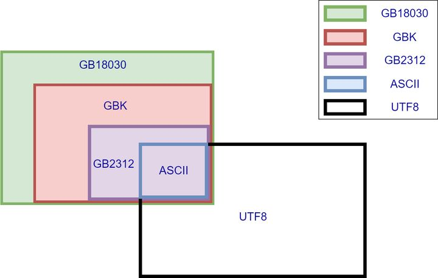

- ASCII: 8bit,占用后7位,128个字符,其中33个非打印字符。
- IS08859-1: 8bit,扩展ASCII空间剩余的128个字符。
- Unicode和UCS: 两个不同标准的通用字符集合。有对应关系。实现方式有多种字符编码(UTF-8、UTF-16、UTF-32、GB18030等)
- UTF-8(UnicodeTransformationFormat,简称为UTF): 可变长度Unicode编码方式,1-4字节,前缀码,兼容ASCII。UTF-16、UTF-32不兼容ASCII。
- BOM头: 用于区分编码方式,UTF8和GBK无BOM头。
- Unicode大端小端: 大端文本以FEFF开头;小端FFFE。
- ANSI标准: 对于英文系统即ASCII编码,中文系统则为GB2312或Big5编码
- 中文编码: GB2312过时标准 < GBK微软标准 < GB18030国家标准 (向下兼容，均兼容ASCII）


## 回调与函数指针
回调函数是通过函数指针调用的函数。把一段可执行的代码函数指针（即回调函数）像参数传递那样传给其他代码,而这段代码会在某个时刻被调用执行,这就叫做回调。
回调是针对于被调用的函数来说的,也就是相对于写回调函数的人来说的,我写好一个函数,等着被调用(等着被回调))

如果代码立即被执行就称为同步回调,如果在之后晚点的某个时间再执行,则称之为异步回调:

作用:可灵活修改参数；实现异步调用。

完全面向对象的语言(例如Java)中没有回调函数的概念,因为"`接口"`(中的方法)充当了回调函数的作用,对象是一个接口的实现类对象。


## ++i与i++
[C与C++实现机制](https://cloud.tencent.com/developer/article/1544050)类似。
i++ 与 ++i 的主要区别有两个：
   1. i++ 返回原来的值，++i 返回加1后的值。 
   2. i++ 不能作为左值，而++i 可以。
   
编译器可能会将两种形式优化成一样的。
在不关注返回值的情况下使用++i，效率更高。
```
#include <stdio.h>

int main()
{
    int i = 0;
    i = i++;
    //问如果打印i的值，结果是多少？
    printf("i = %d\n",i);
    //i = 0; =优先级最低，i先自增（1），然后 = 将oldValue（0）赋值给了i。

    int j = 0;
    j = ++j;
    //j = 1,
    printf("j = %d\n",j);

    return 0;
}
```


i++ 不能作为左值，而++i 可以？**i++ 最后返回的是一个临时变量**，而临时变量是右值。
```
// 前缀形式： 
int& int::operator++() //返回的是一个引用形式，就是说函数返回值也可以作为一个左值使用 
{//函数本身无参，意味着是在自身空间内增加1的   
     *this += 1;  // 增加   
     return *this;  // 取回值 
} 


//后缀形式: 
const int int::operator++(int) //函数返回值是一个非左值型的，与前缀形式的差别所在。
{//函数带参，说明有另外的空间开辟   
    int oldValue = *this;  // 取回值   
    ++(*this);  // 增加   
    return oldValue;  // 返回被取回的值
 }
```


## 结构体
### 指针与结构体
((size_) &(((TYPE* 0)->MEMBER):构造(使编译器认为存在) 一个指向零地址的结构体。其成员的地址值=其成员的地
址偏移量

### 定义

`struct node{ }`在定义 node 的结构体变量时，需要这样写:struct node n;
`typedef struct node{ }NODE; `在定义变量时就可以这样写：NODE n;即NODE 是node 的别名，方便使用。

### 赋值

结构体变量赋值：逐个赋值、memset、用其它结构体赋值。
大括号：结构体变量的赋值是不能采用大括号的方式。结构体数组可以。


### 对齐
1. **结构体**对齐:变量起始位置的偏移量是该变量字节数的整数倍;结构体的总字节数是其中最长变量字节数的整数倍。
2. **联合体**对齐:容纳最宽的成员;被其基本成员类型整除。
3. **位域**对齐:如果相邻位域字段的类型相同,且其位宽之和小于类型的sizeof大小,则后面的字段将紧邻前一个字段存储,直到不能容纳为止。


https://www.cnblogs.com/luxiaoxun/archive/2012/11/09/2762438.html 
https://cloud.tencent.com/developer/article/1703257 

**结构体对齐：**
- 原则A：struct或者union的成员，第一个成员在偏移0的位置，之后的每个成员的起始位置必须是当前成员大小的整数倍；
- 原则B：如果结构体A含有结构体成员B，那么B的起始位置必须是B中最大元素大小整数倍地址；
- 原则C：结构体的总大小，必须是内部最大成员的整数倍；
- #pragma pack :实际对齐原则是自身对齐值(成员sizeof大小)和指定对齐值(#pragma pack指定的对齐大小)的较小者。


**内存对齐的原因：**

1. 某些平台只能在特定的地址处访问特定类型的数据；
2. 提高存取数据的速度。比如有的平台每次都是从偶地址处读取数据，对于一个int型的变量，若从偶地址单元处存放，则只需一个读取周期即可读取该变量；但是若从奇地址单元处存放，则需要2个读取周期读取该变量。


# GCC与汇编
## AT&T(gcc)与Intel汇编的区别
https://www.cnblogs.com/hdk1993/p/4820353.html
## include
`#include "filename"`会首先搜索当前文件夹;如未找到或使用的 `#include <filename>`,则按照系统/编译器IDE配置的路径进行搜索。


## gcc vs g++
gcc: 区分处理.c和.cpp文件;不链接(需要gcc -lstdc++)
g++: .c和.cpp均当作C++处理;自动链接

编译工具链：Binutils、GCC、glibc。

## 浮点数
1. https://www.wikiwand.com/zh/IEEE_754
2. `【算法】解析IEEE 754 标准 - HDWK - 博客园` <https://www.cnblogs.com/HDK2016/p/10506083.html>`__
3. https://evanw.github.io/float-toy/

`Value = sign * 2^E * M`

1. 符号位：首bit；
2. 阶码E；规格化数 E= e(k bit对应二进制值) - Bias( 2^(k-1)-1 )，非规格 E = 1-Bias;
e全0(非规约)、全1(NaN或∞)有特殊含义，故阶码E范围 -126~127 或 -1022~1023；
3. 小数字段M：规约数时 M=1+frac(对应bit 小数值)，非规约时 M=frac

规格化数、非规格化数之间是平滑转变的(过渡区E均为-126)

### 精度
1. 小数精度(最小):二进制指数(粒度2=0.00000011920928955078125)不能完全表示十进制小数。且可知十进制的小数点后6位为可靠数字位,后面则需要近似。

2. 整数精度:float型只有24位有效数字位,只能准确表示23位有效二进制位的整数(int最高有31位)。故float不能作为计数器，可能多个连续大整数(有效二进制位数大于23)的float表示是一样的。

3. 转换成十进制后的可靠小数数字位数:单精度(6),双精度(15)

### 浮点值定义

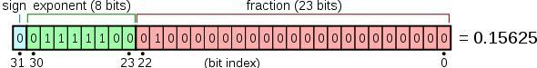


#### 汇编

查看汇编语言,发现浮点数使用xmm0寄存器存储。汇编已将浮点值解释成long型的xmm位模式(位模式1084227584浮点解释是5.0),然后将此long型数值写入xmm0(movss .LC1(%rip),%xmm0)。

SIMD:单指令多数据。基本思想是将若干个数据加载到一个寄存器内部,一条指令可以同处理多个数据,一个XMM(128位)可同时装载4个double或8个float,因此在使用SIMD时,一次处理的float数据量为double的两倍。

相关指令集:MMX(MatrixMatheXtensions,整数)、SSE(StreamingSIMDExtensions)、AVX(AdvancedVectoreXtension)内容逐渐完善:

FPU:浮点单元。

XMM/YMMIZMM是FPALU指令存在的唯一寄存器(除80位longdouble),属于SSE指令集。

扩展精度格式:使用80位寄存器,可通过存储计算中间值来支持其它精度格式。longdouble 数据类型

## 原码反码补码移码
名称 | 英文名 | 含义 | 适用
---|---|----|---
原码 |Sign-Magnitude | 正数是其二进制本身；负数是符号位为1,数值部分取X绝对值的二进制。| 直观
反码 | Ones' Complement | 正数的反码和原码相同；负数是符号位为1,其它位是原码取反。 | 用于原码与补码转换
补码 | Two's complement | **正数的补码和原码，反码相同**；负数是符号位为1，其它位是原码取反，未位加1。 | 计算机存储方式，易于加减运算
移码 | Offset binary | 将符号位取反的补码（不区分正负）。 | 易于比较大小

### 溢出判断
1. 符号位判断($A_s B_s S_s$)；$ V = \overline{A_s}  \overline{B_s} S_s + A_s B_s \overline{S_s}$
2. 结果符号位和结果最高位($C_1$)判断；$ V= C_s \oplus C_1$
3. 双符号位($  S_1 S_2$,移位时低位参与移位，高位代表真符号位。溢出时可补救)。$ V= S_1 \oplus S_1$


# 嵌入式
## 重要概念
### FPGA
Field Programmable Gate Array,现场可编程逻辑门阵列。包括可编程逻辑块CLB输入输出模块IOB和内部连线三个部分。
是作为集成电路ASIC领城中的一种半定制电路而出现的,既解决了定制电路的不足,又克服了原有可编程元器件门电路不足的缺点。

https://www.cnblogs.com/jmilkfan-fanguiju/p/11825031.html
>内部结构和原理？

### 单/双口RAM
单口与双口的区别在于,单口只有一组数据线与地址线,因此读写不能同时进行。而双口有两组数据线与地址线,读写可同时进行。FIFO读写可同时进行,可以看作是双口。
双TRAM分伪双RAM(Simpletw-dualRAM)与双口RAM(truetwo-dualRAM)伪双口RAM,个端口只读,另一个滞口只写;而双口RAM两个端口都可以读写。
FIFO也是一个端口只读,另一个端口只写。


### BSP
Board Support Packages:板级支持系包,用作初始化和运行操作系统,并用于评估板的简易代码。通常包括以基础支持代码来加载操作系统的引导程序,以及
主板上所有设备的驱动程序。介于主板硬件和操作系统中驱动层程序之问的层,一殷认为它属于操作系统一部分,主要是实现对操作系统的支持,为上层的驱动程序提供访问硬件设备寄存器的函数包,使之能够更好的运行于硬件主板。

### AVS
AVS自适应电压调整:基于跟踪系统处理器的性能变化,由嵌入式自适应先进电源控制器(APC)做出自适应电压调整。闭环。
DVS动态调压:基于对系统的预测。开环。
DVS和AVS的核心是先进电源控制器(APC)

## 嵌入式系统
VxWorks:
   https://www.vxworks.net/linux/184-difference-between-linux-and-vxworks
   一种嵌入式实时操作系统(TRTOS),实时性强,结构简单,易用,稳定:
Vxworks与Linux比较

系统 | Linux | VxWorks
---|-------|--------
内核结构 宏内核：必要的服务包括任务管理、中断处理、内存管理等。 | 微内核：除了基本的服务，内核还包括文件系统、网络协议等。
运行模式 | 用户模式/内核模式 | 实模式
内存访问和内存保护 | 虚拟存储 | 实存储：直接操作物理地址
执行单元 | 进程、线程 | 任务
请求内核服务 | 系统调用，更安全 |  函数调用，更快 | 


## 协议
## 串行总线协议

按位传输。

- I2C：半双工，能用于替代标准的并行总线，能连接的各种集成电路和功能模块。I2C是多主控总线，所以任何一个设备都能像主控器一样工作，并控制总线。总线上每一个设备都有一个独一无二的地址，多路微控制器能在同一个I2C总线上共存。一般用于同一板卡上芯片之间的通信，较少用于远距离通信。

- 分别由SDA(串行数据线)和SCL(串行时钟线)及上拉电阻组成。通信原理是通过对SCL和SDA线高低电平时序的控制，来产生I2C总线协议所需要的信号进行数据的传递。在总线空闲状态时，这两根线一般被上面所接的上拉电阻拉高，保持着高电平。 

- SPI：SPI接口和UART相比，多了一条同步时钟线，对通信双方的时序要求不严格不同设备之间可以很容易结合，而且通信速度非常快。一般用在产品内部元件之间的高速数据通信上面，如大容量存储器flash等。

- UART：两线，一根发送一根接收，全双工通信，数据异步传输，对双方的时序要求比较严格，在多机通信上面用的最多。按照标准波特率完成双向通讯，速度慢，适合远距离传输。


## AXI
[AXI总线介绍](https://www.cnblogs.com/mikewolf2002/p/10322532.html)：
>与其它总线比较？

Advancede Xtensive Interface,是一种面向高性能、高带宽、低延时的片内总线协议。是arm提出的AMBA3.0协议中最重要的部分。

它的地址控制和数据相位是分离的,支持不对齐的数据传输,同时在突发传输中,只需要首地址,同时分离的读写数据通道、并支持Outstanding传输访问和乱序访问,更容易进行时序收敛。


# 网络

## socket原理
[socket原理详解](https://www.cnblogs.com/zengzy/p/5107516.html)

```
int socket(int af,int type,int protoco1);
int band(SOCKET s,const struct sockaddr *name,ant name1em),
int send(SOCKET s,const char *buf,int len,int f1ags);
int sendto(SOCKET s,const char *buf,int len,int flags,const struct sockaddr *to,int tolen);
int WSAAPI recV(SOCKET s,char *buf,int len,int flags);
Int WSAAPI recvfrom(SOCKET s,char *buf,int len,int flags,struct sockaddr *from,int *fromlen);

```
socket屏蔽了各个协议的通信细节，无需关注协议本身，直接使用socket提供的接口来进行互联的不同主机间的进程的通信。


>socket实例的结构?


### TCP数据流和UDP数据报
   - UDP不是面向连接的，每个数据包都是独立的包，包一般不会合并。发送端调用了几次write，接收端必须用相同次数的read读完。
   - TCP是面向连接的协议，S和C之间要使用TCP，必须先建立连接，数据就在该连接上流动，可以是双向的。所以叫数据流，占系统资源多。write与read次数不需要统一。
   - TCP保证数据正确性，UDP可能丢包，TCP保证数据顺序，UDP不保证，

## 重要协议
### uPNP
通用即插即用（Universal Plug and Play)，NAT设备主动为主机进行端口映射，使得任意两个设备能在LAN控制设备的管理下相互通信。。
SSDP：简单服务发现协议（SSDP，Simple Service Discovery Protocol）是一种应用层协议，是构成通用即插即用(UPnP)技术的核心协议之一。
为客户提供一种无需配置、管理和维护网络设备服务的机制。采用基于通知和发现路由的多播发现方式实现


### 1588协议
IEEE 1588协议，网络测量和控制系统的精密时钟同步协议标准。
1588是一种**主从同步系统**。主时钟周期性发布PTP时间同步及时间信息,系统从时钟端口
接收主时钟端口发来的时间戳信息,计算出主从线路时间延迟及主从时间差,并差调整本地
时间,使设备时间保持与主设备时间一致的频率和相位。
它定义了一种精确时间协议`PTP`(Precise Time Protocol)，可以达到亚微秒级别时间同步。

### 空口
Air Iterface,相对于有线通信中的线路接口概念而言的。线路接口定义了物理持续和一系列的电信号的和光信号规范。
空中接口定义了终端设备与网络设备之间的电波链接的技术规范,使无线通信像有线通信一样可靠。定义每个无线信道的使用频率、带宽、接入时机、编码方法以及越区切换等
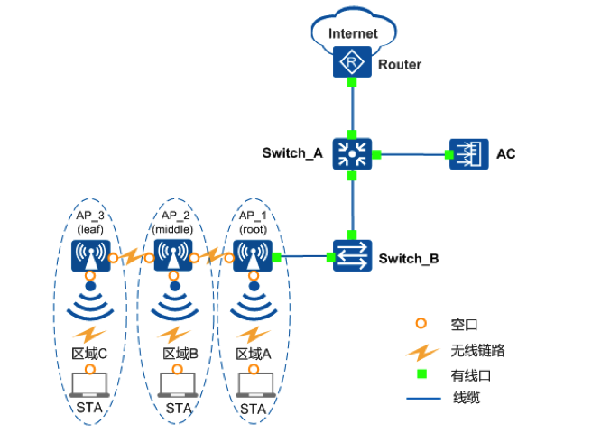

在无线局域网中，空口可以理解为AP和STA上的虚拟逻辑口。

### 多生成树协议？
MST(Multiple Spanning Tree):将环路网络修剪成为一个无环的树型网络,避免报文在环路网络中的增生和无限循环,同时还提供了数据转发的名个尔余路径,在数据转发过程巾实现VLAN数据的负装均衡。
> [多生成树协议](http://www.h3c.com/cn/d_200911/922204_30005_0.htm) ？

### XGMII
MII(Media Independent Interface，介质无关接口)或称为`媒体独立接口`,它是IETE-802.3定义的以太网行业标准。它包括一个数据接口和一个MAC和PHY之问的管理接口。
教据接口包括分别用于发送器和接收器的两条独的信道,每条信道都有自己的数据、时钟和控制信号。MI数据接口总共需要16个信号。
管理接口是个双信号接口:一个是时钟信号,号个是欲据信号。通过管理接口,上层能监机和控制PHY。

## 字节序
[小端字节序与大端字节序](https://www.cnblogs.com/onepixel/p/7468343.html)
X86体系一般是小端,arm架构可以自由设置大端或小端。

大端字节序 (big endian，网络序) 和小端字节序 (litle endian) 。

字节序 | 大端 | 小端
----|----|---
低地址0x01 | 0x12 | 0x34
高地址0x02 | 0x34 | 0x12
说明 | 高位字节(0x12)在低地址| 低位字节(0x34)在低地址
原因 | 这是人类读写数值的方法(从低地址向高地址读)，“所见即所得”的顺序 | 计算机先处理低位字节的效率比较
应用 | 网络传输(网络序)、文件存储等 | 在计算机内部存储时用到(主机序)

>字节内的比特位不受这种顺序的影响，大于1个字节的数据类型才有字节顺序问题

## 环回
传输层检测到目的端地址是环回地址时,可以省珞部分传输层和所有网络层的逻辑操作。但
是大多数的产品还是照样完成传输层和网络层的所有过程,只是当数据报离开网络层时
把它返回给白己:
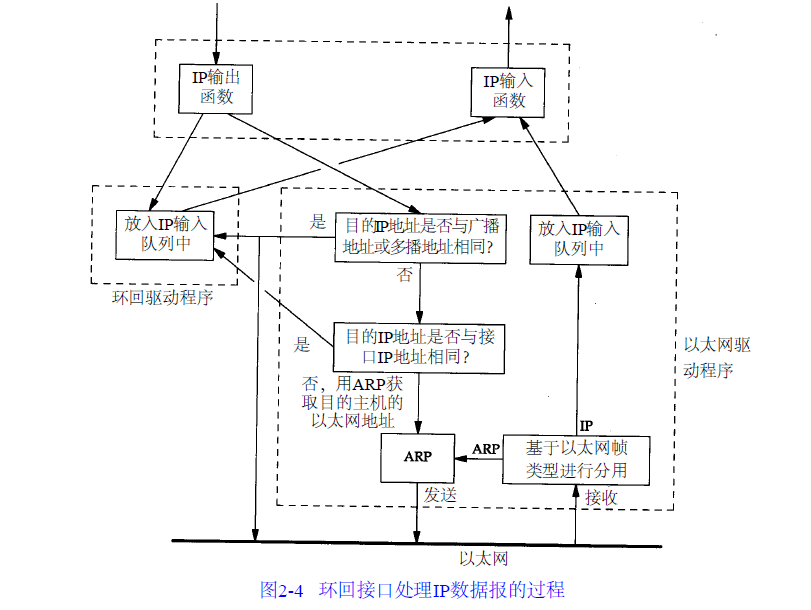
[TCP/IP协议详解卷一参考](https://www.kancloud.cn/lifei6671/tcp-ip/139864)

[OAM 远端环回](https://blog.51cto.com/6326233/1108288)
EEE802.3ah OAM，也称为EFM（the Ethernet in the First Mile）；用于在两台直连设备间检测连接状态、测试链路性能。EFM的功能包括OAM发现功能、远端故障通知功能、OAM远端环回功能、OAM链路监控功能。

OAM远端环回：局端设备发起OAM环回请求，远端设备进行响应。当远端设备处于环回模式下，除了OAMPDU 以外的所有报文都将按照原路返回。

类比协议：IEEE802.3ag连通性故障管理(CFM:ConneclivityFaultManagement)。

## DDOS
DistributedDenialofService,分布式拒绝攻击,使目标无法提供正常服务
[DDOS攻击类型分类](https://www.jianshu.com/p/1db5024673d7)
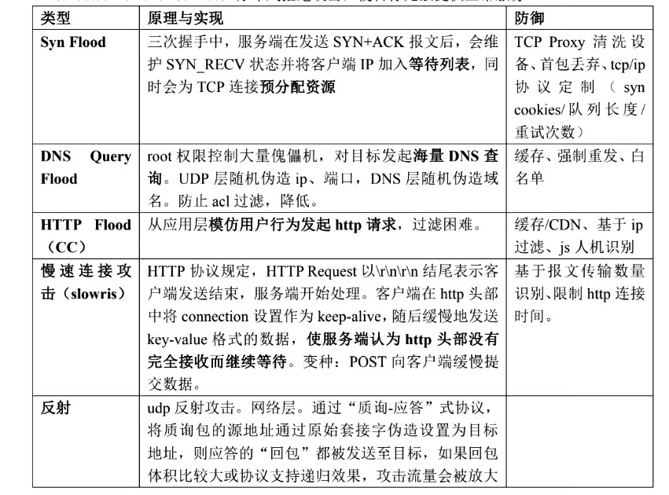

## 相关算法
### Dijkstra算法
一种解决单源最短路径问题的贪心算法
基本思想:设置顶点集合S,并贪婪的方式不断扩充这个集合。

[dijkstra](https://blog.csdn.net/luoshixian099/article/details/51918844)


### 非对称加密
1. RSA
大整数的质数分解。
`公开密钥n、e`的产生:随机选取两个质数`pl、p2，n=p1*p2`，再随机选取一个整数`e`，`e`与欧拉函数 $$ \varphi (n)=(p_1-1)*(p_2-1) $$互质。

加密过程: $(m^e)mod\ n = c$，其中m为原信息，c为加密信息，n、e为公开密钥.
解密过程: $ (c^d) mod\ n = m $,其中d为解密密钥。
 $ d=(k*\varphi(n)+1)e $ 。故需分解n为`p1*p2`,从而求得$ \varphi (n)=(p_1-1)*(p_2-1) $。

2. 离散对数加密
离散对数问题
给定素数p和正整数g(符合特定条件)，已知$ k=g^x mod \ p $


3. 椭圆曲线加密ECC
椭圆曲线上的离散对数问题。定义一些椭圆曲线上的运算其加密、解密运算是在椭圆曲线上进行的
k为正整数，P是椭圆曲线上的点，已知$P^x$和$P$，计算$k=log_pP^k$。
采用椭圆曲线上定义的运算法则;解密时只能以“加法”的形式，每一步加一个P，故此处`复杂度为指数级(RSA和离散对数都有亚指数级的解法)`。

[离散对数和椭圆曲线加密原理](https:/blog.csdn.net/qmickecs/article/details/76585303)

### 卡特兰数
[卡特兰数入门详解](https://www.cnblogs.com/Morning-Glory/p/11747744.html)
有一些操作，这些操作有着一定的限制，如一种操作数不能超过另外一种操作数，或者两种操作不能有交集等，这些操作的合法操作顺序的数量则与卡特兰数有关。

公式：
> $$ f_n = C_{2n}^n - C_{2n}^{n-1} $$

在一个w×h的网格上，你最开始在(0,0)上，你每个单位时间可以向上走一格，或者向右走一格，在任意一个时刻，你往右走的次数都不能少于往上走的次数，问走到(n,m),0≤n有多少种不同的合法路径。答案即为$ f_n $ 。
- 其它问题
1. 括号化匹配
2. 出栈次序
3. 凸多边形三角划分
4. 给定结点组成二叉搜索树


## DPDK
[深入理解DPDK程序设计](https://mp.weixin.qq.com/s/b2WSqcR1ugsNxu9PkLOOtg)

[DPDK](https://cloud.tencent.com/developer/article/1198333) 


传统收发报文方式的缺陷：1）硬中断； 2）系统调用； 3）内核与用户态数据拷贝； 4）内核工作在多核； 5）Cache Miss


用户态的好处是易用开发和维护，灵活性好。并且Crash也不影响内核运行，鲁棒性强。

### DPDK旁路原理

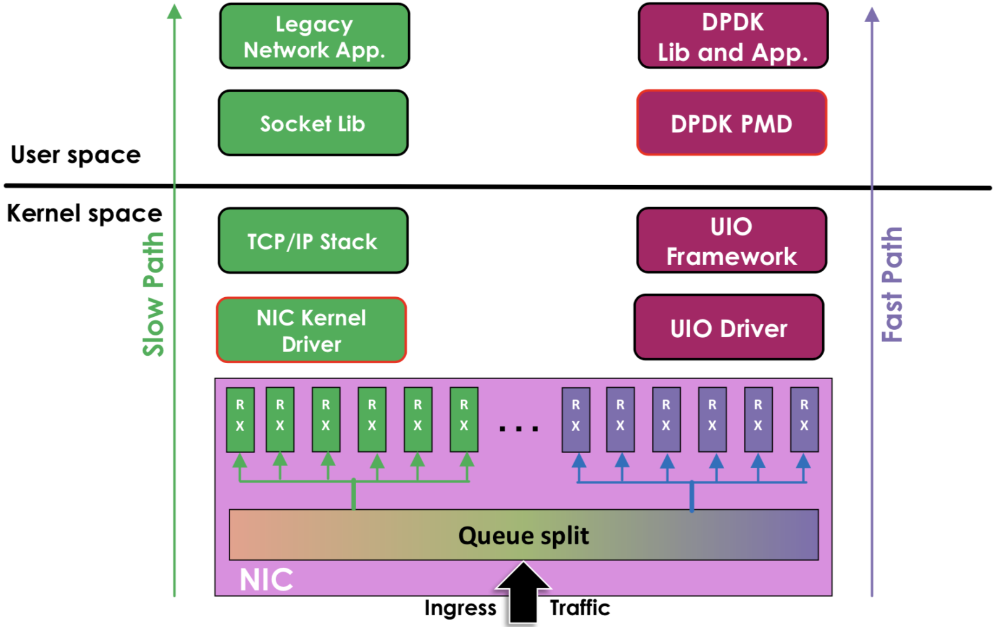

- 原来的方式：数据从 网卡 -> 驱动 -> 协议栈 -> Socket接口 -> 业务
- DPDK的方式：基于UIO（Userspace I/O）旁路数据。数据从 网卡 -> DPDK轮询模式-> DPDK基础库 -> 业务


DPDK支持的CPU体系架构：x86、ARM、PowerPC（PPC）


### UIO原理

Linux提供UIO机制。

>使用UIO可以通过`read`感知中断，通过`mmap`实现和网卡的通讯。

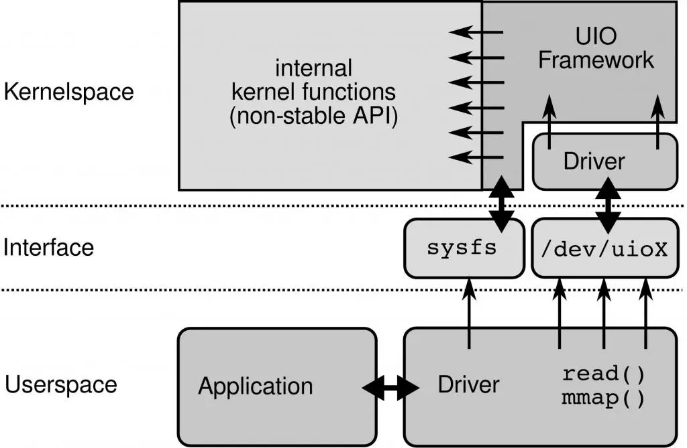

1. 开发运行在内核的UIO模块，因为硬中断只能在内核处理
2. 通过/dev/uioX读取中断
3. 通过`mmap`和外设共享内存


### 核心优化PMD


DPDK的UIO驱动屏蔽了硬件发出中断，然后在用户态采用主动轮询的方式，这种模式被称为PMD（Poll Mode Driver）。

UIO旁路了内核，主动轮询去掉硬中断，DPDK从而可以在用户态做收发包处理。带来Zero Copy、无系统调用的好处，同步处理减少上下文切换带来的Cache Miss。


# 总结

>TCP/IP协议详解
UNIX网络编程
LINUX内核
安全设计
