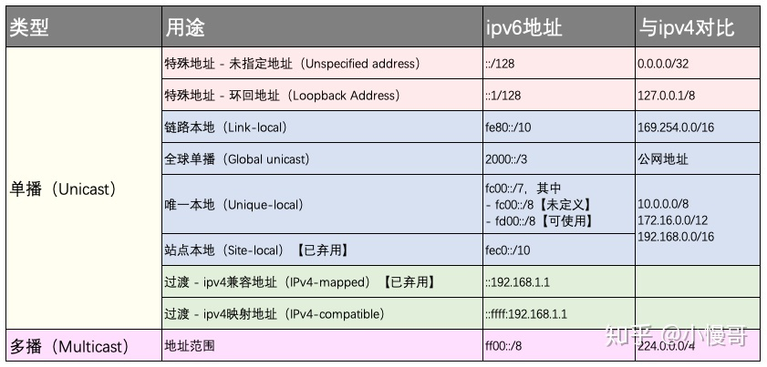
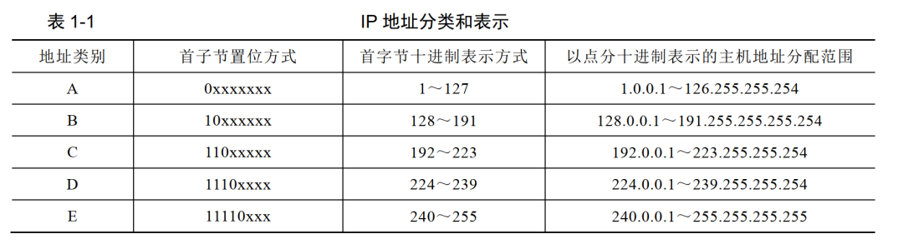

<font face="微软雅黑"> </font>
<center> </center>

<!-- more -->

<!-- TOC -->

- [内网地址](#内网地址)
  - [判断是否公网地址](#判断是否公网地址)
  - [ipv4局域网网段](#ipv4局域网网段)
  - [ipv6局域网网段](#ipv6局域网网段)
- [ipv4地址测试](#ipv4地址测试)
  - [centralops 到 本地](#centralops-到-本地)
  - [本地到centralops](#本地到centralops)
- [ipv6地址测试](#ipv6地址测试)
  - [centralops到本机](#centralops到本机)
  - [本机到hexillion](#本机到hexillion)
  - [本机到百度](#本机到百度)

<!-- /TOC -->

[测试所用网站](https://centralops.net/co/Traceroute.aspx)

逆向追踪所经过的地址都对应的在同一网段。

# 内网地址

## 判断是否公网地址
拥有公网地址则可通过ip直接连接设备。
1. tracert <上网ip>：若只有1跳，则为公网ip；否则为内网ip。
2. 查看路由器WAN口的地址，是否与上网ip一致。



## ipv4 地址分类与CIDR



https://www.jianshu.com/p/1d4765d627c6

CIDR支持任意长度的IP网络号，消除了传统的A类、B类和C类地址以及划分子网的概念。

1. 提高了ip地址空间利用率。

2. CIDR还使用“斜线记法”，或称为CIDR记法，即在IP地址后面加上“/”，然后写上网络前缀所占的位数。如128.14.35.7/20。

3. 超网-路由聚合可提高路由效率
4. 最长前缀匹配


## ipv4局域网网段
IPv4地址协议中预留了3个IP地址段，作为私有地址，供组织机构内部使用。
这三个地址段分别位于A、B、C三类地址内：

        A类地址：10.0.0.0--10.255.255.255
        B类地址：172.16.0.0--172.31.255.255 
        C类地址：192.168.0.0--192.168.255.255

## ipv6局域网网段
[参考](https://www.v2ex.com/t/474951)
目前已分配 IPv6 的公网地址都是 2XXX: 开头的，非常好辨别。
其中 **2002:** 开头的是 6to4 地址，由用户端设备自动建立，通过隧道技术连接至 IPv6 互联网，不是运营商管理和分配的，服务质量与运营商无关。只要有 IPv4 公网地址，设备支持 6to4 协议，且没有被运营商封锁就能建立。
he.net 提供的 IPv6 Tunnel Broker 服务就是采用6in4协议。常用网段为**2001：**。
各大高校的教育网也是用的**2001：**。

| Prefix | Description |
| --- | ---|
|2001:250::/32|CERNET IPv6 BackboneChina|
|2001:251::/32|CERNET IPv6CJChina|
|**2001:da8::/32**|China Next Generation Internet CERNET2China|
|2403:3140::/32|Location Centric NetworkChina|
|240c:c000::/20|China Education and Research Network|


通过以上两种隧道技术获得的地址也是公网 IPv6 地址，只不过他们不是由运营商提供的，而是用户端设备把 IPv6 数据包封装到 IPv4 的数据包中，再通过第三方 Broker 服务器中转来访问 IPv6 互联网，速度通常比较慢。
下面说一说常见的非公网地址段：
**::1**代表 loopback 地址，表示本机，等价于 IPv4 中的127.0.0.1。
**fe80::/10**地址是所谓的 link local 地址段，只在同一链路上有效，不能跨网段通信，类似于 IPv4 下的169.254.0.0/16（是不是很熟悉）。
**fd00::/8**这个段就是通常意义上的内网地址段了，等价于 IPv4 的10.0.0.0/8, 172.16.0.0/12以及192.168.0.0/16这三个段。如果你要组建 IPv6 内网，通常是在这个大段里随机挑选一个 /64、/56、或者 /48 的子网来用。比如可以挑选 fd12:3456:789a:bcde::/64作为你家或者你公司的局域网 IP 段。IPv6 规范中鼓励你随机挑选地址段，避免和别人家的地址段重复，以免并网时的麻烦。
fc00::/8也是一个保留的巨大内网地址段，具体怎么用现在还没有规范。

# ipv4地址测试

ipv4地址为内网ip。
## centralops 到 本地

追踪到`61.186.162.45`中断。
第二跳`169.48.118.162`。

```C++
Tracing route to 222.178.10.151 [222.178.10.151]...

hop	rtt	rtt	rtt	 	ip address	fully qualified domain name
1	3	2	1	 	169.254.158.58	
2	1	1	1	 	169.48.118.162	ae103.ppr04.dal13.networklayer.com
3	0	0	0	 	169.48.118.134	86.76.30a9.ip4.static.sl-reverse.com
4	*	2	*	 	169.45.18.86	ae16.cbs01.eq01.dal03.networklayer.com
5	1	1	1	 	50.97.17.55	ae33.bbr02.eq01.dal03.networklayer.com
6	1	2	1	 	157.238.224.229	ae-11.a00.dllstx04.us.bb.gin.ntt.net
7	*	*	*	 		
8	41	41	41	 	129.250.7.69	ae-5.r22.lsanca07.us.bb.gin.ntt.net
9	37	38	37	 	129.250.3.17	ae-1.r00.lsanca07.us.bb.gin.ntt.net
10	40	40	48	 	129.250.2.104	ae-0.a00.lsanca07.us.bb.gin.ntt.net
11	43	39	39	 	218.30.53.108	
12	31	31	32	 	202.97.90.113	
13	255	255	255	 	202.97.99.217	
14	251	251	251	 	202.97.38.118	
15	*	*	*	 		
16	292	283	283	 	202.97.83.190	
17	291	282	282	 	222.176.2.102	
18	271	272	272	 	222.176.46.21	
19	282	*	281	 	222.176.37.14	
20	282	279	279	 	61.186.162.45	
21	*	*	*	 		
22	*	*	*	 		
23	*	*	*	 		
24	*	*	*	 		
Trace aborted

-- end --
```
## 本地到centralops
路径完整。本地局域网出口为第7跳`61.186.162.46`。
倒数第二跳`169.48.118.169`。与反向的追踪第二跳在同一网段。

```C++
C:\Users\Administrator>tracert centralops.net

通过最多 30 个跃点跟踪
到 centralops.net [75.126.243.167] 的路由:

  1     *        *        *     请求超时。
  2     2 ms     5 ms     2 ms  10.10.8.113
  3     2 ms     2 ms     2 ms  10.10.8.217
  4     2 ms     2 ms     2 ms  10.10.8.73
  5     2 ms     1 ms     1 ms  202.202.0.162
  6     1 ms     1 ms     1 ms  10.10.13.17
  7     2 ms     3 ms     2 ms  61.186.162.46
  8     4 ms     3 ms     3 ms  222.176.37.9
  9     3 ms     3 ms     3 ms  222.176.46.9
 10     3 ms     3 ms     3 ms  222.176.5.137
 11    26 ms    27 ms    30 ms  202.97.86.57
 12     *        *       30 ms  202.97.94.142
 13    26 ms    25 ms    25 ms  202.97.94.114
 14   235 ms   244 ms   241 ms  202.97.73.122
 15   272 ms   280 ms   272 ms  118.85.205.246
 16   285 ms     *      282 ms  ae0.mcs1.ams10.nl.eth.zayo.com [64.125.29.68]
 17   300 ms   295 ms   295 ms  ae1.cs1.ams10.nl.eth.zayo.com [64.125.29.70]
 18     *      289 ms   287 ms  ae2.cs1.lhr15.uk.eth.zayo.com [64.125.29.17]
 19   281 ms   287 ms   279 ms  ae0.cs1.lhr11.uk.eth.zayo.com [64.125.29.118]
 20     *        *        *     请求超时。
 21   293 ms   291 ms   294 ms  ae18.er4.lga5.us.zip.zayo.com [64.125.27.179]
 22     *      305 ms   306 ms  209.66.80.134.IPYX-102621-800-ZYO.zip.zayo.com [209.66.80.134]
 23     *      290 ms   289 ms  ae6.cbs02.tl01.nyc01.networklayer.com [50.97.17.44]
 24     *        *      287 ms  ae0.cbs01.eq01.chi01.networklayer.com [50.97.17.48]
 25   303 ms     *      292 ms  ae2.cbs02.dr01.dal04.networklayer.com [169.45.18.4]
 26   289 ms   281 ms   288 ms  ae3.dar02.dal13.networklayer.com [169.45.18.43]
 27   289 ms   280 ms   291 ms  8d.76.30a9.ip4.static.sl-reverse.com [169.48.118.141]
 28   284 ms   289 ms   283 ms  a9.76.30a9.ip4.static.sl-reverse.com [169.48.118.169]
 29   280 ms   280 ms   280 ms  hexillion.com [75.126.243.167]

跟踪完成。
```


# ipv6地址测试

ipv6地址为公网ip。
可直接使用IPV6地址进行远程桌面连接。
可ping通。
## centralops到本机
可正常完整地追踪到本机地址。
```C++
racing route to 2001:da8:c800:ac05:3cae:f886:21ec:3b32 [2001:da8:c800:ac05:3cae:f886:21ec:3b32]...

hop	rtt	rtt	rtt	 	ip address	fully qualified domain name
1	3	1	1	 	2607:f0d0:2701:6c:ffff:ffff:ffff:ff7e	outbound.hexillion.com
2	1	1	0	 	2607:f0d0:2700:1::20	
3	0	0	0	 	2607:f0d0:2700:1::c	
4	2	2	2	 	2607:f0d0:2:2::336	6330.0000.0000.0000.2000.2000.0d0f.7062.ip6.static.sl-reverse.com
5	19	19	20	 	2607:f0d0:2:2::2ab	ba20.0000.0000.0000.2000.2000.0d0f.7062.ip6.static.sl-reverse.com
6	38	19	19	 	2607:f0d0:2:2::2a3	3a20.0000.0000.0000.2000.2000.0d0f.7062.ip6.static.sl-reverse.com
7	19	19	19	 	2001:478:132::75	
8	24	24	24	 	2001:470:0:4c6::2	100ge2-1.core1.mgm1.he.net
9	20	21	20	 	2001:470:0:2f8::1	100ge8-2.core1.dal1.he.net
10	49	49	49	 	2001:470:0:360::2	100ge4-2.core1.phx2.he.net
11	54	81	48	 	2001:470:0:362::1	100ge11-2.core1.lax2.he.net
12	*	*	*	 		
13	203	203	203	 	2001:252:0:302::1	
14	*	206	*	 	2001:252:0:100::1	
15	*	*	*	 		
16	298	239	219	 	2001:da8:2:3::2	
17	232	232	*	 	2001:da8:2:1d::2	
18	238	240	238	 	2001:da8:2:24::2	
19	*	*	*	 		
20	*	*	*	 		
21	258	245	249	 	2001:da8:c800:ffff::f132	
22	246	253	256	 	2001:da8:c800:ffff::f0ff	
23	254	257	252	 	2001:da8:c800:ac05:3cae:f886:21ec:3b32	
Trace complete

-- end --
```

## 本机到hexillion
```C++

C:\Users\Administrator>tracert -6 outbound.hexillion.com

通过最多 30 个跃点跟踪
到 outbound.hexillion.com [2607:f0d0:1001:118::1] 的路由:

  1     2 ms     2 ms     2 ms  cernet2.net [2001:da8:c800:ac05::1]
  2     1 ms     1 ms     7 ms  cernet2.net [2001:da8:c800:ffff::f0fe]
  3     2 ms     3 ms     2 ms  cernet2.net [2001:da8:c800:ffff::f141]
  4     1 ms     1 ms     1 ms  cernet2.net [2001:da8:c800:ffff::f131]
  5     *        *        *     请求超时。
  6     1 ms     1 ms     1 ms  2001:da8:2:117::1
  7     9 ms    10 ms     8 ms  2001:da8:2:24::1
  8    20 ms    20 ms    20 ms  2001:da8:2:1d::1
  9    41 ms    35 ms    36 ms  2001:da8:2:3::1
 10     *        *        *     请求超时。
 11    63 ms    63 ms    64 ms  cernet2.net [2001:252:0:100::2]
 12     *        *        *     请求超时。
 13   196 ms   199 ms   198 ms  10gigabitethernet13-10.core1.lax2.he.net [2001:470:0:2a2::1]
 14   201 ms   205 ms   202 ms  2001:504:13::210:131
 15     *      193 ms   194 ms  6420.0000.0000.0000.2000.2000.0d0f.7062.ip6.static.sl-reverse.com [2607:f0d0:2:2::246]
 16   238 ms   238 ms   240 ms  2f20.0000.0000.0000.2000.2000.0d0f.7062.ip6.static.sl-reverse.com [2607:f0d0:2:2::2f2]
 17   243 ms   241 ms   240 ms  0230.0000.0000.0000.2000.2000.0d0f.7062.ip6.static.sl-reverse.com [2607:f0d0:2:2::320]
 18   237 ms   239 ms   238 ms  4950.0000.0000.0000.2000.2000.0d0f.7062.ip6.static.sl-reverse.com [2607:f0d0:2:2::594]
 19   247 ms   256 ms   252 ms  po2.fcr01.sr01.dal01.networklayer.com [2607:f0d0:1000:1::52]
 20     *        *        *     请求超时。
 21     *        *        *     请求超时。
 22     *        *        *     请求超时。
 23     *        *        *     请求超时。
 24     *        *        *     请求超时。
 25     *        *        *     请求超时。
 26     *        *        *     请求超时。
 27     *        *        *     请求超时。
 28     *        *        *     请求超时。
 29     *        *        *     请求超时。
 30     *        *        *     请求超时。

跟踪完成。
```
## 本机到百度

```C++
C:\Users\Administrator>tracert -6 ipv6.baidu.com

通过最多 30 个跃点跟踪
到 ipv6.baidu.com [2400:da00:2::29] 的路由:

  1     2 ms     2 ms     3 ms  cernet2.net [2001:da8:c800:ac05::1]
  2     1 ms     5 ms     1 ms  cernet2.net [2001:da8:c800:ffff::f0fe]
  3    15 ms     2 ms     2 ms  cernet2.net [2001:da8:c800:ffff::f141]
  4     1 ms     1 ms     1 ms  cernet2.net [2001:da8:c800:ffff::f131]
  5     *        *        *     请求超时。
  6     1 ms     1 ms     1 ms  2001:da8:2:117::1
  7    17 ms    18 ms    17 ms  2001:da8:2:c::1
  8    25 ms    25 ms    25 ms  2001:da8:2:d::2
  9    40 ms    35 ms    35 ms  2001:da8:2:1::1
 10    35 ms    35 ms    35 ms  2001:da8:2:801::2
 11    36 ms    36 ms    36 ms  2400:a980:ff:3::2
 12    35 ms    35 ms    35 ms  2400:a980:ff:fffc::2
 13    35 ms    35 ms    35 ms  2400:da00:41a::b63d:fe45
 14     *        *        *     请求超时。
 15     *        *        *     请求超时。
 16     *        *        *     请求超时。
 17    50 ms    35 ms    35 ms  2400:da00:2::29

跟踪完成。
```