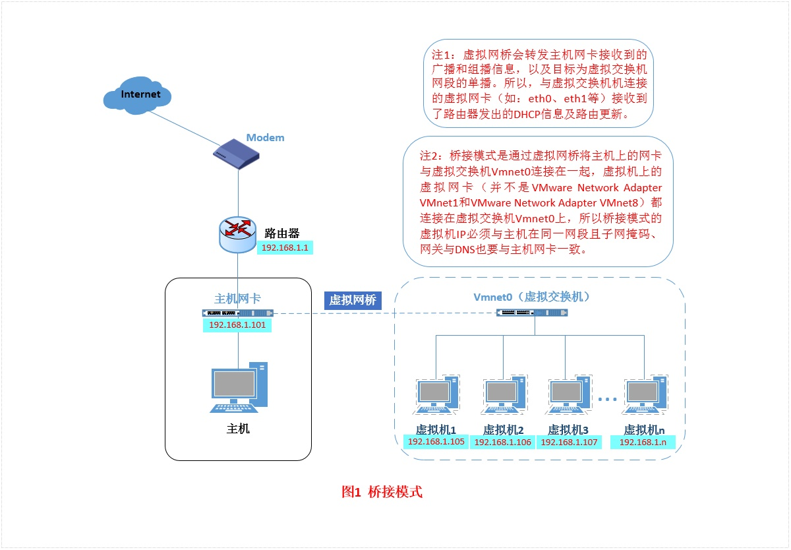
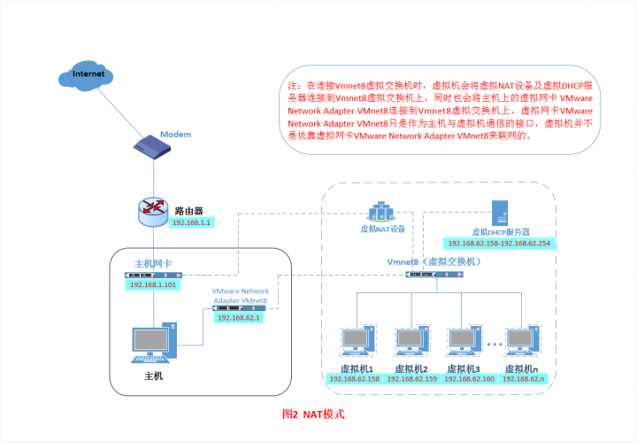
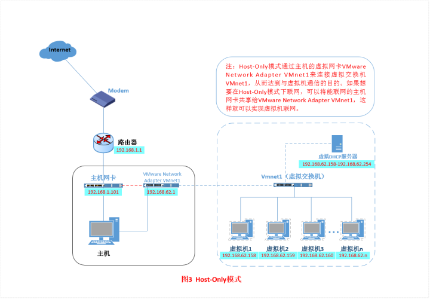
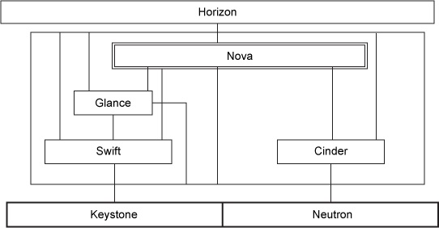

<font face="微软雅黑"> </font>
<center> </center>

<!-- more -->


# VMware磁盘清理

盘占用超过实际使用值
VMWare下的Linux虚拟机，磁盘文件（*.vmdk文件）会越来越大。清理虚拟机内文件后，还是不会减少。

用VMWare自带的磁盘压缩无效果。这是VMWare下Linux虚拟机的通病。与snapshot也有关系。


## VMwareTools
较少在宿主机实际占用的空间。

### vdiskmanager
[vmware-vdiskmanager](https://www.vmware.com/support/ws5/doc/ws_disk_manager_examples.html)

1. 虚拟机：`cat /dev/zero > zero.fill;sync;sleep 1;sync;rm -f zero.fill`后关闭虚拟机
2. 宿主win10机器上进入虚拟机文件目录`cmd或bash`执行`C:\Program Files (x86)\VMware\VMware Workstation\vmware-vdiskmanager.exe -k Name.vmdk` 。注意：此命令只能在`无snapshot`的vmdk上执行。

### vmware-toolbox-cmd
和上面的方法类似，也需要先删除快照。


linux安装VMwareTools

执行


```

vmware-toolbox-cmd disk shrink /
```


## 导出ovf
采用上述方法shrink硬盘后再导出为ovf。

`文件->导出为OVF` ，然后 打开，选择我刚才导出的 ovf 文件进行重新导入。
注意：会丢失快照。
ovf为压缩过的文件，大小小于虚拟机实际使用空间。

## 命令行运行

Vmware Workstation启动指定虚拟机的命令为：

```
vmrun -T (ws|fusion|player) start "指定虚拟机vmx文件路径" [gui|nogui]

```

或可关闭linux图形界面+vmware后台运行


# 虚拟网络
[虚拟网络](https://zhuanlan.zhihu.com/p/24758022)
[NAT静态ip](https://blog.csdn.net/xiaoyangsavvy/article/details/73718473)

## Vmware虚拟网络概述

VMware有三种虚拟网络工作方式，即：
**Briged（桥接模式）**
**NAT（网络地址转换模式）**
**Host-Only（仅主机模式）**
主机电脑中只能看到虚拟网络适配器，看不到虚拟网络交换机。

VMware Workstation提供了几种为虚拟网络配置虚拟机的方法。

1. Bridged:将您的虚拟机配置为网络上的唯一标识，与主机分离且无关。请参阅桥接网络。
2. NAT:将您的虚拟机配置为共享主机的IP和MAC地址。虚拟机和主机共享在网络外部不可见的单个网络标识。当网络管理员允许您使用单个IP地址或MAC地址时，NAT非常有用。您还可以使用NAT配置单独的虚拟机来处理http和ftp请求，两个虚拟机都运行相同的IP地址或域。请参阅网络地址转换（NAT）。
3. Host-Only:将虚拟机配置为仅允许对主机进行网络访问。当您需要连接到主机网络但仅通过主机可用的安全虚拟机时，此功能非常有用。请参阅仅限主机网络。
自定义网络允许您手动配置虚拟机的网络连接。

如果在创建虚拟机时在“新建虚拟机向导”中选择“ 典型”安装路径，则向导会为虚拟机设置桥接网络。您可以通过选择自定义设置路径来选择任何常见配置 - 桥接网络，网络地址转换（NAT）和仅主机网络。然后，向导将虚拟机连接到适当的虚拟网络。
您可以通过在虚拟机设置编辑器，虚拟网络编辑器（在Windows主机上）和主机上选择适当的设置来设置更专业的配置。

**DHCP**动态主机设定协定（Dynamic Host Configuration Protocol）是一个局域网的网络协议，使用UDP协议工作，主要有两个用途：

* 用于内部网路或网络服务供应商自动分配IP地址给用户
* 用于内部网路管理员作为对所有电脑作中央管理的手段

## 网段与网关

**网段**是指一个计算机网络中使用同一物理层直接通讯的那一部分。
在以太网环境中，一个网段其实也就是一个冲突域（碰撞域）。同一网段中的设备共享（包括通过集线器等设备中转连接）同一物理总线，在这一总线上执行CSMA/CD（载波监听多路存取/冲突检测）机制。不同网段间不共享同一物理层，因此不会跨网段发生冲突（碰撞）。
现代高速以太网通常使用交换机代替集线器，交换机是工作在数据链路层的设备，由它转接的两组设备不在同一网段中。事实上，交换机为连在其上的每一个独立设备各自划分出一个独立的网段，每个网段只包含两个设备——交换机本身，和这个独立设备。这样，交换机就能隔离冲突，提高网络的利用率和总体性能。
**网关(Gateway)**又称网间连接器、协议转换器。网关在传输层上以实现网络互连，是最复杂的网络互连设备，仅用于两个高层协议不同的网络互连。
网关是转发其他服务器通信数据的服务器，接收从客户端发送来的请求时，它就像自己拥有资源的源服务器一样对请求进行处理。有时客户端可能都不会察觉，自己的通信目标是一个网关。
网关也经常指把一种协议转成另一种协议的设备，比如语音网关。
在今天很多局域网采用都是路由来接入网络，因此现在通常指的网关就是路由器的IP。
网关顾名思义就是连接两个网络的设备，对于语音网关来说，他可以连接PSTN和以太网，这就相当于VOIP，把不同电话中的模拟信号通过网关而转换成数字信号，而且加入协议再去传输。在到了接收端的时候再通过网关还原成模拟的电话信号，最后才能在电话机上听到。
对于以太网中的网关只能转发三层以上封包，这一点和路由是一样的。而不同的是网关中并没有路由表，他只能按照预先设定的不同网段来进行转发。网关最重要的一点就是**端口映射**，子网内用户在外网看来只是外网的IP地址对应着不同的端口，这样看来就会保护子网内的用户。
网关的工作机制与代理十分相似。而网关能使通信线路上的服务器提供非 HTTP 协议服务。

## Bridged桥接模式

桥接模式就是将主机网卡与虚拟机虚拟的网卡利用虚拟网桥进行通信。在桥接的作用下，类似于把物理主机虚拟为一个交换机，所有桥接设置的虚拟机连接到这个交换机的一个接口上，物理主机也同样插在这个交换机当中，所以所有桥接下的网卡与网卡都是交换模式的，相互可以访问而不干扰。在桥接模式下，虚拟机ip地址需要与主机在同一个网段，如果需要联网，则网关与DNS需要与主机网卡一致。其网络结构如下图所示：



***

## NAT地址转换模式

如果网络ip资源紧缺，但是你又希望你的虚拟机能够联网，这时候NAT模式是最好的选择。NAT模式借助虚拟NAT设备和虚拟DHCP服务器，使得虚拟机可以联网。其网络结构如下图所示：


在这种网络模式下，主机可以通过两种方式与虚拟机通信：

1. 通过虚拟网卡直接进行局域网通信，这时需要图上所示的虚拟网卡开启;
2. 通过主机网卡由虚拟NAT设备的端口映射进行通信，这时需要开启NAT端口映射，如下图：

需要补充的是，对于虚拟机提供的**DHCP服务和NAT服务**，其实在我们安装VMware Workstation的宿主机上是可以看到这些服务的：


## Host-Only仅主机模式

Host-Only模式其实就是NAT模式去除了虚拟NAT设备，然后使用VMware Network Adapter VMnet1虚拟网卡连接VMnet1虚拟交换机来与虚拟机通信的，Host-Only模式将虚拟机与外网隔开，使得虚拟机成为一个独立的系统，只与主机相互通讯。其网络结构如下图所示：

虚拟机不能直接连接到外网，只能通过主机的虚拟机网卡与主机通信，其实可以通过XP或win7的网络共享功能使虚拟机与外网连接：网络-属性-共享。


## 桥接模式代理
使用前提：电脑环境或手机Wifi环境
电脑使用：
1. 夜神模拟器使用桥接模式，安装腾讯加速器，选择Switch商店（限免）（国际）。
2. 弹出窗口提示主机系统代理设置为：192.168.43.225:58601。设置后即可上网。
3. 无法访问Google、tg系列网站。较冷门小众网站可行。
   知识屏蔽了某些域名关键词，如t.me可用，而telegram.com不行。
   可用：`Onedrive/MS`、wiki、duckduckgo、[startpage](https://www.startpage.com/)、quora、 [pp](www.pornhubpremium.com)
4. 香港IP;延迟低：Unloaded-38 ms；Loaded-171 ms；速度快（上下行20Mbs）。
5. 通过网页代理（限制视频站等）上google、tg、twitter\fb等页面。
手机使用：
安装；设置WIFI代理。

## 网页代理
https://via.hypothes.is/
https://www.genmirror.com/
https://unblockyoutube.video/


https://proxygather.com/zh/webproxylist
https://www.croxyproxy.com/_zh/
http://free-proxy.cz/zh/web-proxylist/

https://surveybypass.com/
https://www.bnetweb.org/proxy/
https://surveybypass.com/

## Openstack

[OpenStack ](https://www.openstack.org/)是一个面向 IaaS 层的开源项目，用于实现公有云和私有云的部署及管理。
含七个核心项目：

```
Compute (Nova)
Networking (Neutron/Quantum)
Identity Management (Keystone)
Object Storage (Swift)
Block Storage (Cinder)
Image Service (Glance)
User Interface Dashboard (Horizon)
```

