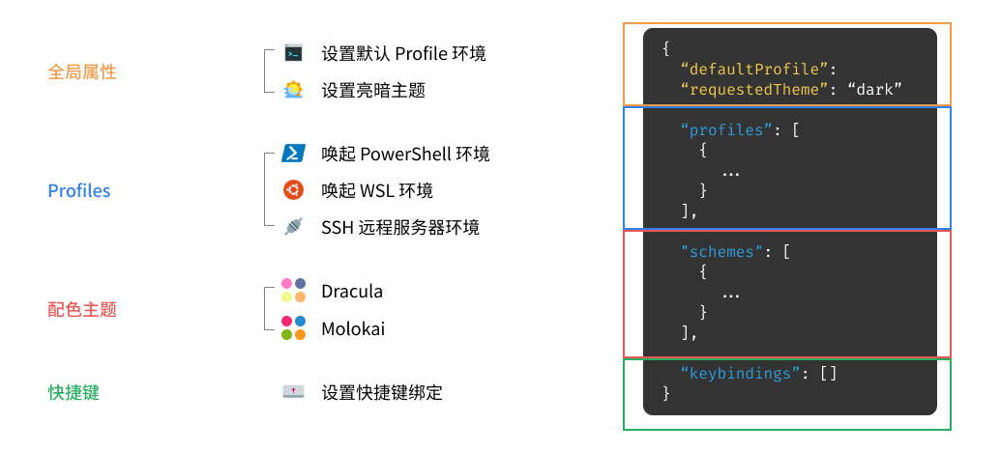
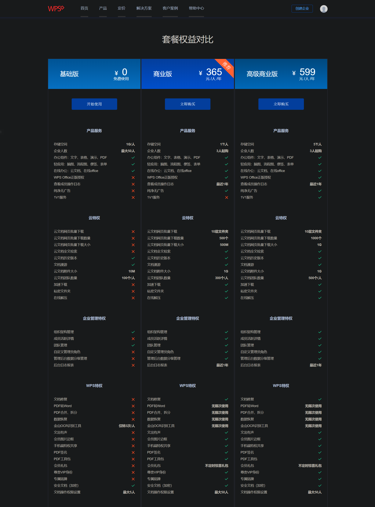

<font face="微软雅黑"> </font>
<center></center>

<!-- more -->
- [禁止自动生成桌面快捷方式](#禁止自动生成桌面快捷方式)
- [Windows以指定权限运行程序](#windows以指定权限运行程序)
- [更改PowerShell默认启动路径](#更改powershell默认启动路径)
  - [添加右键命令](#添加右键命令)
- [去除此电脑下多余文件夹](#去除此电脑下多余文件夹)
- [你需要来自 XXX 的权限才能对此文件夹进行更改](#你需要来自-xxx-的权限才能对此文件夹进行更改)
- [Windows10 关闭UAC](#windows10-关闭uac)
  - [彻底关闭](#彻底关闭)
  - [关闭UAC通知](#关闭uac通知)
  - [组策略关闭UAC](#组策略关闭uac)
- [netsh](#netsh)
  - [端口转发](#端口转发)
- [QTTabBar](#qttabbar)
- [ssh登录window](#ssh登录window)
  - [安装SSH客户端](#安装ssh客户端)
  - [开启服务](#开启服务)
- [复制文件属性](#复制文件属性)
  - [robocopy](#robocopy)
  - [修改文件时间](#修改文件时间)
  - [fastcopy](#fastcopy)
  - [压缩与解压的方式](#压缩与解压的方式)
- [scoop](#scoop)
- [开机自启动](#开机自启动)
  - [自启动目录](#自启动目录)
  - [组策略](#组策略)
  - [windows注册自启动服务项](#windows注册自启动服务项)
- [开机自动登录](#开机自动登录)
  - [注册表方式](#注册表方式)
  - [可视化方式](#可视化方式)
- [Windows激活密钥](#windows激活密钥)
  - [系统环境变量Path过大](#系统环境变量path过大)
- [浏览器保存的密码](#浏览器保存的密码)
- [双开电脑微信](#双开电脑微信)
  - [命令行](#命令行)
  - [沙盘隔离程序](#沙盘隔离程序)
  - [网易云歌单导出到Spotify](#网易云歌单导出到spotify)
- [终端配置代理](#终端配置代理)
- [Windows Terminal](#windows-terminal)
  - [配置文件](#配置文件)
  - [设置窗口大小](#设置窗口大小)
  - [添加右键菜单](#添加右键菜单)
- [Chrome](#chrome)
  - [拓展](#拓展)
  - [停用开发者提示](#停用开发者提示)
    - [Google组策略方法](#google组策略方法)
    - [使用第三方工具](#使用第三方工具)
  - [http强制跳转https](#http强制跳转https)
  - [如何打开Tab Groups](#如何打开tab-groups)
  - [删除的文件](#删除的文件)
- [WPS](#wps)
- [Everything常用语法](#everything常用语法)
  - [常用语法](#常用语法)
  - [常用文件类型匹配](#常用文件类型匹配)
  - [函数语法](#函数语法)
  - [完整匹配](#完整匹配)
  - [日期匹配](#日期匹配)
# 禁止自动生成桌面快捷方式
问题：
EasyConect VPN每次启动都会在桌面生成 IE 的快捷方式。
***
更新：EasyConect更新了一次，也失效l。

方法：
windows 10可用。
注册表编辑器中展开定位`HKEY_USERS\.DEFAULT\Software\Microsoft\Windows\CurrentVersion\Explorer`。在右侧空白，右键，新建`-DWORD（32位）值`。把数值数据修改为`1`。
设置后可手动生成。对有些软件无效。

# Windows以指定权限运行程序
由于系统使用的是 `Administrator`账户，且关闭了UAC，开启了自动提权,在使用clash tap模式时出现问题。

[在 Windows 系统上降低 UAC 权限运行程序](https://blog.walterlv.com/post/start-process-with-lowered-uac-privileges.html)
[程序降权启动方法](https://www.cnblogs.com/zpchcbd/p/11730857.html)


```
runas /trustlevel:0x20000 .\Walterlv.Demo.exe //普通用户权限
runas /trustlevel:0x40000 .\Walterlv.Demo.exe //管理员权限
runas /user:A cmd //使用其它用户，需输入密码
```

vbs脚本
```
set WshShell = WScript.CreateObject("WScript.Shell")  
WshShell.run "runas /user:domain\user command" 'Open command prompt  
WScript.Sleep 1000  
WshShell.SendKeys "password" 'send password   
WshShell.SendKeys "{ENTER}"    
WScript.Sleep 1000  
```

# 更改PowerShell默认启动路径

输入`$Profile` 显示PowerShell的默认属性文件路径,开启前会加载, 把需要预处理的命令都丢进去,比如Set-ExecutionPolicy之类的。
（路径一般为C:\Users\Administrator\Documents\PowerShell\Microsoft.PowerShell_profile.ps1）
`echo "Set-Location D:\" > $Profile`

其它适用方法：
1. 右键新建快捷方式，`powershell.exe -NoExit -command "& {Set-Location C:\OfficeGuide}"`。
2. 新建快捷方式，在快捷方式->属性->起始位置 填入路径。

## 添加右键命令
进入`HKEY_CLASSES_ROOT\Directory\ContextMenus\`和
`HKEY_CLASSES_ROOT\Directory\Background\shell`,
在`PowerShell7x64`文件夹中新建项目`command`，
再在里面新建 字符串值：
```
C:\Program Files\PowerShell\7\pwsh.exe -NoExit -RemoveWorkingDirectoryTrailingCharacter -WorkingDirectory "%V!" -Command "$host.UI.RawUI.WindowTitle = 'PowerShell 7 (x64)'"
```

# 去除此电脑下多余文件夹
```
Windows Registry Editor Version 5.00


;如需还原，去除上语句前减号即可


;取消我的电脑"视频"文件夹

[-HKEY_LOCAL_MACHINE\SOFTWARE\Microsoft\Windows\CurrentVersion\Explorer\MyComputer\NameSpace\{f86fa3ab-70d2-4fc7-9c99-fcbf05467f3a}]


;取消我的电脑"文档"文件夹

[-HKEY_LOCAL_MACHINE\SOFTWARE\Microsoft\Windows\CurrentVersion\Explorer\MyComputer\NameSpace\{d3162b92-9365-467a-956b-92703aca08af}]


;取消我的电脑"桌面"文件夹

[-HKEY_LOCAL_MACHINE\SOFTWARE\Microsoft\Windows\CurrentVersion\Explorer\MyComputer\NameSpace\{B4BFCC3A-DB2C-424C-B029-7FE99A87C641}]


;取消我的电脑"音乐"文件夹?

[-HKEY_LOCAL_MACHINE\SOFTWARE\Microsoft\Windows\CurrentVersion\Explorer\MyComputer\NameSpace\{3dfdf296-dbec-4fb4-81d1-6a3438bcf4de}]


;取消我的电脑"下载"文件夹

[-HKEY_LOCAL_MACHINE\SOFTWARE\Microsoft\Windows\CurrentVersion\Explorer\MyComputer\NameSpace\{088e3905-0323-4b02-9826-5d99428e115f}]


;取消我的电脑"图片"文件夹

[-HKEY_LOCAL_MACHINE\SOFTWARE\Microsoft\Windows\CurrentVersion\Explorer\MyComputer\NameSpace\{24ad3ad4-a569-4530-98e1-ab02f9417aa8}]


;取消我的电脑"3D对象"文件夹

[-HKEY_LOCAL_MACHINE\SOFTWARE\Microsoft\Windows\CurrentVersion\Explorer\MyComputer\NameSpace\{0DB7E03F-FC29-4DC6-9020-FF41B59E513A}]

```

# 你需要来自 XXX 的权限才能对此文件夹进行更改
您需要 administrator 权限才能对此文件进行更改
**有可能也是因为文件被占用**
1. 更改所有者。高级安全设置-添加用户，勾选两个继承选项。
2. 设置权限。高级安全设置-勾选继承选项

# 找不到该项目
Windows10系统删除文件夹“找不到该项目”强删方法

新建del.bat文件，内容如下。将文件夹拖到del.bat上即可删除。

```
DEL /F /A /Q \\?\%1
RD /S /Q \\?\%1
```

# Windows10 关闭UAC
[UAC](https://docs.microsoft.com/zh-cn/windows/security/identity-protection/user-account-control/user-account-control-group-policy-and-registry-key-settings)
## 彻底关闭
在注册表中找到如下的registry key
`HKEY_LOCAL_MACHINE \Software \Microsoft \Windows \CurrentVersion \Policies \System`
找到EnableLUA的注册表项值改为0

## 关闭UAC通知
控制面板

## 组策略关闭UAC

运行输入gpedit.msc打开组策略（家庭版没有组策略功能）
依次展开计算机配置-》Windows设置-》安全设置-》本地策略-》安全选项-》用户账户控制：`以管理员批准模式运行所有管理员，设置为已禁用`

Windows10关闭UAC后，会发现启动项不生效。(?)

# netsh
windows系统本身提供的功能强大[网络配置命令行工具](https://docs.microsoft.com/en-us/windows-server/networking/technologies/netsh/)

## 端口转发

```
netsh interface portproxy show all

```
```
netsh interface portproxy add v4tov4 listenaddress=192.168.193.1 listenport=22 connectaddress=xxx.xxx.xxx.xxx connectport=22

```

# 第三方文件浏览器

1. https://www.onecommander.com/
2. XYplorer https://masuit.com/1587?t=us4a91afgn40

# QTTabBar
[官网](http://qttabbar.wikidot.com/)，先安装1038版本，再安装1040更新包。
[github维护版本](https://github.com/indiff/qttabbar)，不支持黑暗模式。

**卸载QTTabBar后出现的问题**：WIN10打开资源管理器显示`该文件没有与之关联的程序来执行该操作.请安装应用,请在“默认应用设置”..关联`,`explore.exe`也无法打开。
解决方法，将以下内容加入注册表：
```
Windows Registry Editor Version 5.00

[HKEY_CLASSES_ROOT\Folder\shell\explore\command]

"DelegateExecute"="{11dbb47c-a525-400b-9e80-a54615a090c0}"

[HKEY_CLASSES_ROOT\Folder\shell\opennewprocess\command]

"DelegateExecute"="{11dbb47c-a525-400b-9e80-a54615a090c0}"

[HKEY_CLASSES_ROOT\Folder\shell\opennewwindow\command]

"DelegateExecute"="{11dbb47c-a525-400b-9e80-a54615a090c0}"

[HKEY_CLASSES_ROOT\Folder\shell\open\command]

"DelegateExecute"="{11dbb47c-a525-400b-9e80-a54615a090c0}"
```
**原因**：删除了系统的右键菜单而导致的。QTTabBar也设置了右键菜单。两个都删除后则缺失了默认的打开方式。
`\HKEY_CLASSES_ROOT\Folder\shell`即为文件夹右键菜单对应的注册表。


# ssh登录window

[如何使用 SSH 控制连接 Windows 服务器](https://cuiqingcai.com/6509.html)
## 安装SSH客户端
开始菜单->设置->应用和功能->管理可选功能。
选择 **OpenSSH 服务器**
安装完成之后，就需要进行一些初始化配置了，还是以管理员身份，使用 PowerShell 执行即可。

首先需要开启 SSHD 服务：
`Start-Service sshd`
然后设置服务的自动启动：
`Set-Service -Name sshd -StartupType 'Automatic'`
最后确认一下防火墙是否是放开的：
`Get-NetFirewallRule -Name *ssh*`
如果是放开的，那么结果会提示 `OpenSSH-Server-In-TCP`这个状态是 enabled。
好了，完成如上操作之后我们就可以使用 SSH 来连接我们的 Windows 服务器了。

## 开启服务
[参考](https://www.cnblogs.com/sparkdev/p/10166061.html)
安装完成后打开服务管理器，把 OpenSSH Authentication Agent 服务和 OpenSSH SSH Server 服务都设置为自启动，并启动这两个服务。

**监听端口**
启动服务后可以通过 netstat 命令查看 SSH Server 服务是不是已经开始监听默认的 22 号端口了。
`netatat -an | findstr 22`
**防火墙规则**
在安装 OpenSSH Server 的时候会在防火墙的入站规则中添加一条记录让防火墙放行对 22 号端口的访问：

**服务器端的配置文件目录**
服务器端的配置文件在 C:\ProgramData\ssh 目录中，注意 C:\ProgramData 是一个隐藏目录。

**安装目录**
Windows 系统中 OpenSSH 的安装目录为 `C:\Windows\System32\OpenSSH`，不管是客户端程序还是服务器端程序都这这个目录中。
OpenSSH 服务器端程序的默认配置文件 sshd_config_default 也在这个目录中。这个目录会被添加到 PATH 环境变量中


# 复制文件属性
## robocopy
复制目录，可多线程。
```
Robocopy C:\some_directory D:\some_directory /DCOPY:T /COPYALL /E /R:0

/DCOPY:T保留原始目录的时间戳（需要XP026或更高版本）
/E：以递归方式复制目录，包括空目录
/R:0：不要重试锁定的文件（失败副本的重试次数默认值为100万）
/MT:32 — 使用 n 个线程进行多线程复制(默认值为 8)。必须至少为 1，但不得大于 128。
```
xcopy：复制命令。

## 修改文件时间
powershell显示文件gh.txt的创建、最后修改、最后访问时间 属性

```
PS D:\godhat> (ls gh.txt).CreationTimeUtc
PS D:\godhat> (ls gh.txt).LastWriteTimeUtc
PS D:\godhat> (ls gh.txt).LastAccessTimeUtc

```
修改
```
(ls gh.txt).LastWriteTimeUtc="2019-12-31 11:22:33"
```
目录/文件夹的时间属性修改，需要用到Get-ChildItem，如Fo1目录
$F=Get-ChildItem Fo1
$F[1].Name
$F[1].CreationTime
## fastcopy
第三方软件，将[FastCopy](https://fastcopy.jp/)配置为保留目录mtimes，ACL和ADSes。

## 压缩与解压的方式
压缩方式选`存储`，压缩为`zip`。解压在winrar高级设置中选择`保留创建时间`。

# scoop
Windows 平台的一款软件安装管理工具，省去了繁琐的「搜索 - 下载 - 安装」步骤，通过「一行代码」就能完成安装管理。
[安装](https://scoop.sh/)（PowerShell 5 and .NET Framework 4.5）
```
iwr -useb get.scoop.sh | iex
```
Note: if you get an error you might need to change the execution policy (i.e. enable Powershell) with
```
Set-ExecutionPolicy RemoteSigned -scope CurrentUser
```
使用：

```
scoop install curl
```
安装目录：`C:\Users\Administrator\scoop\apps\`


# 开机自启动
## 自启动目录
将可执行的程序或快捷方式放入启动文件夹：(尽量放快捷方式，放入程序/源文件可能由于权限原因而无法执行)
`Win+R`打开“运行”窗口，
用户启动文件夹
```
shell:startup

```
系统启动文件夹
```
%programdata%\Microsoft\Windows\Start Menu\Programs\Startup

```
区别：

1。 用户开机启动文件夹，对应“开始菜单”-“程序”-“启动”功能，路径是：`C:\Users\Administrator\AppData\Roaming\Microsoft\Windows\Start Menu\Programs\Startup`；系统启动文件夹对应的路径是：`C:\ProgramData\Microsoft\Windows\Start Menu\Programs\Startup`。

2. 用户启动文件夹的启动项只在当前用户登录时启动；系统启动文件夹设置的开机启动项，在admin和guest登录系统时都会启动。

## 组策略

Windows+R 输入gpedit.msc打开组策略编辑器。

用户配置—>Windows设置—>脚本(登录|注销) -> 登录 -> 添加运行脚本


## windows注册自启动服务项

[winsw](https://github.com/kohsuke/winsw)
1. 下载`WinSW.exe`文件，exe与xml文件名需统一；
2. 按照`sample-minimal.xml`的内容格式，新建配置文件 `WinSW.xml`,写入以下内容
```
<service>
        <id>frp</id>
        <name>frp</name>
        <description>frp内网渗透</description>
        <executable>frpc</executable>
        <arguments>-c frpc.ini</arguments>
        <logmode>reset</logmode>
</service>
```
路径需要根据实际情况更改。
3. 命令行运行`WinSW.exe install`；
4. Windows Service Manager,找到frp,启动，并设为自动。
5. xml文件可设置`服务`中大部分功能，如`恢复`项、账户等。
6. 其它命令： `uninstall、start、stop、restart、status`。

# 开机自动登录
## 注册表方式
以下文本填入账户名和密码，保存为`.reg`文件，双击导入即可
```
Windows Registry Editor Version 5.00

[HKEY_LOCAL_MACHINE\SOFTWARE\Microsoft\Windows NT\CurrentVersion\Winlogon]
"DefaultUserName"="Administrator"
"AutoAdminLogon"="1"
"DefaultPassword"="your_password"
```

## 可视化方式
1. Windows+R打开运行，输入control userpasswords2敲回车。
2. 在弹出的用户账户窗口中，取消勾选。
3. 要使用本计算机，用户必须输入用户名和密码输入两次准备自动登录的账户密码
4. 完成之后，该账户即可无需密码自动登录

# Windows激活密钥
`设置->更新与安全->激活->填入激活秘钥`，可能会提示密钥失效，把一下三个都试一遍，重启就好了。
激活为`Windwos10 专业版 数字许可证激活`，绑定Microsoft账号。
```
KRJF3-NGVYP-27T3H-HKP72-MP2KM
```
```
XYV2H-YN7BQ-FWB36-X7KHC-VFPK2
```
```
29NFD-3CGMY-CCMM8-VV9RF-WFG44
```

## 系统环境变量Path过大
`新建-保存`或`删除部分变量`时，提示`此环境变量太大，最大为2047字符`。
解决方法：点击`编辑文本`，即以单行模式编辑，然后保存。


# 浏览器保存的密码
1. 设置中查看（chrome）：Autofill-> Passwords -> 点击对应密码，输入电脑密码即可查看。可进行搜索；
2. 网站页面查看：密码框右键->审查元素Inspect（Ctrl + Shift + I） ->type="password"中passord随便改为其它值，即可在密码框显示密码；
3. [WebBrowserPassView](https://www.nirsoft.net/utils/web_browser_password.html)，支持绝大部分浏览器，可视化查看列表，可保存为常规文件。可自定义浏览器用户数据路径。360极速浏览器配置为：`Advance Options` -> `Chrome Options` -> `User Data Folder` -> `C:\Users\Administrator\AppData\Local\360Chrome\Chrome\User Data\Default`

# 双开电脑微信

## 命令行
```
@echo off

start /d "C:\software\WeChat" WeChat.exe

start /d "C:\software\WeChat" WeChat.exe

exit
```

## 沙盘隔离程序


## 网易云歌单导出到Spotify
导出歌单文本，然后使用[tunemymusic](https://www.tunemymusic.com/zh-cn/)导入到Spotify等音乐平台。

导出歌单文本：
1. 网站导出：https://yyrcd.com/2018/11/14/n2s-zh/ 
2. 网易云网页导出：
   
- 浏览器打开歌单页面
- F12 => console标签页
- 切换iframe
- 粘贴代码 回车
  ```
    // 音乐链接
  let link = $$(".m-table tbody td:nth-child(2) a").map(function(item){return item.href})

  //标题
  let title = $$(".m-table tbody td:nth-child(2) b").map(function(item){return item.title})

  //艺术家
  let artist = $$(".m-table tbody td:nth-child(4) > div").map(function(item){return item.title})

  let list = []

  for(let i=0; i<title.length; i++){
      let temp = (i+1) + '.' + title[i] + ' || ' + artist[i]
      let regx = / - .+( \|\| )/
      list.push(temp.replace(regx, '$1'))
  }

  copy(list.join('\n'));

  ```
3. 网易云程序数据库导出。

# 终端配置代理

```
set http_proxy=http://127.0.0.1:1080

set https_proxy=http://127.0.0.1:1080

set http_proxy_user=user
set http_proxy_pass=pass

set https_proxy_user=user
set https_proxy_pass=pass

# 恢复
set http_proxy=

set https_proxy=

# Ubuntu 下命令为 export
# export http_proxy=http://127.0.0.1:1080

```

# Windows Terminal
[新生代 Windows 终端：Windows Terminal 的全面自定义](https://sspai.com/post/59380)
https://github.com/microsoft/terminal


在当前路径下进入默认的 Windows Terminal 环境：`wt -d .`
## 配置文件
一个 JSON 格式的文件，这个配置文件包含了如下的几个部分：

- 全局属性：位于 JSON 最外侧，包含有设置亮暗主题、默认 Profile 等项目的配置。
- 环境入口 profiles：一个列表，其中包含有 Windows Terminal 下拉菜单中唤起的各种环境（比如打开 PowerShell 环境、WSL 环境或 SSH 至远程服务器的环境……）与各种环境里 Windows Terminal 的显示方案（比如字体、背景、色彩方案等）。
- 配色主题 schemes：一个配色方案列表，其中包含有 Windows Terminal 在上一项「环境入口」中可以调用的「色彩主题」。
- 快捷键绑定 keybindings：自定义快捷键。

## 设置窗口大小
https://aka.ms/terminal-global-settings
```
    "initialCols": 100,
    "initialRows": 32,
```

## 添加右键菜单


# Chrome

一些扩展安装后，每次打开chrome/edge会提醒`请停用以开发者模式运行的扩展程序`。

## 拓展
一下以[bypass-paywalls-chrome](https://github.com/iamadamdev/bypass-paywalls-chrome)为例。
[bypass-paywalls-chrome](https://github.com/iamadamdev/bypass-paywalls-chrome)可下载crx或zip文件版，两个版本解压后内部文件一致，只有文件后缀不同。但是将zip后缀直接改为crx后不可以。
安装到chrome后，路径下 C:\Users\Administrator\AppData\Local\Google\Chrome\User Data\Default\Extensions\dcpih*******\1.7.0_0 的文件与上述也相同。

打开`开发者模式`才能拖拽到[`chrome://extensions`](chrome://extensions)页面安装。支持crx和文件夹。

## 停用开发者提示
### Google组策略方法
[Google指南](https://support.google.com/chrome/a/answer/187202?hl=zh-Hans)
[下载](https://dl.google.com/dl/edgedl/chrome/policy/policy_templates.zip)
1. 下载 Chrome组策略管理模板“chrome.adm”（下载地址）；
2. Win+R 打开运， gpedit.msc定；
3. 本地计算机策略 > 计算机配置 > 管理模板，在“管理模板”上右击，选择“添加/删除模板”；
4. 点击添加，找到第1步下载的“chrome.adm”，打开，关闭“添加/删除模板”窗口；
5. 本地计算机策略 > 计算机配置 > 管理模板 > 经典管理模板(ADM) > Google > Google Chrome > 扩展程序，双击右侧的“配置扩展程序安装白名单”；
6. 点选左边第二项“已启用”，点击下面的“显示”，
7. 打开 Chrome，将下载的 .crx 文件拖放至 Chrome 扩展程序页面安装；
8. 找到右上角的“开发者模式”，勾选，复制刚安装的扩展的 ID；
9. 粘贴到第6步弹出的窗口中，确定；
10. 
添加入白名单后在注册表中也能看到记录。

注：同时`禁用：禁止安装外部拓展程序`在chrome中才生效。
`使用文件夹安装时此方法对此应用无效`

**使用组策略后，Chrome设置会出现一项`Managed by your Organization`**

### 使用第三方工具
[第三方](http://www.epinv.com/dl/12721.html)


其中的.reg对`edge`无效；exe有效。

chrome未测试。


## http强制跳转https
Chrome的307返回码, 会强制将http转换为https, 解决方法, 清除Chrome保存与当前网页相关的密码.


## 如何打开Tab Groups

1） 将`edge://flags/#tab-groups`”`复制到地址栏中回车；

2） 找到已标黄的`Tab Groups`，将对应菜单修改为“Enable”；

批量编辑组：按住Ctrl键依次点击要编组的页面（顺序选择可用Shift键），然后右击选择“添加到新组”。


## 删除的文件
卡巴斯基：

```
若要恢复已经被应用程序删除或清除的文件：

打开主应用程序窗口。
单击主窗口底部的“更多工具"链接以打开“工具"窗口。
在“工具”窗口左侧，单击“隔离”链接，打开“隔离”窗口。
在打开的“隔离”窗口中，从列表中选择所需文件并单击“恢复”按钮。

```


windows defender：必须在卡巴斯基未启动时操作！！！

```
被Windows defender 删除的文件如何找回
打开windows 安全中心

病毒和威胁防护

进入保护历史记录

找到被隔离的威胁，点击还原操作。


```


## onedrive 提示电池优化设置和省电模式无法登陆
需打开微软验证器Authenticator的自启动。

# WPS
版本分类乱；收费方式复杂。

WPS官网的三个版本


同时提供了个人版本的会员购买，89/年。提供PDF增值服务，功能弱于商业版。

WPS教育版：=广告较少的个人免费版，集成于同一个软件窗口。`安装时捆绑看图软件。许多需要付费使用的按钮`安装目录到%Program DATA。必须手机号注册。
WPS政府专用版：无广告，去除了需要付费才能使用的功能按钮。
WPS专业版：类似商业高级版，但无商业高级版的云功能。有`VBA`。
WPS海外版：无广告或少量不明显的广告。账号与国内不通用。

**与Office比较：**
WPS胜在免费；Office放任盗版也是一种默认提供免费版本的方式。
WPS免费版具有PDF阅读功能，但不强大，可替代性高。Office 为提供专门的PDF套件，word可直接打开PDF（转成word）。
Office专业版比WPS 商业高级版功能更为全面强大。WPS的价格不具优势。

Office与`Onedrive`协作的云办公功能目前无可比拟（可使用个人免费版Onedrive）。

使用WPS`Endnote`插件插入参考文献；很大一部分citation会出现参数错误，无法插入。
相同的文献在Word中不会出现该问题。


# Everything常用语法

## 常用语法
empty:    搜索空文件夹        
ext:<list>    ；搜索指定后缀   
file:<ext:bmp|txt>    bmp和txt文件
folder:
len:<length>    筛选出特定长度     *.txt len:5-10   
parents:<count>    文件夹深度        
size:<size>    搜索特定大小的文件    *.txt size:large、7mb-8mb    
case/nocase:	区分大小写.


## 常用文件类型匹配
zip:	搜索压缩文件.
doc:	搜索文档文件.
exe:	搜索可执行文件.
pic:	搜索图片文件.
video:	搜索视频文件.


## 函数语法
function:value	等于某设定值.
function:<=value	小于等于某设定值.
function:>=value	大于等于某设定值.
function:start..end	在起始值和终止值的范围内.
function:start-end	在起始值和终止值的范围内.


## 完整匹配
wfn:	匹配完整文件名.
wholefilename:	匹配完整文件名.
wholeword:	仅匹配全字符.
ww:	仅全字匹配.
***

## 日期匹配
dc:<date>、datecreated:<date>    dc:last year
dm:<date>、datemodified:<date>    dm:2015-2016

# Fluent Search 
https://fluentsearch.net/

1. 模糊搜索、部分文件全文搜索、浏览器历史
2. 类vi功能，解放鼠标

# 硬盘选择


## 叠瓦盘CMR与垂直盘PMR-CMR
1. https://www.bilibili.com/read/cv11616105

SMR 在硬盘空间占用 50-80%这个区间掉速到个位数 m/s 。建议只当作光盘使用，勿频繁删除覆写。

smr特点：
1. SMR叠瓦式硬盘优势在于大容量、低价格，缺点是即便使用了大缓存，小文件读写仍然十分缓慢，4K读取速度不会超过2MB/s

2. SMR硬盘读取、修改的写入周期太长。PMR硬盘只需要原地覆写就行。而SMR硬盘，当你遇到需要修改某一区域的数据的时候，覆写会影响后面的数据。所以在覆写之前，需要先将被影响的数据转移。这也就是为啥SMR硬盘需要大缓存，为啥越用越慢。

如何判断是否smr：

1. 新盘无数据用hdtune基准测试，正常应出现平滑曲线，叠瓦盘基准测试曲线一看就知道不正常，当你把盘差不多拷满时再拷入数据速度会变慢很多。

2. 缓存128M及以上的都是。笔记本硬盘区分可以通过容量和厚度对比，1T以上的7mm基本都是，2T的7mm绝对是。指令集支持TRIM的一般都是。SMR盘多做备份，因为寿命相对低一点，误删文件找回概率降低，写得多速度会变慢。SMR一响爹妈白养，数据安全多做备份。

## tlc ssd

光威悍将720G，全盘模拟slc，缓存取决于剩余空间（实测slc约剩余空间 5%-10%），缓外顺序20M/s，需至少保持剩余空间大于 30%。

# rainmeter

- Draggable：自由拖动
- Click through: 在挂件上点击无效。在桌面挂件上ctrl+右键点击两次，则会弹出设置菜单。
