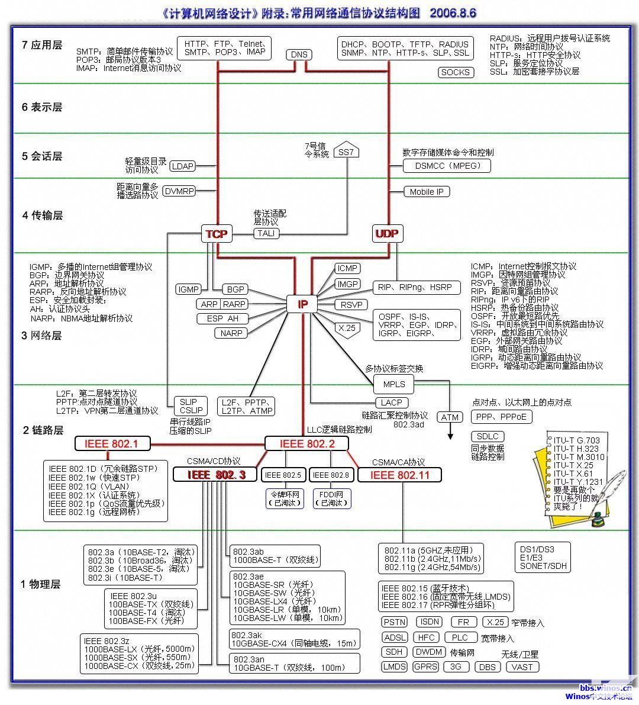

<font face="微软雅黑"> </font>
<center> </center>

<!-- more -->


[细说OSI七层协议模型及OSI参考模型中的数据封装过程](https://www.zhoulujun.cn/html/theory/ComputerScienceTechnology/network/2016_0316_7709.html)


[如果看了这个你还是不会用Wireshark，那就来找我吧](https://www.dell.com/community/%E5%85%A5%E9%97%A8%E7%BA%A7%E5%92%8C%E4%B8%AD%E7%AB%AF/%E5%A6%82%E6%9E%9C%E7%9C%8B%E4%BA%86%E8%BF%99%E4%B8%AA%E4%BD%A0%E8%BF%98%E6%98%AF%E4%B8%8D%E4%BC%9A%E7%94%A8Wireshark-%E9%82%A3%E5%B0%B1%E6%9D%A5%E6%89%BE%E6%88%91%E5%90%A7-8%E6%9C%886%E6%97%A5%E5%AE%8C%E7%BB%93/m-p/7007033)


# Wireshark界面
Wireshark抓取通过选定网卡的网络数据包。

从上到下：
- Display Filter(显示过滤器)， 用于过滤
- 1号窗口展示的是wireshark捕获到的所有`数据包的列表`。注意最后一列Info列是wireshark组织的说明列并不一定是该数据包中的原始内容。
- 2号窗口是1号窗口中选定的数据包的`分协议层展示`。底色为红色的是因为wireshark开启校验和验证而该层协议校验和又不正确所致。
- 3号窗口是1号窗口中选定的`数据包的源数据`，其中左侧是十六进制表示右侧是ASCII码表示。另外在2号窗口中选中某层或某字段，3号窗口对应位置也会被高亮。
- Miscellanous(地址栏，杂项)

色彩标识:
默认绿色是TCP报文，深蓝色是DNS，浅蓝是UDP，黑色标识出有问题的TCP报文——比如乱序报文。

# 过滤器表达式
捕捉过滤器（CaptureFilters）：用于决定将什么样的信息记录在捕捉结果中。需要在开始捕捉前设置。

显示过滤器（DisplayFilters）：在捕捉结果中进行详细查找。他们可以在得到捕捉结果后随意修改。


一条基本的表达式由`过滤项、过滤关系、过滤值`三项组成。比如ip.addr == 192.168.1.1
过滤项是`协议.协议字段`的模式

1. 协议过滤
比如`TCP`，只显示TCP协议。

2. IP 过滤
比如 `ip.src ==192.168.1.102` 显示源地址为192.168.1.102，
`ip.dst==192.168.1.102`, 目标地址为192.168.1.102

3. 端口过滤
`tcp.port ==80`, 端口为80的
`tcp.srcport == 80`, 只显示TCP协议的愿端口为80的。

4. Http模式过滤
`http.request.method=="GET"`, 只显示HTTP GET方法的。

5. 逻辑运算符为 AND/ OR


# 其它

## IO Graphs
`Statistics – IO Graphs`：基本的Wireshark IO graph会显示抓包文件中的整体流量情况，点击图形中的任意点就会看到报文的细节。

**过滤**：每一个图形都可以应用一个过滤条件，同时显示多个图形。

**可用函数**：SUM, MIN, AVG, MAX, COUNT, LOAD。

## 拦截本地回环数据
本机访问本机的回环数据是不经过网卡的，比如我们在本机访问搭建在本机上的web服务。
1. 使用ipconfig查看本机ip和网关：
ipconfig
2. 添加路由，指定回环数据也要先转发到网关（使用上一步获取本的本机ip和网关替换其中的`<your_IP>和<gateway_IP>`）：
```
route add <your_IP> mask 255.255.255.255 <gateway_IP> metric 1
```
3. 最后，查看路由表中路由是否已添加成功：
```
route print

```
4. 使用以下命令删除路由（使用前边获取本的本机ip替换其中的<your_IP>）：
```
route delete <your_IP>
```

# 实际应用
[Wireshark抓包实例诊断TCP连接问题](https://wizardforcel.gitbooks.io/network-basic/22.html)

