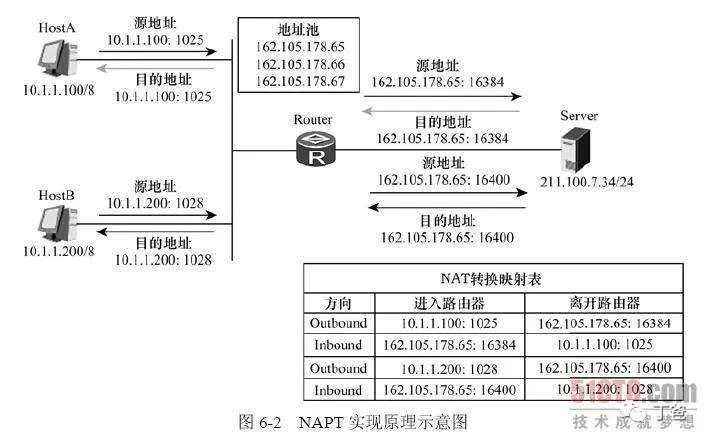

<font face="微软雅黑"> </font>
<center> </center>

<!-- more -->
- [内网穿透](#内网穿透)
  - [内网穿透简介](#内网穿透简介)
  - [网络地址转换](#网络地址转换)
  - [端口映射](#端口映射)
  - [反向代理](#反向代理)
  - [SSH隧道](#ssh隧道)
- [内网穿透的工具](#内网穿透的工具)
- [FRP搭建](#frp搭建)
  - [Centos& as Server](#centos-as-server)
  - [frpc示例](#frpc示例)
  - [ssh端口](#ssh端口)
  - [Window远程桌面](#window远程桌面)
  - [文件共享访问示例](#文件共享访问示例)
- [开机启动](#开机启动)
  - [设Linux frps开机启动](#设linux-frps开机启动)
  - [windows注册frp服务项](#windows注册frp服务项)
- [xtcp模式](#xtcp模式)
  - [NAT类别](#nat类别)


# 内网穿透
## 内网穿透简介
[百度百科](https://baike.baidu.com/item/%E5%86%85%E7%BD%91%E7%A9%BF%E9%80%8F)
也即 NAT 穿透，进行 NAT 穿透是为了使具有某一个特定源 IP 地址和源端口号的数据包不被 NAT 设备屏蔽而正确路由到内网主机。
NAT的缺陷之一就是只能由内网主机发起连接，外网主机无法主动连接到内网。

## 网络地址转换
（Network Address Translation，NAT）机制的问题在于，**NAT设备自动屏蔽了非内网主机主动发起的连接**，也就是说，从外网发往内网的数据包将被NAT设备丢弃，这使得位于不同NAT设备之后的主机之间无法直接交换信息。这一方面保护了内网主机免于来自外部网络的攻击，另一方面也为P2P通信带来了一定困难。Internet上的NAT设备大多是地址限制圆锥形NAT或端口限制圆锥形 NAT，外部主机要与内网主机相互通信，必须由内网主机主动发起连接，使 NAT设备产生一个映射条目，这就有必要研究一下内网穿透技术。

## 端口映射
网络地址转换（Network Address Translation，NAT）地址转换的一种，其功能就是把在公网的地址转翻译成私有地址， 采用路由方式的ADSL宽带路由器拥有一个动态或固定的公网IP，ADSL直接接在HUB或交换机上，所有的电脑共享上网。在局域网内部的任一PC或服务器上运行到内网穿透客户端，此时**域名解析到的IP地址是局域网网关出口处的公网IP地址**，再在网关处做端口映射指向监控设备即可。
在NAT网关上会有一张映射表，表上记录了内网向公网哪个IP和端口发起了请求，然后如果内网有主机向公网设备发起了请求，内网主机的请求数据包传输到了NAT网关上，那么NAT网关会修改该数据包的源IP地址和源端口为NAT网关自身的IP地址和任意一个不冲突的自身未使用的端口，并且把这个修改记录到那张映射表上。最后把修改之后的数据包发送到请求的目标主机，等目标主机发回了响应包之后，再根据响应包里面的目的IP地址和目的端口去映射表里面找到该转发给哪个内网主机。这样就实现了内网主机在没有公网IP的情况下，通过NAPT技术借助路由器唯一的一个公网IP来访问公网设备。
NAT有三种类型：静态NAT(StaticNAT)、动态地址NAT(PooledNAT)、网络地址端口转换NAPT（Port-LevelNAT）。
其中，网络地址端口转换NAPT（NetworkAddressPortTranslation）则是把内部地址映射到外部网络的一个IP地址的不同端口上。它可以将中小型的网络隐藏在一个合法的IP地址后面。NAPT与动态地址NAT不同，它将内部连接映射到外部网络中的一个单独的IP地址上，同时在该地址上加上一个由NAT设备选定的端口号。


NAPT是使用最普遍的一种转换方式，在HomeGW中也主要使用该方式。它又包含两种转换方式：SNAT和DNAT。
1. 源NAT（SourceNAT，SNAT）：修改数据包的源地址。源NAT改变第一个数据包的来源地址，它永远会在数据包发送到网络之前完成，数据包伪装就是一具SNAT的例子。
2. 目的NAT（DestinationNAT，DNAT）：修改数据包的目的地址。DestinationNAT刚好与SNAT相反，它是改变第一个数据懈的目的地地址，如平衡负载、端口转发和透明代理就是属于DNAT。

## 反向代理
正向代理隐藏真实客户端，反向代理隐藏真实服务端。

## SSH隧道
[SSH的三种端口转发](https://jeremyxu2010.github.io/2018/12/ssh%E7%9A%84%E4%B8%89%E7%A7%8D%E7%AB%AF%E5%8F%A3%E8%BD%AC%E5%8F%91/)
# 内网穿透的工具
许多工具是基于[ngrok](https://ngrok.com/)或[frp](https://github.com/fatedier/frp)开发的。
提供免费服务的一般为共享服务器且限速严重。
1. Ngrok
2. Natapp
3. 小米球
4. Sunny-Ngrok
5. echosite
6. Ssh、autossh
7. Lanproxy
8. Spike
9. [Frp](https://github.com/fatedier/frp)
10. Fcn
11. [ProxyGo](https://github.com/snail007/goproxy)
12. [natfrp](natfrp.com)
13. [holer](https://github.com/Wisdom-Projects/holer)

# FRP搭建
## Centos& as Server
centos7，端口已确认开放。
[Github FRP](https://github.com/fatedier/frp/blob/master/README_zh.md)

1. 路由器空间太小无法运行frp。
2. Centos失败原因：
     1. Centos系统不纯净，被修改过。
     2. 之前安装的LNMP修改了某些配置。

---

（20191205更新）**重装腾讯云系统**
重装系统时取消第一个安全选项。
使用`ssh`测试frps端口，端口通。
成功启动。
在安全组策略中放行端口后**即刻生效**，可以用于frp.
## frpc示例

```
# frpc.ini
[common]
server_addr = x.x.x.x
server_port = xxxx


[Raspi_ssh]
type = tcp
local_ip = 127.0.0.1
local_port = 22
remote_port = 22222
```
## ssh端口
[参考](https://blog.51cto.com/chidongting/1761061)

        vi /etc/ssh/sshd_config
        Port 2022        //查找到 Port=22字段，新增一行，增加修改后的端口号。可开放多个端口

## Window远程桌面

windows 运行 `mstsc` 打开远程桌面。
frps服务器的带宽过小以致卡顿。
按照以下设置：
远程桌面连接->显示选项

        ->显示->颜色->增强色（16）
        ->体验->性能->低速宽带(256kbps-2Mbps)

## 文件共享访问示例
通过 static_file 插件可以对外提供一个简单的基于 HTTP 的文件访问服务。

frps 的部署步骤同上。

启动 frpc，启用 static_file 插件，配置如下：
```
# frpc.ini
[common]
server_addr = x.x.x.x
server_port = 7000

[test_static_file]
type = tcp
remote_port = 6000
plugin = static_file
# 要对外暴露的文件目录
plugin_local_path = /tmp/file
# 访问 url 中会被去除的前缀，保留的内容即为要访问的文件路径
plugin_strip_prefix = static
plugin_http_user = abc
plugin_http_passwd = abc

```
通过浏览器访问 `http://x.x.x.x:6000/static/` （最后的`/`不能少）来查看位于 `/tmp/file` 目录下的文件，会要求输入已设置好的用户名和密码。

# 开机启动
## 设Linux frps开机启动
[记录搭建FRP服务器实现内网穿透](https://um.ci/183.html)

执行`./frpc -c frpc.ini`，查看是否能够成功连接。

**设置后台运行并且开机自启**：

frp自带的`./systemd/frpc.service`文件一直不可用（？），以下模板文件才可用，文件拷贝至`/etc/systemd/system/`文件夹下，使用systemctl启用。

**手动设置**
通过`vi /etc/systemd/system/frps.service`命令新建文件并写入以下内容:
```
[Unit]
Description=frps daemon
After=syslog.target  network.target
Wants=network.target

[Service]
Type=simple
ExecStart=/root/frp/frps -c /root/frp/frps.ini
Restart= always
RestartSec=1min

[Install]
WantedBy=multi-user.target
```
frpc

通过`vi /etc/systemd/system/frps.service`命令新建文件并写入以下内容:
```
[Unit]
Description=frpc daemon
After=syslog.target  network.target
Wants=network.target

[Service]
Type=simple
ExecStart=/home/frp/frpc -c /home/frp/frpc.ini
Restart= always
RestartSec=1min

[Install]
WantedBy=multi-user.target
```

注意ExecStart中要配置成自己的路径. 可以用pwd命令查看路径
然后
`systemctl start frps` 启动frps
`systemctl enable frps`将frps设置为开机启动。
`systemctl stop frps` 停止frps
`systemctl disable frps`取消开机启动

## windows注册frp服务项

[winsw](https://github.com/kohsuke/winsw)
1. 下载`WinSW.exe`文件，exe与xml文件名需统一；
2. 按照`sample-minimal.xml`的内容格式，新建配置文件 `WinSW.xml`,写入以下内容
```
<service>
        <id>frp</id>
        <name>frp</name>
        <description>frp内网渗透</description>
        <executable>frpc</executable>
        <arguments>-c frpc.ini</arguments>
        <logmode>reset</logmode>
</service>
```
路径需要根据实际情况更改。
3. 命令行运行`WinSW.exe install`；
4. Windows Service Manager,找到frp,启动，并设为自动。
5. xml文件可设置`服务`中大部分功能，如`恢复`项、账户等。
6. 其它命令： `uninstall、start、stop、restart、status`。

# xtcp模式
[p2p模式](https://github.com/fatedier/frp#p2p-mode)
[P2P如何实现内网穿透（打洞）](https://blog.csdn.net/u014023993/article/details/86563976)


除了 xtcp 外，其他类型的内网穿透模式的流量都需要经过 frps 所在服务器中转。
xtcp使用方式同 stcp 类似，需要在**两边都部署frpc** 用于建立直接的连接。

**支持 ConeNAT（锥形 NAT），不支持 Symmetric NAT （对称NAT）**，因此没办法能够支持全部的 NAT方式。
更何况，你知道你在访问公网的时候中间经过了多少层 NAT 吗，因此这项功能不用纠结，不好用就不好用，静待更好的解决方案。
其它内网穿透工具如nps也是一样。

## [NAT类别](https://www.jianshu.com/p/f71707892eb2)
1. 静态NAT：也就是静态地址转换
2. NAPT：端口多路复用技术
  NAPT主要分为两大类：锥型NAT和对称型NAT。
  其中锥型NAT又分：完全锥型，受限锥型和端口受限锥型。


# 小米路由器3G
## mixbox工具
1. 在可写目录（/data或extdisks/sda1/）下载程序
```
sh -c "$(curl -kfsSl https://raw.githubusercontent.com/monlor/mbfiles/master/install_github.sh)" && source /etc/profile &> /dev/null


```

2. 在目录下执行 mixbox/bin/mixbox 程序，进行安装脚本选择

## 修改samba默认可browseable

```
vi /etc/init.d/samba 
#       [ -n "$browseable" ] && echo -e "\tbrowseable = $browseable" >> /var/etc/smb.conf
[ -n "$browseable" ] && echo -e "\tbrowseable = yes" >> /var/etc/smb.conf
```