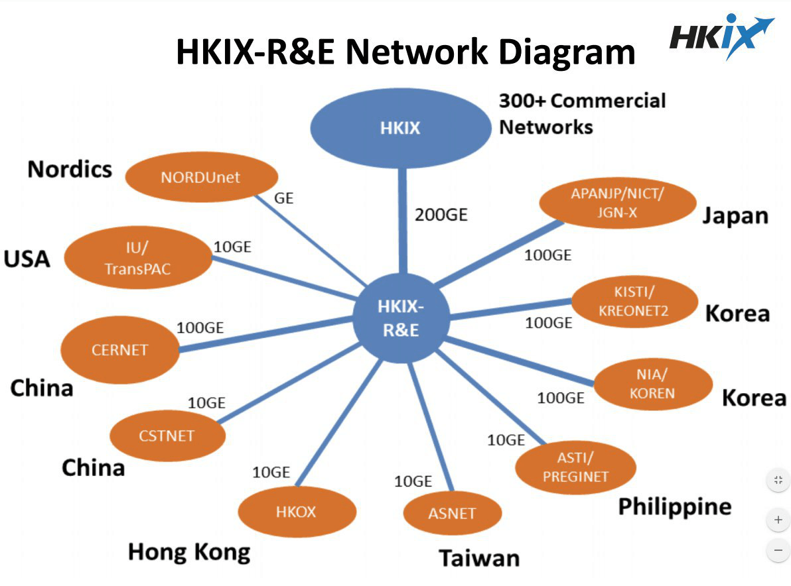

 

ipv6环境下使用ipv4网络

<!-- more -->
<!-- TOC -->

- [问题描述](#%e9%97%ae%e9%a2%98%e6%8f%8f%e8%bf%b0)
- [6Plat](#6plat)
  - [修改DNS](#%e4%bf%ae%e6%94%b9dns)
  - [Proxy](#proxy)
- [TunnelBroker](#tunnelbroker)
- [适合教育网CERNET IPv6使用的VPS](#%e9%80%82%e5%90%88%e6%95%99%e8%82%b2%e7%bd%91cernet-ipv6%e4%bd%bf%e7%94%a8%e7%9a%84vps)
- [结论](#%e7%bb%93%e8%ae%ba)

<!-- /TOC -->
***

# 问题描述

校园网提供免费的ipv6网络，国外ip的6to4代理使用有一定限制，欲尝试ipv6 to ipv4网络走国内ip代理。

# 6Plat

提供 `6to4` 和`4to6`。

## 修改DNS

不可用

## Proxy

无法申请6to4账号，无法加群。

# TunnelBroker

参考教程[高校生使用教育网的一点姿势](https://blog.itswincer.com/posts/36b4c1ab/),实现以下步骤。

1. 注册并使用tunnelbroker的提供的ipv6服务，并在服务器上按照其说明配置。
2. 腾讯云安全组入站规则添加41端口时显示不支持，故设置全部开放。
3. [安装v2ray](https://blog.itswincer.com/posts/36b4c1ab/)。
4. 手机端使用v2rayng，填入ipv4或ipv6均无法连接。但是均可ping通。

参考[v2ex的帖子](https://www.v2ex.com/t/370751),得知本机为VPC，不支持此方式。

        腾讯云不屏蔽 41 但如果你网络是 VPC 那么虽然不屏蔽但虚拟路由也不会转发给你的服务器 
        你得是经典网络才会转发过去 
        如果是经典网络的话只需要注意一下 NAT 后的实际 localaddress 就行了

# 适合教育网CERNET IPv6使用的VPS

转自[盘点适合教育网CERNET IPv6使用的VPS](https://luotianyi.vc/2256.html)。

# 结论

1. 本机不支持。腾讯云中需要基础网络才支持，本机为（VPC）。
2. [参考帖子](https://www.v2ex.com/t/370751),阿里云可以使用，华为云不支持。
3. 对主机类别的了解不够深入，需要学习。
4. [盘点适合教育网CERNET IPv6使用的VPS](https://luotianyi.vc/2256.html) 中推荐 GCP、AWS、Vultr、Linodo，可尝试。

GCP参考文章[使用谷歌云GCP IPv6为教育网搭建6to4服务](https://luotianyi.vc/1941.html)
